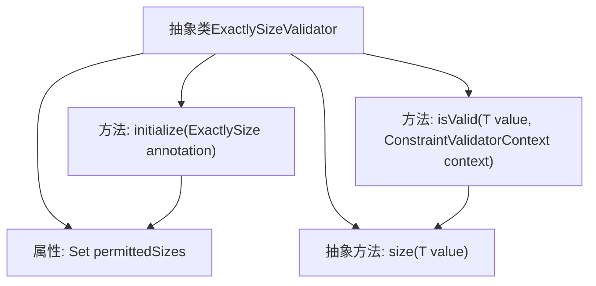

# 基础信息

|      |      |
|------|------|
| 名称 | ExactlySizeValidator |
| 编码语言 | .java |
| 代码路径 | Signal-Server/service/src/main/java/org/whispersystems/textsecuregcm/util/ExactlySizeValidator.java |
| 包名 | org.whispersystems.textsecuregcm.util |
| 依赖项 | ['jakarta.validation.ConstraintValidator', 'jakarta.validation.ConstraintValidatorContext', 'java.util.Arrays', 'java.util.Set', 'java.util.stream.Collectors'] |
| 概述说明 | ExactlySizeValidator类验证对象大小是否符合指定值集。 |

# 说明

ExactlySizeValidator类的主要功能是验证对象的大小是否符合预设的指定值集。该类通过检查对象的大小，确保其满足特定的尺寸要求，从而在数据处理或对象管理过程中提供有效的验证机制。

# 类列表 Class Summary

| 名称   | 类型  | 说明 |
|-------|------|-------------|
| ExactlySizeValidator | class | ExactlySizeValidator类用于验证对象大小是否符合指定值集。 |


## 类 ExactlySizeValidator

|      |      |
|------|------|
| 访问范围 | public abstract |
| 类型 | class |
| 名称 | ExactlySizeValidator |
| 说明 | ExactlySizeValidator类用于验证对象大小是否符合指定值集。 |


### UML类图

```mermaid
classDiagram
    class ExactlySizeValidator~T~ {
        <<Abstract>>
        -Set~Integer~ permittedSizes
        +initialize(ExactlySize annotation) void
        +isValid(T value, ConstraintValidatorContext context) boolean
        #size(T value) int
    }

    interface ConstraintValidator~A, T~ {
        <<Interface>>
        +initialize(A annotation) void
        +isValid(T value, ConstraintValidatorContext context) boolean
    }

    ExactlySizeValidator ..|> ConstraintValidator : 实现
```

这段代码定义了一个抽象类 `ExactlySizeValidator`，它实现了 `ConstraintValidator` 接口。`ExactlySizeValidator` 用于验证某个值的大小是否在允许的尺寸集合中。它包含一个私有成员 `permittedSizes`，用于存储允许的尺寸集合，并提供了 `initialize` 和 `isValid` 方法来实现接口的功能。此外，它还定义了一个抽象方法 `size`，用于计算值的大小，具体实现由子类完成。


### 内部方法调用关系图



这段代码定义了一个抽象类 `ExactlySizeValidator<T>`，它实现了 `ConstraintValidator<ExactlySize, T>` 接口。类中包含一个 `permittedSizes` 属性，用于存储允许的尺寸集合。`initialize` 方法用于初始化 `permittedSizes`，`isValid` 方法用于验证给定值的大小是否在允许的尺寸集合中。`size` 方法是一个抽象方法，由子类实现以返回具体的大小值。

### 字段列表 Field List

| 名称  | 类型  | 说明 |
|-------|-------|------|
| permittedSizes | Set<Integer> | 私有整数集合存储允许的尺寸。 |

### 方法列表 Method List

| 名称  | 类型  | 说明 |
|-------|-------|------|
| initialize | void | 重写initialize方法，将注解值转为集合存储。 |
| isValid | boolean | 检查值大小是否在允许范围内。 |
| size | int | 保护抽象方法，返回类型为int，参数为T类型值。 |


