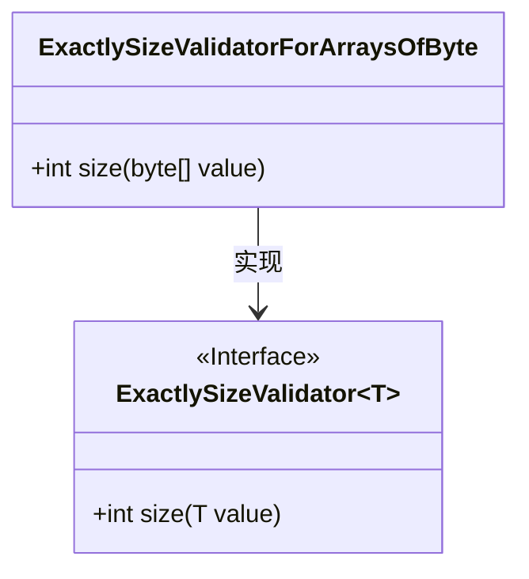
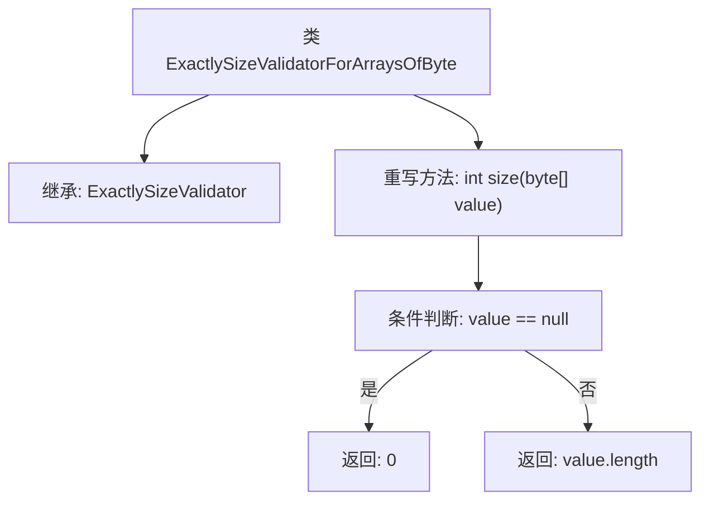

# 基础信息

|      |      |
|------|------|
| 名称 | ExactlySizeValidatorForArraysOfByte |
| 编码语言 | .java |
| 代码路径 | Signal-Server/service/src/main/java/org/whispersystems/textsecuregcm/util/ExactlySizeValidatorForArraysOfByte.java |
| 包名 | org.whispersystems.textsecuregcm.util |
| 依赖项 | [] |
| 概述说明 | ExactlySizeValidatorForArraysOfByte继承ExactlySizeValidator，重写size方法返回字节数组长度。 |

# 说明

ExactlySizeValidatorForArraysOfByte类继承自ExactlySizeValidator，并重写了size方法，使其能够返回字节数组的长度。

# 类列表 Class Summary

| 名称   | 类型  | 说明 |
|-------|------|-------------|
| ExactlySizeValidatorForArraysOfByte | class | ExactlySizeValidatorForArraysOfByte类继承ExactlySizeValidator，重写size方法以返回字节数组长度。 |

## 类 ExactlySizeValidatorForArraysOfByte

|      |      |
|------|------|
| 访问范围 | public |
| 类型 | class |
| 名称 | ExactlySizeValidatorForArraysOfByte |
| 说明 | ExactlySizeValidatorForArraysOfByte类继承ExactlySizeValidator，重写size方法以返回字节数组长度。 |

### UML类图

这段代码定义了一个名为 `ExactlySizeValidatorForArraysOfByte` 的类，它继承自泛型类 `ExactlySizeValidator`，并实现了 `size` 方法。`ExactlySizeValidator` 是一个泛型接口，要求实现类提供一个 `size` 方法，用于计算传入对象的大小。`ExactlySizeValidatorForArraysOfByte` 类专门处理 `byte[]` 类型的数据，返回数组的长度，如果数组为 `null`，则返回 `0`。这个类的主要作用是验证字节数组的大小是否符合预期。

### 内部方法调用关系图

这段代码定义了一个名为`ExactlySizeValidatorForArraysOfByte`的类，该类继承自`ExactlySizeValidator<byte[]>`，并重写了`size`方法。`size`方法用于计算字节数组的长度，如果数组为`null`，则返回0，否则返回数组的长度。流程图展示了类的继承关系以及`size`方法内部的逻辑判断和返回路径。

### 字段列表 Field List

| 名称  | 类型  | 说明 |
|-------|-------|------|

### 方法列表 Method List

| 名称  | 类型  | 说明 |
|-------|-------|------|
| size | int | 该方法返回字节数组长度，若数组为空则返回0。 |

