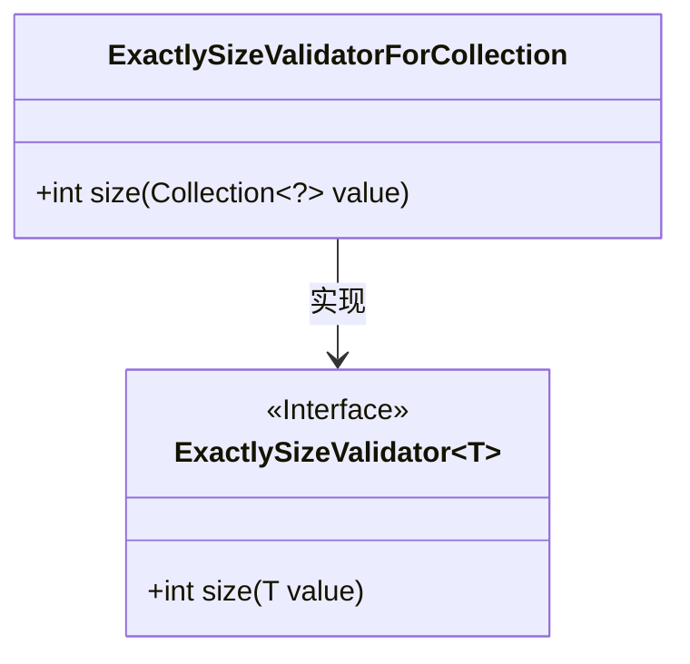
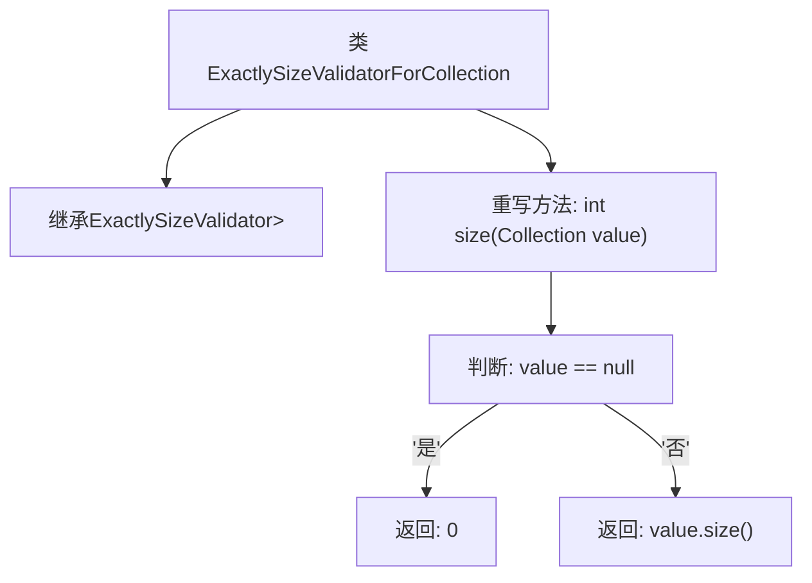

# 基础信息

|      |      |
|------|------|
| 名称 | ExactlySizeValidatorForCollection |
| 编码语言 | .java |
| 代码路径 | Signal-Server/service/src/main/java/org/whispersystems/textsecuregcm/util/ExactlySizeValidatorForCollection.java |
| 包名 | org.whispersystems.textsecuregcm.util |
| 依赖项 | ['java.util.Collection'] |
| 概述说明 | ExactlySizeValidatorForCollection类验证集合大小，返回大小或0。 |

# 说明

ExactlySizeValidatorForCollection类的主要功能是验证集合的大小。该类通过检查集合的元素数量，返回集合的实际大小。如果集合为空或无效，则返回0。该验证器适用于需要确保集合符合特定大小要求的场景，提供了一种简单而有效的方式来验证集合的规模。

# 类列表 Class Summary

| 名称   | 类型  | 说明 |
|-------|------|-------------|
| ExactlySizeValidatorForCollection | class | ExactlySizeValidatorForCollection类用于验证集合大小，返回集合大小或0。 |

## 类 ExactlySizeValidatorForCollection

|      |      |
|------|------|
| 访问范围 | public |
| 类型 | class |
| 名称 | ExactlySizeValidatorForCollection |
| 说明 | ExactlySizeValidatorForCollection类用于验证集合大小，返回集合大小或0。 |

### UML类图

**描述**：`ExactlySizeValidatorForCollection` 类继承自泛型接口 `ExactlySizeValidator`，并实现了 `size` 方法。该方法用于计算集合的大小，如果集合为 `null`，则返回 0。类图清晰地展示了 `ExactlySizeValidatorForCollection` 与 `ExactlySizeValidator` 之间的实现关系，并标注了泛型类型。

### 内部方法调用关系图

这段代码定义了一个名为`ExactlySizeValidatorForCollection`的类，继承自`ExactlySizeValidator<Collection<?>>`。该类重写了`size`方法，用于计算集合的大小。如果传入的集合为`null`，则返回0；否则返回集合的实际大小。流程图展示了类的继承关系和`size`方法内部的逻辑判断流程。

### 字段列表 Field List

| 名称  | 类型  | 说明 |
|-------|-------|------|

### 方法列表 Method List

| 名称  | 类型  | 说明 |
|-------|-------|------|
| size | int | 重写size方法，处理空集合返回0。 |

