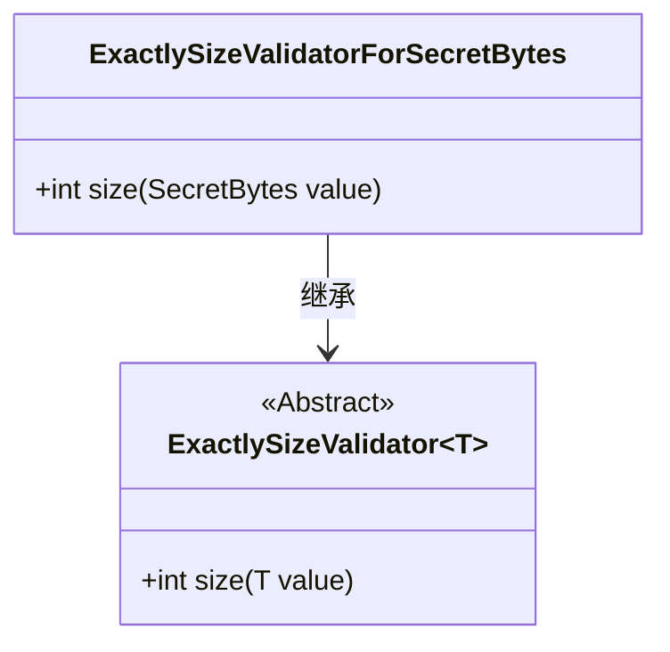
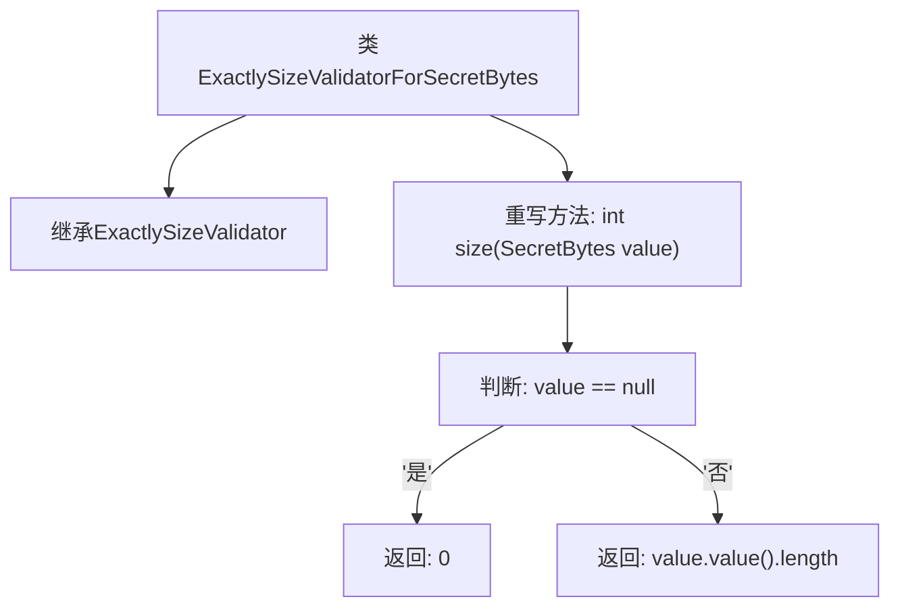

# 基础信息

|      |      |
|------|------|
| 名称 | ExactlySizeValidatorForSecretBytes |
| 编码语言 | .java |
| 代码路径 | Signal-Server/service/src/main/java/org/whispersystems/textsecuregcm/util/ExactlySizeValidatorForSecretBytes.java |
| 包名 | org.whispersystems.textsecuregcm.util |
| 依赖项 | ['org.whispersystems.textsecuregcm.configuration.secrets.SecretBytes'] |
| 概述说明 | ExactlySizeValidatorForSecretBytes继承ExactlySizeValidator，重写size方法返回SecretBytes长度。 |

# 说明

ExactlySizeValidatorForSecretBytes类继承自ExactlySizeValidator，并重写了size方法。该方法的实现返回SecretBytes对象的长度。这一设计使得ExactlySizeValidatorForSecretBytes能够专门处理SecretBytes类型的长度验证，确保其符合预期大小。

# 类列表 Class Summary

| 名称   | 类型  | 说明 |
|-------|------|-------------|
| ExactlySizeValidatorForSecretBytes | class | ExactlySizeValidatorForSecretBytes类继承ExactlySizeValidator，重写size方法，返回SecretBytes长度。 |

## 类 ExactlySizeValidatorForSecretBytes

|      |      |
|------|------|
| 访问范围 | public |
| 类型 | class |
| 名称 | ExactlySizeValidatorForSecretBytes |
| 说明 | ExactlySizeValidatorForSecretBytes类继承ExactlySizeValidator，重写size方法，返回SecretBytes长度。 |

### UML类图

这段代码定义了一个泛型抽象类 `ExactlySizeValidator`，其中包含一个抽象方法 `size`。`ExactlySizeValidatorForSecretBytes` 类继承自 `ExactlySizeValidator`，并实现了 `size` 方法，用于计算 `SecretBytes` 对象的长度。如果 `SecretBytes` 对象为 `null`，则返回 0，否则返回其内部字节数组的长度。类图展示了继承关系，并明确了方法的实现细节。

### 内部方法调用关系图

这段代码定义了一个名为`ExactlySizeValidatorForSecretBytes`的类，该类继承自`ExactlySizeValidator<SecretBytes>`，并重写了`size`方法。`size`方法接受一个`SecretBytes`类型的参数，判断该参数是否为`null`，如果是则返回`0`，否则返回`value.value().length`。这段代码主要用于验证`SecretBytes`对象的大小，确保其符合预期的长度要求。

### 字段列表 Field List

| 名称  | 类型  | 说明 |
|-------|-------|------|

### 方法列表 Method List

| 名称  | 类型  | 说明 |
|-------|-------|------|
| size | int | 重写size方法，返回SecretBytes长度，若为空则返回0。 |

