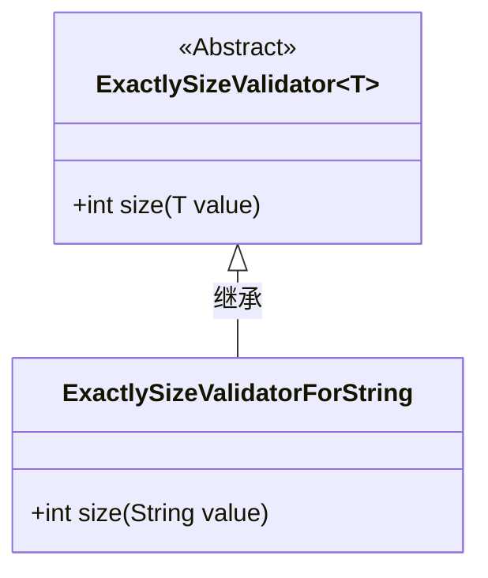
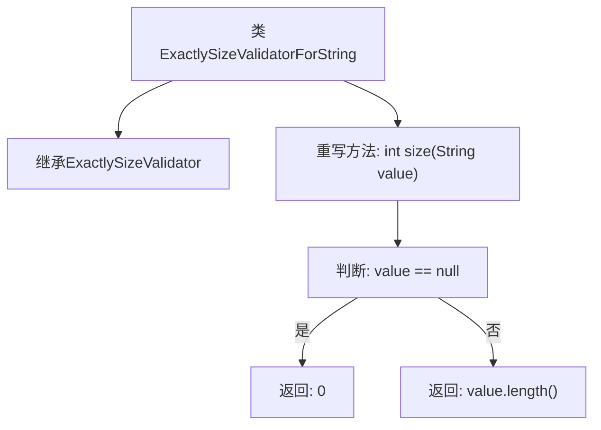

# 基础信息

|      |      |
|------|------|
| 名称 | ExactlySizeValidatorForString |
| 编码语言 | .java |
| 代码路径 | Signal-Server/service/src/main/java/org/whispersystems/textsecuregcm/util/ExactlySizeValidatorForString.java |
| 包名 | org.whispersystems.textsecuregcm.util |
| 依赖项 | [] |
| 概述说明 | ExactlySizeValidatorForString继承ExactlySizeValidator，重写size方法以返回字符串长度。 |

# 说明

ExactlySizeValidatorForString类继承自ExactlySizeValidator，并重写了size方法。该方法的主要功能是返回字符串的长度。通过继承和重写，该类专门用于验证字符串的精确长度，确保字符串符合特定的长度要求。这一设计使得字符串长度的验证更加灵活和精确，适用于需要严格控制字符串长度的场景。

# 类列表 Class Summary

| 名称   | 类型  | 说明 |
|-------|------|-------------|
| ExactlySizeValidatorForString | class | ExactlySizeValidatorForString类继承ExactlySizeValidator，重写size方法，返回字符串长度。 |

## 类 ExactlySizeValidatorForString

|      |      |
|------|------|
| 访问范围 | public |
| 类型 | class |
| 名称 | ExactlySizeValidatorForString |
| 说明 | ExactlySizeValidatorForString类继承ExactlySizeValidator，重写size方法，返回字符串长度。 |

### UML类图

这段代码定义了一个泛型抽象类 `ExactlySizeValidator<T>`，它包含一个抽象方法 `size`，用于计算传入值的尺寸。`ExactlySizeValidatorForString` 类继承自 `ExactlySizeValidator<String>`，并实现了 `size` 方法，该方法计算字符串的长度，如果字符串为 `null`，则返回 0。类图展示了 `ExactlySizeValidatorForString` 继承自 `ExactlySizeValidator` 的关系，并具体化了泛型参数为 `String`。

### 内部方法调用关系图

这段代码定义了一个名为`ExactlySizeValidatorForString`的类，继承自`ExactlySizeValidator<String>`。该类重写了`size`方法，用于计算字符串的长度。如果传入的字符串为`null`，则返回`0`，否则返回字符串的长度。流程图展示了类的继承关系以及`size`方法内部的逻辑判断和返回值。

### 字段列表 Field List

| 名称  | 类型  | 说明 |
|-------|-------|------|

### 方法列表 Method List

| 名称  | 类型  | 说明 |
|-------|-------|------|
| size | int | 重写size方法，返回字符串长度，若为空则返回0。 |

