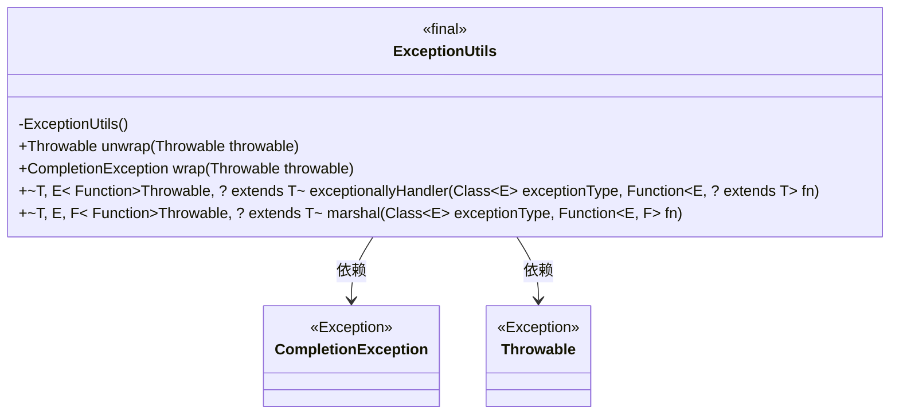
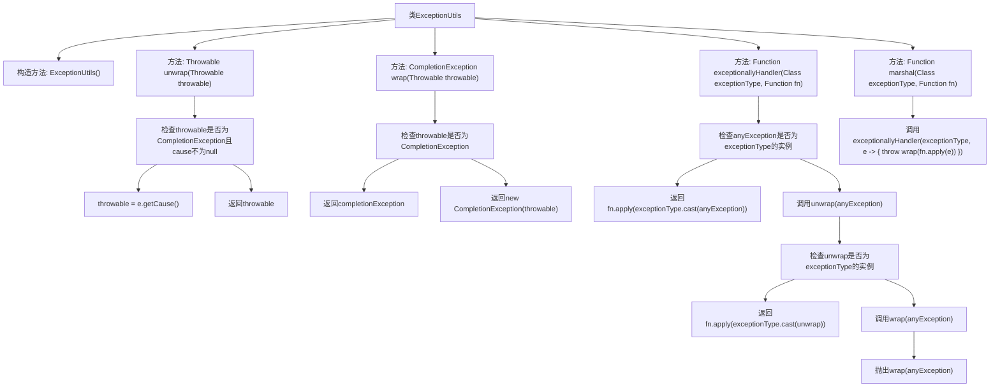

# 基础信息

|      |      |
|------|------|
| 名称 | ExceptionUtils |
| 编码语言 | .java |
| 代码路径 | Signal-Server/service/src/main/java/org/whispersystems/textsecuregcm/util/ExceptionUtils.java |
| 包名 | org.whispersystems.textsecuregcm.util |
| 依赖项 | ['java.util.concurrent.CompletionException', 'java.util.function.Function'] |
| 概述说明 | ExceptionUtils类提供处理CompletionException的工具方法，包括解包和包装。 |

# 说明

ExceptionUtils类是一个专门用于处理CompletionException的工具类，提供了多种方法来解包、包装和处理CompletionException。通过这些方法，开发者可以更高效地管理和处理异步操作中可能出现的异常情况，确保代码的健壮性和可维护性。该类简化了异常处理流程，帮助开发者快速定位和解决异步任务中的问题。

# 类列表 Class Summary

| 名称   | 类型  | 说明 |
|-------|------|-------------|
| ExceptionUtils | class | ExceptionUtils类提供解包、包装和处理CompletionException的工具方法。 |

## 类 ExceptionUtils

|      |      |
|------|------|
| 访问范围 | public final |
| 类型 | class |
| 名称 | ExceptionUtils |
| 说明 | ExceptionUtils类提供解包、包装和处理CompletionException的工具方法。 |

### UML类图

### 描述
`ExceptionUtils` 是一个工具类，提供了处理异常的方法。它包含四个静态方法：`unwrap` 用于递归解包 `CompletionException` 的因果链，直到找到第一个非 `CompletionException` 的异常；`wrap` 用于将异常包装为 `CompletionException`；`exceptionallyHandler` 用于创建处理特定类型异常的处理器；`marshal` 用于将一种类型的异常转换为另一种类型。这些方法在处理异步编程中的异常时非常有用。

### 内部方法调用关系图

**描述：**
该流程图展示了`ExceptionUtils`类的结构及其方法调用关系。`ExceptionUtils`类包含四个主要方法：`unwrap`用于递归解包`CompletionException`的因果链，`wrap`用于将异常包装为`CompletionException`，`exceptionallyHandler`用于处理特定类型的异常，`marshal`用于将一种异常类型转换为另一种类型。每个方法的逻辑流程通过条件判断和函数调用逐步展开，确保异常处理的准确性和灵活性。

### 字段列表 Field List

| 名称  | 类型  | 说明 |
|-------|-------|------|

### 方法列表 Method List

| 名称  | 类型  | 说明 |
|-------|-------|------|
| unwrap | Throwable | 解包CompletionException异常，返回原始异常原因。 |
| wrap | CompletionException | 静态方法wrap将异常包装为CompletionException，若已为则直接返回。 |
| exceptionallyHandler | Function<Throwable, ? extends T> | 静态方法，处理特定异常并返回结果，否则重新抛出异常。 |
| marshal | Function<Throwable, ? extends T> | 静态方法marshal将异常类型E转换为F，并返回处理函数。 |

