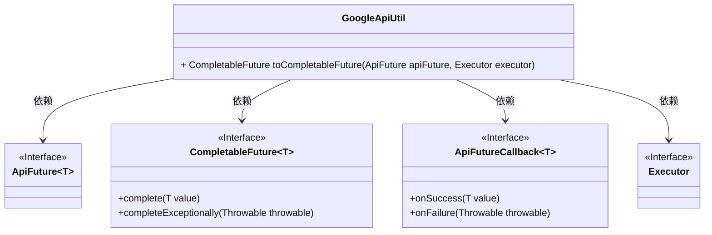
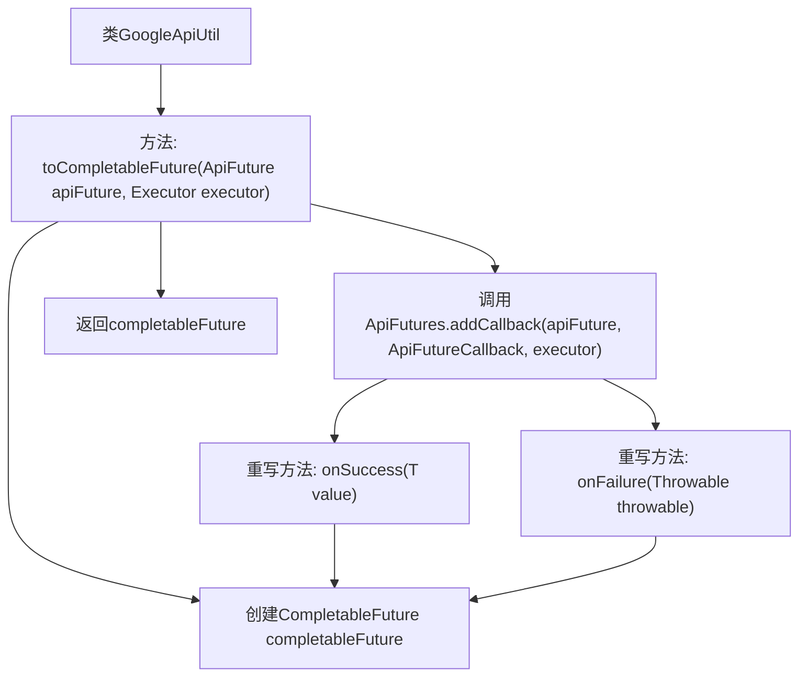

# 基础信息

|      |      |
|------|------|
| 名称 | GoogleApiUtil |
| 编码语言 | .java |
| 代码路径 | Signal-Server/service/src/main/java/org/whispersystems/textsecuregcm/util/GoogleApiUtil.java |
| 包名 | org.whispersystems.textsecuregcm.util |
| 依赖项 | ['com.google.api.core.ApiFuture', 'com.google.api.core.ApiFutureCallback', 'com.google.api.core.ApiFutures', 'java.util.concurrent.CompletableFuture', 'java.util.concurrent.Executor'] |
| 概述说明 | GoogleApiUtil类实现ApiFuture到CompletableFuture的转换，支持成功和异常处理。 |

# 说明

GoogleApiUtil类提供了将ApiFuture转换为CompletableFuture的功能，支持在操作成功或发生异常时的处理。这一转换使得开发者能够更灵活地处理异步操作的结果，并利用CompletableFuture的丰富特性进行进一步的操作和错误管理。

# 类列表 Class Summary

| 名称   | 类型  | 说明 |
|-------|------|-------------|
| GoogleApiUtil | class | GoogleApiUtil类将ApiFuture转换为CompletableFuture，支持成功和异常处理。 |

## 类 GoogleApiUtil

|      |      |
|------|------|
| 访问范围 | public |
| 类型 | class |
| 名称 | GoogleApiUtil |
| 说明 | GoogleApiUtil类将ApiFuture转换为CompletableFuture，支持成功和异常处理。 |

### UML类图

这段代码定义了一个工具类 `GoogleApiUtil`，它包含一个泛型方法 `toCompletableFuture`，用于将 `ApiFuture` 转换为 `CompletableFuture`。该方法通过 `ApiFutures.addCallback` 方法注册回调，当 `ApiFuture` 成功或失败时，分别调用 `CompletableFuture` 的 `complete` 或 `completeExceptionally` 方法。`ApiFuture` 和 `CompletableFuture` 都是泛型接口，`ApiFutureCallback` 是回调接口，`Executor` 是执行器接口。

### 内部方法调用关系图

这段代码定义了一个工具类 `GoogleApiUtil`，其中包含一个静态方法 `toCompletableFuture`，用于将 `ApiFuture` 转换为 `CompletableFuture`。该方法通过调用 `ApiFutures.addCallback` 来注册回调函数，分别在 `ApiFuture` 成功或失败时调用 `onSuccess` 或 `onFailure` 方法，最终返回 `CompletableFuture`。流程图展示了方法的主要步骤和回调函数的执行路径。

### 字段列表 Field List

| 名称  | 类型  | 说明 |
|-------|-------|------|

### 方法列表 Method List

| 名称  | 类型  | 说明 |
|-------|-------|------|
| toCompletableFuture | CompletableFuture<T> | 将ApiFuture转换为CompletableFuture，支持成功和异常处理。 |

