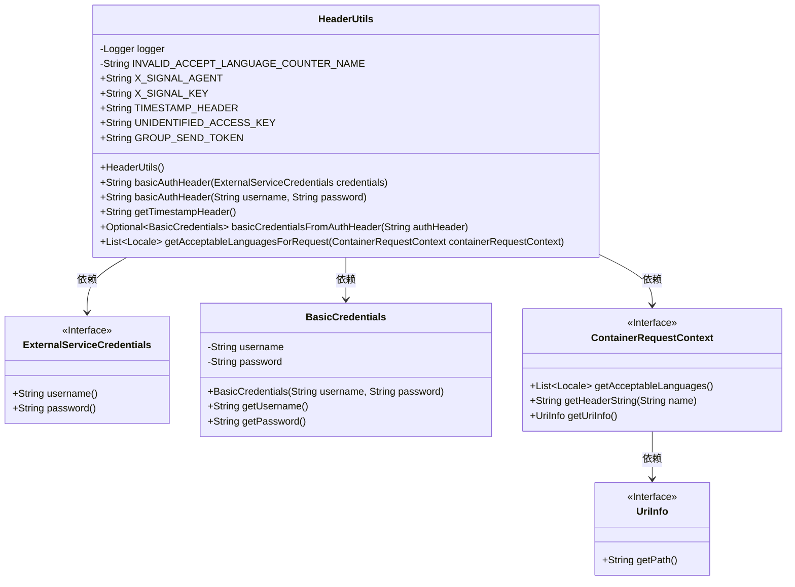
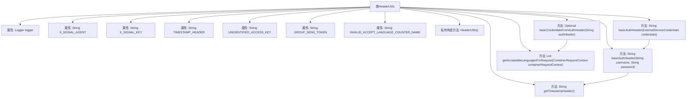

# 基础信息

|      |      |
|------|------|
| 名称 | HeaderUtils |
| 编码语言 | .java |
| 代码路径 | Signal-Server/service/src/main/java/org/whispersystems/textsecuregcm/util/HeaderUtils.java |
| 包名 | org.whispersystems.textsecuregcm.util |
| 依赖项 | ['java.util.Objects.requireNonNull', 'com.google.common.net.HttpHeaders', 'io.dropwizard.auth.basic.BasicCredentials', 'io.micrometer.core.instrument.Metrics', 'io.micrometer.core.instrument.Tag', 'io.micrometer.core.instrument.Tags', 'jakarta.ws.rs.ProcessingException', 'jakarta.ws.rs.container.ContainerRequestContext', 'java.nio.charset.StandardCharsets', 'java.util.Base64', 'java.util.List', 'java.util.Locale', 'java.util.Optional', 'javax.annotation.Nonnull', 'org.slf4j.Logger', 'org.slf4j.LoggerFactory', 'org.whispersystems.textsecuregcm.auth.ExternalServiceCredentials', 'org.whispersystems.textsecuregcm.metrics.MetricsUtil', 'org.whispersystems.textsecuregcm.metrics.UserAgentTagUtil'] |
| 概述说明 | HeaderUtils类提供HTTP头处理工具，支持认证、时间戳和语言解析。 |

# 说明

HeaderUtils类是一个专门用于处理HTTP头的工具类，提供了多种实用功能。它支持基本认证处理，能够生成时间戳，并具备语言解析能力。这些功能帮助开发者高效地管理和操作HTTP请求与响应中的头信息，确保通信的准确性和安全性。

# 类列表 Class Summary

| 名称   | 类型  | 说明 |
|-------|------|-------------|
| HeaderUtils | class | HeaderUtils类提供HTTP头处理工具，包括基本认证、时间戳生成、语言解析等功能。 |

## 类 HeaderUtils

|      |      |
|------|------|
| 访问范围 | public final |
| 类型 | class |
| 名称 | HeaderUtils |
| 说明 | HeaderUtils类提供HTTP头处理工具，包括基本认证、时间戳生成、语言解析等功能。 |

### UML类图

这段代码定义了一个工具类 `HeaderUtils`，主要用于处理HTTP请求头相关的操作。它提供了生成Basic认证头、获取时间戳头、解析Basic认证头、以及获取请求的可接受语言列表等功能。`HeaderUtils` 依赖于 `ExternalServiceCredentials` 接口来获取用户名和密码，依赖于 `BasicCredentials` 类来封装解析后的Basic认证信息，还依赖于 `ContainerRequestContext` 接口来获取请求上下文信息，如可接受语言和URI信息。

### 内部方法调用关系图

**描述：**
`HeaderUtils` 是一个工具类，主要用于处理HTTP请求头相关的操作。它包含多个静态常量和静态方法，用于生成和解析基本的认证头、获取时间戳头、解析授权头以及获取请求的可接受语言列表。类中的方法通过调用Java标准库和其他工具类来实现功能，确保在处理HTTP请求头时的安全性和准确性。

### 字段列表 Field List

| 名称  | 类型  | 说明 |
|-------|-------|------|
| logger = LoggerFactory.getLogger(HeaderUtils.class) | Logger | HeaderUtils类中定义了一个静态的Logger实例。 |
| GROUP_SEND_TOKEN = "Group-Send-Token" | String | 定义常量GROUP_SEND_TOKEN，值为"Group-Send-Token"。 |
| X_SIGNAL_KEY = "X-Signal-Key" | String | 定义常量X_SIGNAL_KEY，值为"X-Signal-Key"。 |
| UNIDENTIFIED_ACCESS_KEY = "Unidentified-Access-Key" | String | 定义常量字符串UNIDENTIFIED_ACCESS_KEY为"Unidentified-Access-Key"。 |
| INVALID_ACCEPT_LANGUAGE_COUNTER_NAME = MetricsUtil.name(HeaderUtils.class,      "invalidAcceptLanguage") | String | 定义常量记录无效Accept-Language头计数。 |
| TIMESTAMP_HEADER = "X-Signal-Timestamp" | String | 定义常量字符串TIMESTAMP_HEADER为"X-Signal-Timestamp"。 |
| X_SIGNAL_AGENT = "X-Signal-Agent" | String | X_SIGNAL_AGENT是静态常量字符串，值为"X-Signal-Agent"。 |

### 方法列表 Method List

| 名称  | 类型  | 说明 |
|-------|-------|------|
| basicAuthHeader | String | 生成Basic认证头信息，包含用户名和密码的Base64编码。 |
| basicAuthHeader | String | 生成外部服务认证头信息的静态方法。 |
| getTimestampHeader | String | 获取当前时间戳并返回带前缀的字符串。 |
| basicCredentialsFromAuthHeader | Optional<BasicCredentials> | 从认证头提取Basic凭证，验证并解码后返回用户名和密码。 |
| getAcceptableLanguagesForRequest | List<Locale> | 获取请求可接受语言列表，失败时记录日志并返回空列表。 |

