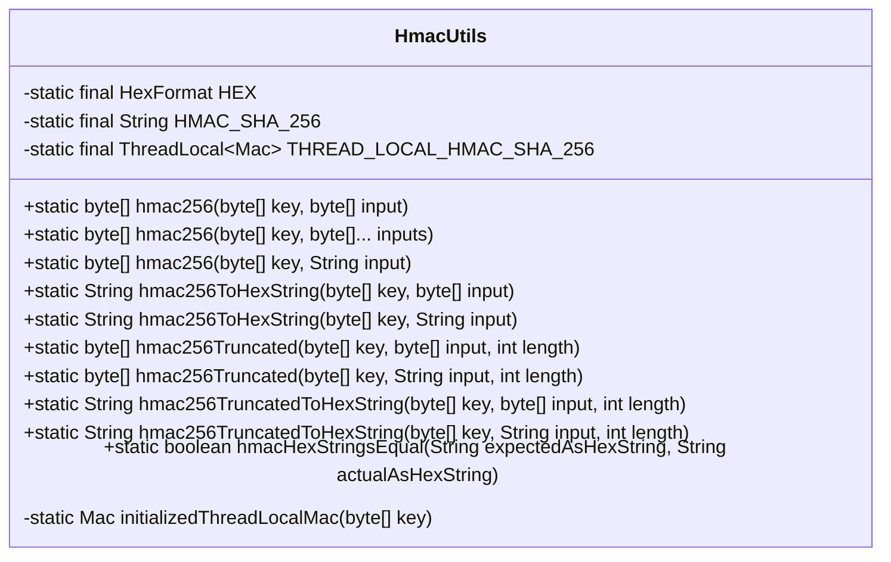
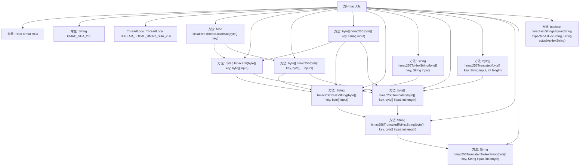

# 基础信息

|      |      |
|------|------|
| 名称 | HmacUtils |
| 编码语言 | .java |
| 代码路径 | Signal-Server/service/src/main/java/org/whispersystems/textsecuregcm/util/HmacUtils.java |
| 包名 | org.whispersystems.textsecuregcm.util |
| 依赖项 | ['java.nio.charset.StandardCharsets', 'java.security.InvalidKeyException', 'java.security.MessageDigest', 'java.security.NoSuchAlgorithmException', 'java.util.HexFormat', 'javax.crypto.Mac', 'javax.crypto.spec.SecretKeySpec'] |
| 概述说明 | HmacUtils类实现HmacSHA256加密，支持多种输入和输出格式，包含结果比较功能。 |

# 说明

HmacUtils类提供了HmacSHA256加密功能，支持输入字节数组和字符串，能够生成加密结果、截断结果以及十六进制字符串，并且支持对十六进制字符串进行比较。

# 类列表 Class Summary

| 名称   | 类型  | 说明 |
|-------|------|-------------|
| HmacUtils | class | HmacUtils类提供HmacSHA256加密功能，支持字节数组和字符串输入，生成加密结果、截断结果及十六进制字符串，并支持比较十六进制字符串。 |

## 类 HmacUtils

|      |      |
|------|------|
| 访问范围 | public final |
| 类型 | class |
| 名称 | HmacUtils |
| 说明 | HmacUtils类提供HmacSHA256加密功能，支持字节数组和字符串输入，生成加密结果、截断结果及十六进制字符串，并支持比较十六进制字符串。 |

### UML类图

**描述**：`HmacUtils` 类是一个工具类，提供了多种静态方法用于生成和验证 HMAC-SHA256 哈希值。它使用了 `ThreadLocal` 来确保线程安全，并通过 `initializedThreadLocalMac` 方法初始化 `Mac` 实例。该类支持对字节数组和字符串进行哈希计算，并提供了将结果转换为十六进制字符串、截断哈希值以及比较两个十六进制字符串的功能。

### 内部方法调用关系图

这段代码定义了一个名为`HmacUtils`的工具类，主要用于生成和验证HMAC-SHA256哈希值。它包含多个方法，支持对字节数组和字符串进行哈希计算，并将结果转换为十六进制字符串或截断后的字节数组。类中使用`ThreadLocal`来保证线程安全，并通过`HexFormat`进行十六进制编码和解码。代码结构清晰，功能丰富，适用于多种哈希计算场景。

### 字段列表 Field List

| 名称  | 类型  | 说明 |
|-------|-------|------|
| THREAD_LOCAL_HMAC_SHA_256 = ThreadLocal.withInitial(() -> {    try {      return Mac.getInstance(HMAC_SHA_256);    } catch (NoSuchAlgorithmException e) {      throw new RuntimeException(e);    }  }) | ThreadLocal<Mac> | 使用ThreadLocal初始化HMAC_SHA_256加密实例。 |
| HMAC_SHA_256 = "HmacSHA256" | String | 定义常量HMAC_SHA_256为"HmacSHA256"。 |
| HEX = HexFormat.of() | HexFormat | 定义静态常量HEX，使用HexFormat.of()初始化。 |

### 方法列表 Method List

| 名称  | 类型  | 说明 |
|-------|-------|------|
| hmacHexStringsEqual | boolean | 比较两个十六进制字符串的HMAC值是否相等。 |
| hmac256 | byte[] | 静态方法hmac256使用密钥和输入生成HMAC-SHA256摘要。 |
| hmac256ToHexString | String | 使用HMAC-SHA256算法将密钥和输入转换为十六进制字符串。 |
| hmac256TruncatedToHexString | String | HMAC256算法生成并截取指定长度的十六进制字符串。 |
| hmac256Truncated | byte[] | HMAC256截断方法，输入密钥、字符串及长度，返回截断后的字节数组。 |
| hmac256ToHexString | String | 使用HMAC-SHA256算法将输入字符串转换为十六进制字符串。 |
| initializedThreadLocalMac | Mac | 静态方法初始化线程本地HMAC-SHA256，使用指定密钥并返回Mac实例。 |
| hmac256Truncated | byte[] | HMAC256截断方法：使用密钥和输入生成HMAC256，并截取指定长度。 |
| hmac256 | byte[] | 使用HMAC-SHA256算法对输入数据进行加密，返回加密结果。 |
| hmac256 | byte[] | 静态方法hmac256使用密钥和输入生成HMAC-SHA256哈希值。 |
| hmac256TruncatedToHexString | String | 静态方法将HMAC-SHA256哈希结果截取并转为十六进制字符串。 |

