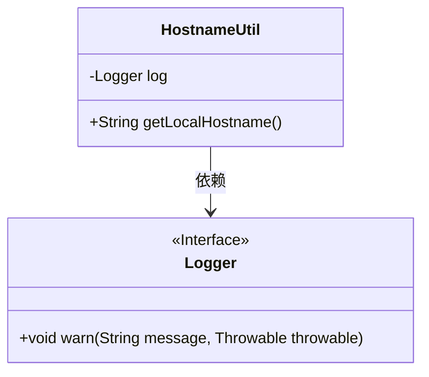
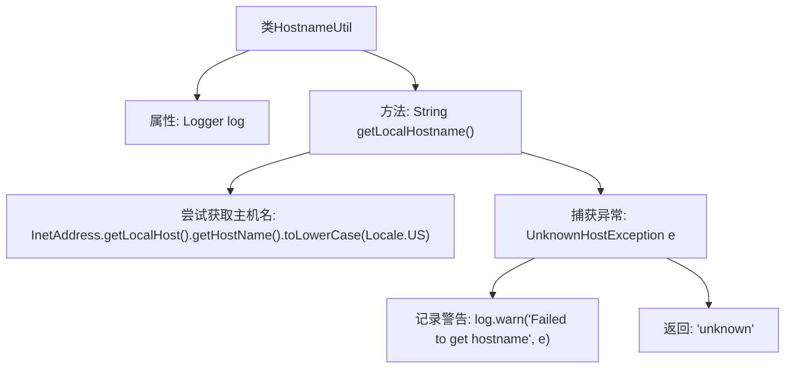

# 基础信息

|      |      |
|------|------|
| 名称 | HostnameUtil |
| 编码语言 | .java |
| 代码路径 | Signal-Server/service/src/main/java/org/whispersystems/textsecuregcm/util/HostnameUtil.java |
| 包名 | org.whispersystems.textsecuregcm.util |
| 依赖项 | ['org.slf4j.Logger', 'org.slf4j.LoggerFactory', 'java.net.InetAddress', 'java.net.UnknownHostException', 'java.util.Locale'] |
| 概述说明 | HostnameUtil类用getLocalHostname获取主机名，失败返回unknown。 |

# 说明

HostnameUtil类提供了一个名为getLocalHostname的方法，用于获取本地主机的主机名。如果该方法在尝试获取主机名时遇到任何失败或错误情况，它将返回字符串“unknown”作为默认值。这种方法设计确保了即使在无法获取主机名的情况下，程序也能继续运行，并提供一个明确的默认值，避免因主机名获取失败而导致的问题。

# 类列表 Class Summary

| 名称   | 类型  | 说明 |
|-------|------|-------------|
| HostnameUtil | class | HostnameUtil类通过getLocalHostname方法获取本地主机名，失败时返回unknown。 |

## 类 HostnameUtil

|      |      |
|------|------|
| 访问范围 | public |
| 类型 | class |
| 名称 | HostnameUtil |
| 说明 | HostnameUtil类通过getLocalHostname方法获取本地主机名，失败时返回unknown。 |

### UML类图

**描述：**  
`HostnameUtil` 类用于获取本地主机名，并通过 `Logger` 接口记录日志。类中包含一个私有静态 `Logger` 实例，用于在获取主机名失败时记录警告信息。`getLocalHostname` 方法尝试获取本地主机名，若失败则返回 "unknown" 并记录警告日志。`Logger` 是一个接口，定义了 `warn` 方法，用于记录警告信息。`HostnameUtil` 依赖于 `Logger` 接口来实现日志记录功能。

### 内部方法调用关系图

这段代码定义了一个名为 `HostnameUtil` 的类，其中包含一个静态方法 `getLocalHostname()`，用于获取本地主机名。方法首先尝试通过 `InetAddress.getLocalHost().getHostName()` 获取主机名，并将其转换为小写。如果获取过程中发生 `UnknownHostException` 异常，则记录警告日志并返回字符串 `"unknown"`。流程图展示了类结构、方法调用以及异常处理流程。

### 字段列表 Field List

| 名称  | 类型  | 说明 |
|-------|-------|------|
| log = LoggerFactory.getLogger(HostnameUtil.class) | Logger | HostnameUtil类中定义了一个静态的Logger对象log。 |

### 方法列表 Method List

| 名称  | 类型  | 说明 |
|-------|-------|------|
| getLocalHostname | String | 获取本地主机名，失败返回"unknown"。 |

