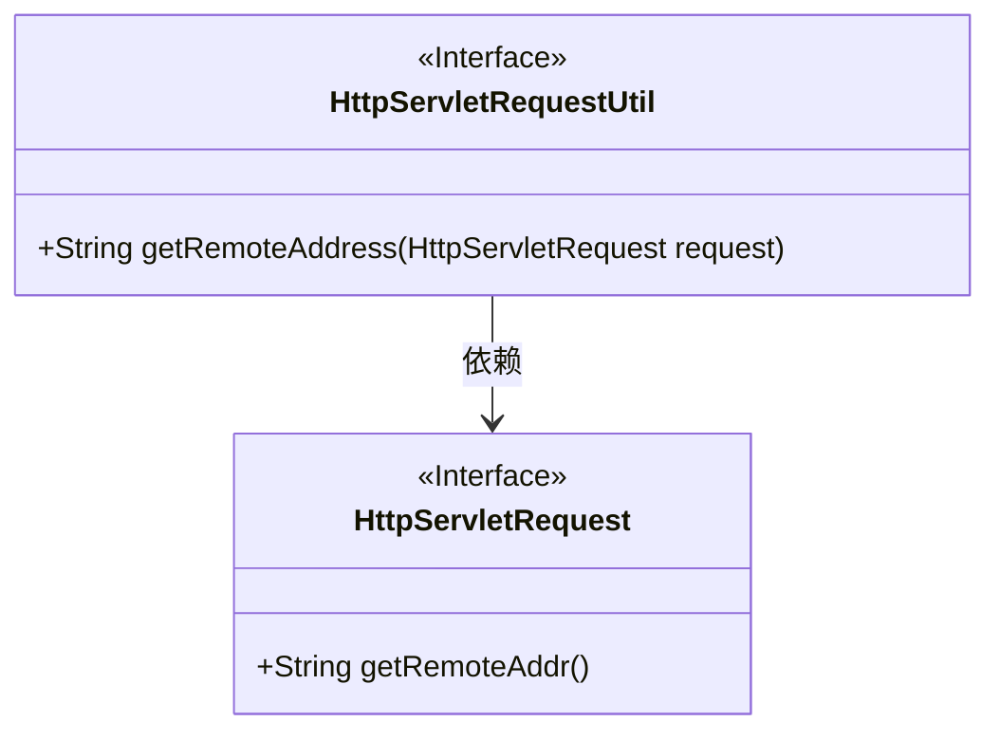
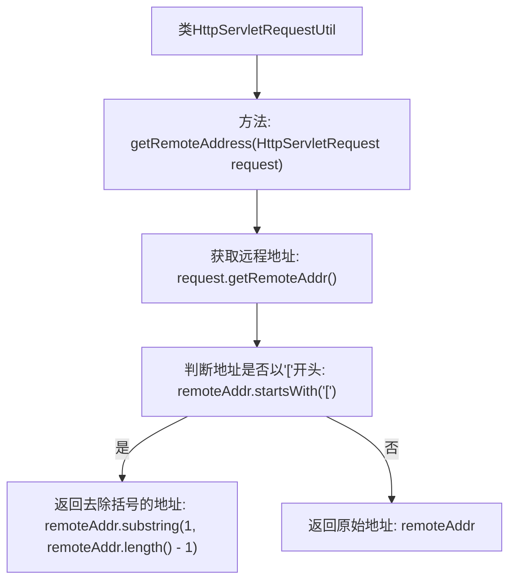

# 基础信息

|      |      |
|------|------|
| 名称 | HttpServletRequestUtil |
| 编码语言 | .java |
| 代码路径 | Signal-Server/service/src/main/java/org/whispersystems/textsecuregcm/util/HttpServletRequestUtil.java |
| 包名 | org.whispersystems.textsecuregcm.util |
| 依赖项 | ['jakarta.servlet.http.HttpServletRequest'] |
| 概述说明 | HttpServletRequestUtil类可获取并处理IPv6格式的远程地址。 |

# 说明

HttpServletRequestUtil类包含一个用于获取远程地址的方法，该方法能够处理IPv6地址格式，确保在各种网络环境下都能准确获取客户端的IP地址。

# 类列表 Class Summary

| 名称   | 类型  | 说明 |
|-------|------|-------------|
| HttpServletRequestUtil | class | HttpServletRequestUtil类提供获取远程地址方法，处理IPv6地址格式。 |

## 类 HttpServletRequestUtil

|      |      |
|------|------|
| 访问范围 | public |
| 类型 | class |
| 名称 | HttpServletRequestUtil |
| 说明 | HttpServletRequestUtil类提供获取远程地址方法，处理IPv6地址格式。 |

### UML类图

这段代码定义了一个工具类 `HttpServletRequestUtil`，其中包含一个静态方法 `getRemoteAddress`，用于从 `HttpServletRequest` 对象中获取远程地址。该方法处理了IPv6地址的特殊情况，即移除方括号。`HttpServletRequest` 是一个接口，提供了 `getRemoteAddr` 方法来获取远程地址。`HttpServletRequestUtil` 依赖于 `HttpServletRequest` 接口来实现其功能。

### 内部方法调用关系图

这段代码定义了一个名为`HttpServletRequestUtil`的工具类，其中包含一个静态方法`getRemoteAddress`，用于获取HTTP请求的远程地址。该方法首先通过`request.getRemoteAddr()`获取远程地址，然后判断该地址是否以'['开头。如果是，则去除地址两端的括号并返回；否则直接返回原始地址。该流程图清晰地展示了方法的执行流程和逻辑判断。

### 字段列表 Field List

| 名称  | 类型  | 说明 |
|-------|-------|------|

### 方法列表 Method List

| 名称  | 类型  | 说明 |
|-------|-------|------|
| getRemoteAddress | String | 获取HTTP请求的远程地址，处理IPv6格式。 |

