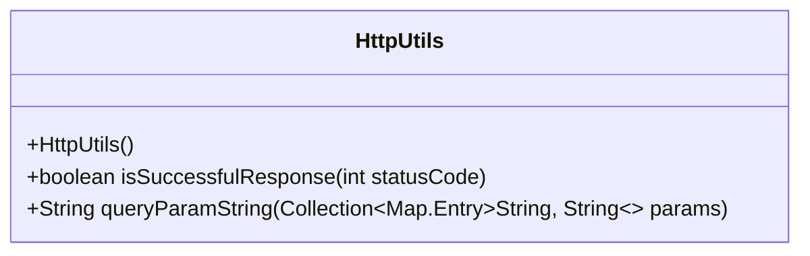
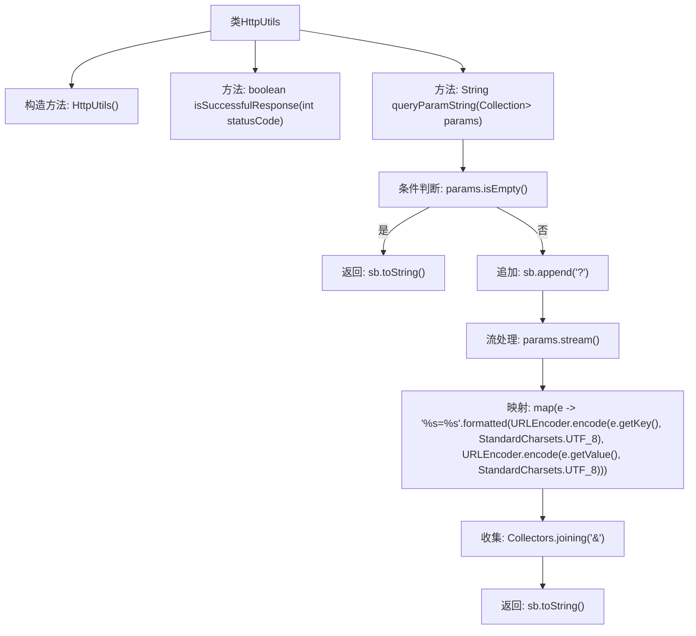

# 基础信息

|      |      |
|------|------|
| 名称 | HttpUtils |
| 编码语言 | .java |
| 代码路径 | Signal-Server/service/src/main/java/org/whispersystems/textsecuregcm/util/HttpUtils.java |
| 包名 | org.whispersystems.textsecuregcm.util |
| 依赖项 | ['java.net.URLEncoder', 'java.nio.charset.StandardCharsets', 'java.util.Collection', 'java.util.Map', 'java.util.stream.Collectors'] |
| 概述说明 | HttpUtils类具备HTTP响应成功判断和查询参数字符串生成功能。 |

# 说明

HttpUtils类主要提供两个核心功能：一是判断HTTP响应是否成功，二是生成查询参数字符串。该工具类简化了HTTP请求处理流程，帮助开发者快速验证响应状态并构建查询参数，提升开发效率和代码可维护性。

# 类列表 Class Summary

| 名称   | 类型  | 说明 |
|-------|------|-------------|
| HttpUtils | class | HttpUtils类提供HTTP响应成功判断和查询参数字符串生成功能。 |

## 类 HttpUtils

|      |      |
|------|------|
| 访问范围 | public final |
| 类型 | class |
| 名称 | HttpUtils |
| 说明 | HttpUtils类提供HTTP响应成功判断和查询参数字符串生成功能。 |

### UML类图

类图描述：`HttpUtils` 是一个工具类，提供了两个静态方法。`isSuccessfulResponse` 方法用于判断给定的 HTTP 状态码是否表示成功响应（状态码在 200 到 299 之间）。`queryParamString` 方法将一组键值对转换为 URL 查询参数字符串，使用 UTF-8 编码对键和值进行 URL 编码，并用 `&` 连接多个参数。该类是 `final` 的，并且构造函数是私有的，表示它不能被继承或实例化。

### 内部方法调用关系图

这段代码定义了一个名为`HttpUtils`的工具类，包含两个静态方法。`isSuccessfulResponse`方法用于判断给定的HTTP状态码是否表示成功响应（状态码在200到299之间）。`queryParamString`方法用于将一组键值对转换为URL查询参数字符串，格式为`?key1=value1&key2=value2`。代码通过流处理和URL编码确保生成的查询字符串符合URL规范。

### 字段列表 Field List

| 名称  | 类型  | 说明 |
|-------|-------|------|

### 方法列表 Method List

| 名称  | 类型  | 说明 |
|-------|-------|------|
| queryParamString | String | 将键值对集合转换为URL查询参数字符串。 |
| isSuccessfulResponse | boolean | 判断状态码是否在200到299之间，表示成功响应。 |

