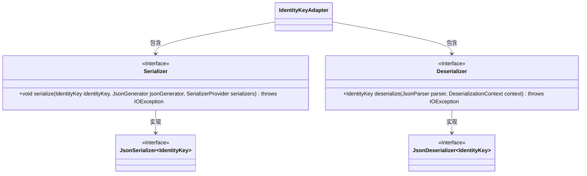
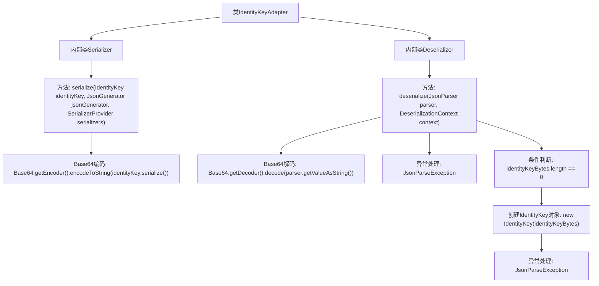

# 基础信息

|      |      |
|------|------|
| 名称 | IdentityKeyAdapter |
| 编码语言 | .java |
| 代码路径 | Signal-Server/service/src/main/java/org/whispersystems/textsecuregcm/util/IdentityKeyAdapter.java |
| 包名 | org.whispersystems.textsecuregcm.util |
| 依赖项 | ['com.fasterxml.jackson.core.JsonGenerator', 'com.fasterxml.jackson.core.JsonParseException', 'com.fasterxml.jackson.core.JsonParser', 'com.fasterxml.jackson.databind.DeserializationContext', 'com.fasterxml.jackson.databind.JsonDeserializer', 'com.fasterxml.jackson.databind.JsonSerializer', 'com.fasterxml.jackson.databind.SerializerProvider', 'java.io.IOException', 'java.util.Base64', 'org.signal.libsignal.protocol.IdentityKey', 'org.signal.libsignal.protocol.InvalidKeyException'] |
| 概述说明 | IdentityKeyAdapter实现序列化和反序列化，采用Base64编码。 |

# 说明

IdentityKeyAdapter负责实现IdentityKey的序列化和反序列化功能，采用Base64编码方式进行处理。该适配器确保IdentityKey对象能够以字符串形式进行存储和传输，同时通过反序列化恢复为原始对象，便于在系统中使用和操作。

# 类列表 Class Summary

| 名称   | 类型  | 说明 |
|-------|------|-------------|
| IdentityKeyAdapter | class | IdentityKeyAdapter实现IdentityKey的序列化和反序列化，使用Base64编码。 |

## 类 IdentityKeyAdapter

|      |      |
|------|------|
| 访问范围 | public |
| 类型 | class |
| 名称 | IdentityKeyAdapter |
| 说明 | IdentityKeyAdapter实现IdentityKey的序列化和反序列化，使用Base64编码。 |

### UML类图

这段代码定义了一个 `IdentityKeyAdapter` 类，其中包含两个内部静态类 `Serializer` 和 `Deserializer`。`Serializer` 类实现了 `JsonSerializer<IdentityKey>` 接口，用于将 `IdentityKey` 对象序列化为 Base64 编码的字符串。`Deserializer` 类实现了 `JsonDeserializer<IdentityKey>` 接口，用于将 Base64 编码的字符串反序列化为 `IdentityKey` 对象。这两个类分别处理 `IdentityKey` 对象的序列化和反序列化逻辑，并在过程中处理可能的异常情况。

### 内部方法调用关系图

这段代码定义了一个名为 `IdentityKeyAdapter` 的类，包含两个内部类 `Serializer` 和 `Deserializer`，分别用于序列化和反序列化 `IdentityKey` 对象。`Serializer` 类将 `IdentityKey` 对象序列化为 Base64 编码的字符串，而 `Deserializer` 类则从 Base64 编码的字符串中反序列化出 `IdentityKey` 对象，并处理可能的异常和空值情况。

### 字段列表 Field List

| 名称  | 类型  | 说明 |
|-------|-------|------|

### 方法列表 Method List

| 名称  | 类型  | 说明 |
|-------|-------|------|

