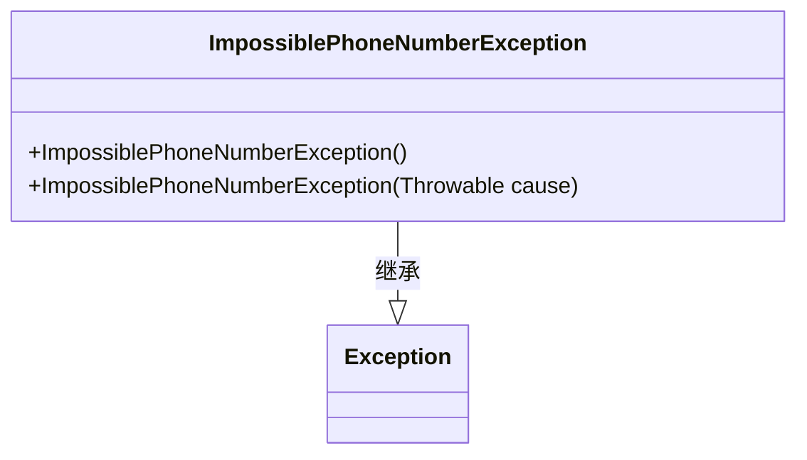
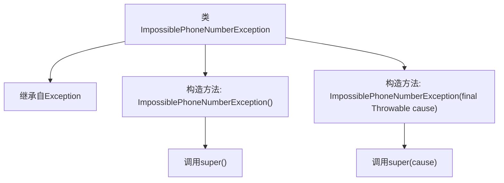

# 基础信息

|      |      |
|------|------|
| 名称 | ImpossiblePhoneNumberException |
| 编码语言 | .java |
| 代码路径 | Signal-Server/service/src/main/java/org/whispersystems/textsecuregcm/util/ImpossiblePhoneNumberException.java |
| 包名 | org.whispersystems.textsecuregcm.util |
| 依赖项 | [] |
| 概述说明 | 自定义异常类处理无效电话号码。 |

# 说明

自定义异常类用于处理无效电话号码的情况。该类专门设计来捕获和识别电话号码格式或内容不符合预期的情况，确保在处理电话号码时能够及时发现并处理错误。通过使用该异常类，开发者可以在程序中明确标识和响应无效电话号码的问题，从而提高代码的健壮性和可维护性。该异常类的实现有助于在电话号码验证过程中提供更清晰的错误信息，便于调试和用户反馈。

# 类列表 Class Summary

| 名称   | 类型  | 说明 |
|-------|------|-------------|
| ImpossiblePhoneNumberException | class | 自定义异常类，用于处理无效电话号码。 |

## 类 ImpossiblePhoneNumberException

|      |      |
|------|------|
| 访问范围 | public |
| 类型 | class |
| 名称 | ImpossiblePhoneNumberException |
| 说明 | 自定义异常类，用于处理无效电话号码。 |

### UML类图

**描述**：  
`ImpossiblePhoneNumberException` 是一个自定义异常类，继承自 `Exception`。它提供了两个构造函数：一个无参构造函数，用于创建一个不带原因的异常实例；另一个构造函数接受一个 `Throwable` 类型的参数，用于创建一个带有原因的异常实例。该类用于处理电话号码无效或不可能的情况，适合在需要抛出特定异常时使用。

### 内部方法调用关系图

这段代码定义了一个名为 `ImpossiblePhoneNumberException` 的异常类，该类继承自 `Exception`。它包含两个构造方法：一个无参构造方法，调用父类的 `super()` 方法；另一个构造方法接受一个 `Throwable` 类型的参数，并调用父类的 `super(cause)` 方法。这个异常类用于处理电话号码无效或不可能的异常情况。

### 字段列表 Field List

| 名称  | 类型  | 说明 |
|-------|-------|------|

### 方法列表 Method List

| 名称  | 类型  | 说明 |
|-------|-------|------|

