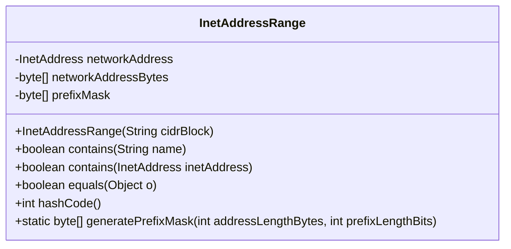
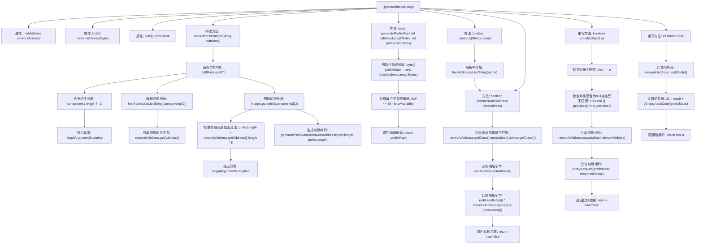

# 基础信息

|      |      |
|------|------|
| 名称 | InetAddressRange |
| 编码语言 | .java |
| 代码路径 | Signal-Server/service/src/main/java/org/whispersystems/textsecuregcm/util/InetAddressRange.java |
| 包名 | org.whispersystems.textsecuregcm.util |
| 依赖项 | ['com.google.common.annotations.VisibleForTesting', 'com.google.common.net.InetAddresses', 'java.net.InetAddress', 'java.util.Arrays'] |
| 概述说明 | InetAddressRange类处理CIDR块，验证地址格式，生成掩码，检查包含关系，实现equals和hashCode方法。 |

# 说明

InetAddressRange类主要用于处理CIDR块，具备验证IP地址格式的功能，能够生成相应的子网掩码，并检查地址之间的包含关系。此外，该类还实现了equals和hashCode方法，以确保对象在比较和哈希操作中的正确性和一致性。这些功能使得该类在处理网络地址范围时非常实用和高效。

# 类列表 Class Summary

| 名称   | 类型  | 说明 |
|-------|------|-------------|
| InetAddressRange | class | InetAddressRange类处理CIDR块，验证地址格式，生成掩码，检查地址包含关系，实现equals和hashCode方法。 |

## 类 InetAddressRange

|      |      |
|------|------|
| 访问范围 | public |
| 类型 | class |
| 名称 | InetAddressRange |
| 说明 | InetAddressRange类处理CIDR块，验证地址格式，生成掩码，检查地址包含关系，实现equals和hashCode方法。 |

### UML类图

**描述：**  
`InetAddressRange` 类用于表示一个 IP 地址范围，支持 CIDR 表示法。该类通过构造函数解析 CIDR 块，生成网络地址和前缀掩码。提供了 `contains` 方法用于检查给定 IP 地址是否在该范围内，并实现了 `equals` 和 `hashCode` 方法以确保对象比较的正确性。`generatePrefixMask` 方法用于生成前缀掩码，支持不同长度的 IP 地址。

### 内部方法调用关系图

这段代码定义了一个`InetAddressRange`类，用于表示一个IP地址范围，并提供了检查某个IP地址是否在该范围内的方法。类中包含构造方法、生成前缀掩码的方法、检查IP地址是否在范围内的方法，以及重写的`equals`和`hashCode`方法。流程图展示了类的内部结构和方法调用关系，详细描述了从解析CIDR块到生成前缀掩码、检查IP地址是否在范围内的完整流程。

### 字段列表 Field List

| 名称  | 类型  | 说明 |
|-------|-------|------|
| networkAddress | InetAddress | 私有不可变网络地址变量。 |
| networkAddressBytes | byte[] | 私有字节数组存储网络地址。 |
| prefixMask | byte[] | 私有不可变的字节数组前缀掩码。 |

### 方法列表 Method List

| 名称  | 类型  | 说明 |
|-------|-------|------|
| contains | boolean | 该方法检查字符串是否为有效IP地址，并返回布尔值。 |
| equals | boolean | 重写equals方法，比较对象地址和类，检查网络地址和前缀掩码是否相同。 |
| generatePrefixMask | byte[] | 生成前缀掩码的静态方法，根据地址长度和前缀长度计算掩码字节数组。 |
| contains | boolean | 该方法检查给定IP地址是否属于指定网络地址范围，通过逐字节比较实现。 |
| hashCode | int | 重写hashCode方法，计算网络地址和前缀掩码的哈希值。 |

