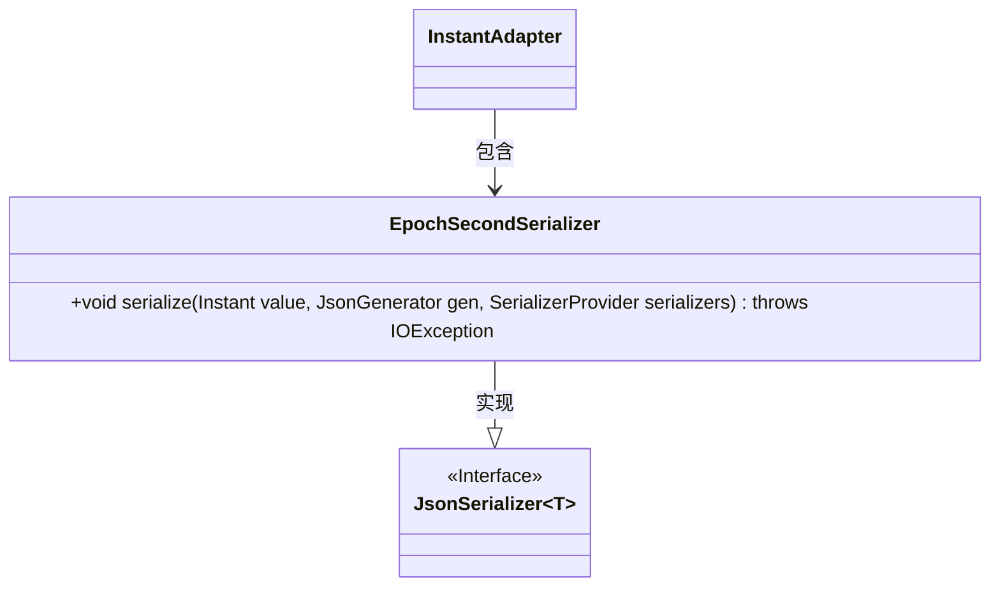
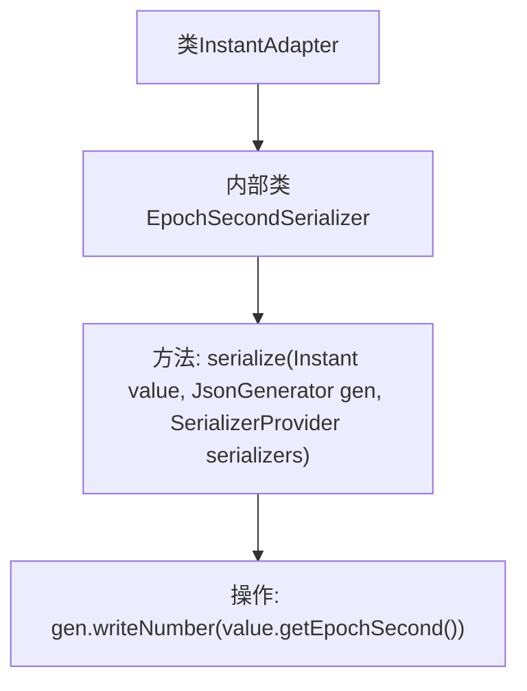

# 基础信息

|      |      |
|------|------|
| 名称 | InstantAdapter |
| 编码语言 | .java |
| 代码路径 | Signal-Server/service/src/main/java/org/whispersystems/textsecuregcm/util/InstantAdapter.java |
| 包名 | org.whispersystems.textsecuregcm.util |
| 依赖项 | ['com.fasterxml.jackson.core.JsonGenerator', 'com.fasterxml.jackson.databind.JsonSerializer', 'com.fasterxml.jackson.databind.SerializerProvider', 'java.io.IOException', 'java.time.Instant'] |
| 概述说明 | InstantAdapter类含EpochSecondSerializer，用于序列化Instant为epoch秒数。 |

# 说明

InstantAdapter类包含一个名为EpochSecondSerializer的组件，该组件专门用于将Instant对象序列化为epoch秒数。Epoch秒数表示从1970年1月1日00:00:00 UTC开始计算的秒数，是一种常用的时间表示方式。通过这个序列化器，Instant对象可以方便地转换为长整型的秒数，便于存储和传输。

# 类列表 Class Summary

| 名称   | 类型  | 说明 |
|-------|------|-------------|
| InstantAdapter | class | InstantAdapter类包含EpochSecondSerializer，用于将Instant对象序列化为epoch秒数。 |

## 类 InstantAdapter

|      |      |
|------|------|
| 访问范围 | public |
| 类型 | class |
| 名称 | InstantAdapter |
| 说明 | InstantAdapter类包含EpochSecondSerializer，用于将Instant对象序列化为epoch秒数。 |

### UML类图

这段代码定义了一个名为 `InstantAdapter` 的类，其中包含一个静态内部类 `EpochSecondSerializer`。`EpochSecondSerializer` 实现了 `JsonSerializer<Instant>` 接口，并重写了 `serialize` 方法，用于将 `Instant` 对象序列化为其纪元秒数。`InstantAdapter` 类依赖于 `EpochSecondSerializer`，而 `EpochSecondSerializer` 实现了 `JsonSerializer` 接口，形成了类与接口之间的层级关系。

### 内部方法调用关系图

这段代码定义了一个名为 `InstantAdapter` 的类，其中包含一个内部类 `EpochSecondSerializer`。`EpochSecondSerializer` 继承自 `JsonSerializer<Instant>`，并重写了 `serialize` 方法。`serialize` 方法接收一个 `Instant` 类型的值、一个 `JsonGenerator` 对象和一个 `SerializerProvider` 对象作为参数，并将 `Instant` 值的纪元秒数写入 `JsonGenerator`。这段代码的主要作用是将 `Instant` 对象序列化为 JSON 格式的数值。

### 字段列表 Field List

| 名称  | 类型  | 说明 |
|-------|-------|------|

### 方法列表 Method List

| 名称  | 类型  | 说明 |
|-------|-------|------|

