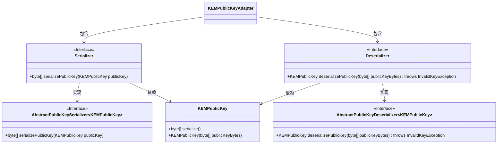
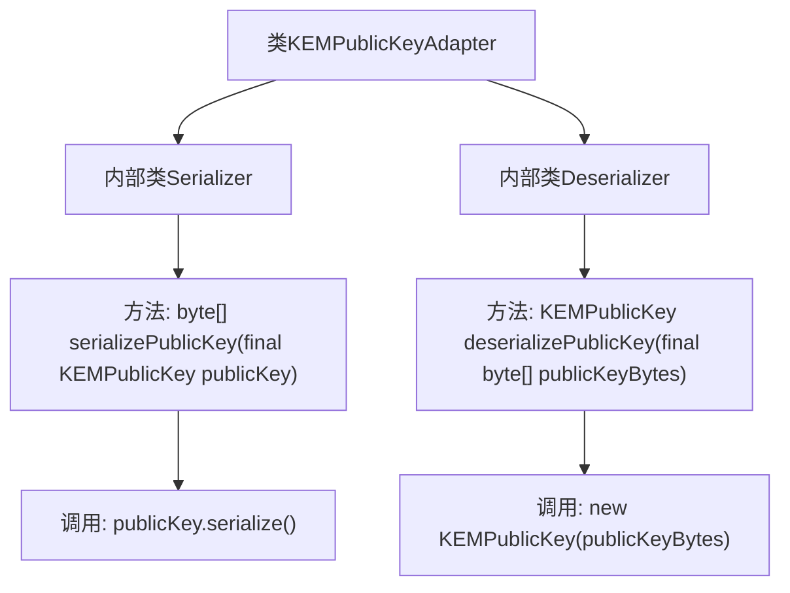

# 基础信息

|      |      |
|------|------|
| 名称 | KEMPublicKeyAdapter |
| 编码语言 | .java |
| 代码路径 | Signal-Server/service/src/main/java/org/whispersystems/textsecuregcm/util/KEMPublicKeyAdapter.java |
| 包名 | org.whispersystems.textsecuregcm.util |
| 依赖项 | ['org.signal.libsignal.protocol.InvalidKeyException', 'org.signal.libsignal.protocol.kem.KEMPublicKey'] |
| 概述说明 | KEMPublicKeyAdapter类提供KEMPublicKey的序列化和反序列化功能。 |

# 说明

KEMPublicKeyAdapter类提供了序列化和反序列化KEMPublicKey的功能，用于将公钥转换为可存储或传输的格式，以及从该格式还原为公钥对象。

# 类列表 Class Summary

| 名称   | 类型  | 说明 |
|-------|------|-------------|
| KEMPublicKeyAdapter | class | KEMPublicKeyAdapter类包含序列化和反序列化KEMPublicKey的方法。 |

## 类 KEMPublicKeyAdapter

|      |      |
|------|------|
| 访问范围 | public |
| 类型 | class |
| 名称 | KEMPublicKeyAdapter |
| 说明 | KEMPublicKeyAdapter类包含序列化和反序列化KEMPublicKey的方法。 |

### UML类图

这段代码描述了一个`KEMPublicKeyAdapter`类，该类包含两个内部类`Serializer`和`Deserializer`，分别用于序列化和反序列化`KEMPublicKey`对象。`Serializer`类继承自`AbstractPublicKeySerializer`，并实现了`serializePublicKey`方法，而`Deserializer`类继承自`AbstractPublicKeyDeserializer`，并实现了`deserializePublicKey`方法。这两个内部类都依赖于`KEMPublicKey`类来完成其功能。整体结构展示了如何通过适配器模式来处理公钥的序列化和反序列化操作。

### 内部方法调用关系图

这段代码定义了一个名为`KEMPublicKeyAdapter`的类，其中包含两个内部类`Serializer`和`Deserializer`。`Serializer`类负责将`KEMPublicKey`对象序列化为字节数组，而`Deserializer`类则负责将字节数组反序列化为`KEMPublicKey`对象。`Serializer`类通过调用`KEMPublicKey`的`serialize()`方法实现序列化，`Deserializer`类通过调用`KEMPublicKey`的构造函数实现反序列化。

### 字段列表 Field List

| 名称  | 类型  | 说明 |
|-------|-------|------|

### 方法列表 Method List

| 名称  | 类型  | 说明 |
|-------|-------|------|

