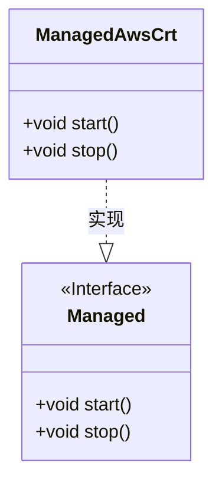
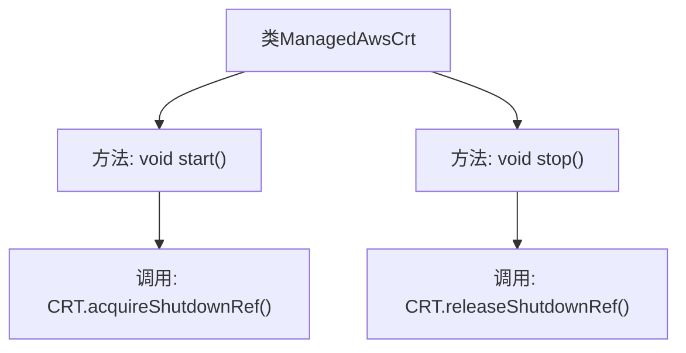

# 基础信息

|      |      |
|------|------|
| 名称 | ManagedAwsCrt |
| 编码语言 | .java |
| 代码路径 | Signal-Server/service/src/main/java/org/whispersystems/textsecuregcm/util/ManagedAwsCrt.java |
| 包名 | org.whispersystems.textsecuregcm.util |
| 依赖项 | ['io.dropwizard.lifecycle.Managed', 'software.amazon.awssdk.crt.CRT'] |
| 概述说明 | ManagedAwsCrt类实现Managed接口，负责CRT的启动和停止管理。 |

# 说明

ManagedAwsCrt类实现了Managed接口，负责管理CRT（Common Runtime）的启动和停止操作。该类通过实现Managed接口，确保了对CRT生命周期的有效控制，使其能够在需要时正确初始化和关闭，从而保证系统的稳定性和资源的合理利用。

# 类列表 Class Summary

| 名称   | 类型  | 说明 |
|-------|------|-------------|
| ManagedAwsCrt | class | ManagedAwsCrt类实现Managed接口，管理CRT的启动和停止。 |

## 类 ManagedAwsCrt

|      |      |
|------|------|
| 访问范围 | public |
| 类型 | class |
| 名称 | ManagedAwsCrt |
| 说明 | ManagedAwsCrt类实现Managed接口，管理CRT的启动和停止。 |

### UML类图

这段代码定义了一个名为 `ManagedAwsCrt` 的类，该类实现了 `Managed` 接口。`ManagedAwsCrt` 类包含两个方法：`start()` 和 `stop()`，分别用于获取和释放 `CRT` 的关闭引用。`Managed` 接口定义了这两个方法的契约，`ManagedAwsCrt` 类通过实现该接口来提供具体的功能。

### 内部方法调用关系图

这段代码定义了一个名为 `ManagedAwsCrt` 的类，该类实现了 `Managed` 接口。类中包含两个方法：`start()` 和 `stop()`。`start()` 方法调用了 `CRT.acquireShutdownRef()`，用于获取关闭引用；`stop()` 方法调用了 `CRT.releaseShutdownRef()`，用于释放关闭引用。这两个方法分别用于启动和停止与 CRT 相关的资源管理。

### 字段列表 Field List

| 名称  | 类型  | 说明 |
|-------|-------|------|

### 方法列表 Method List

| 名称  | 类型  | 说明 |
|-------|-------|------|
| start | void | 重写start方法，调用CRT的acquireShutdownRef。 |
| stop | void | 重写stop方法，释放CRT的关闭引用。 |

