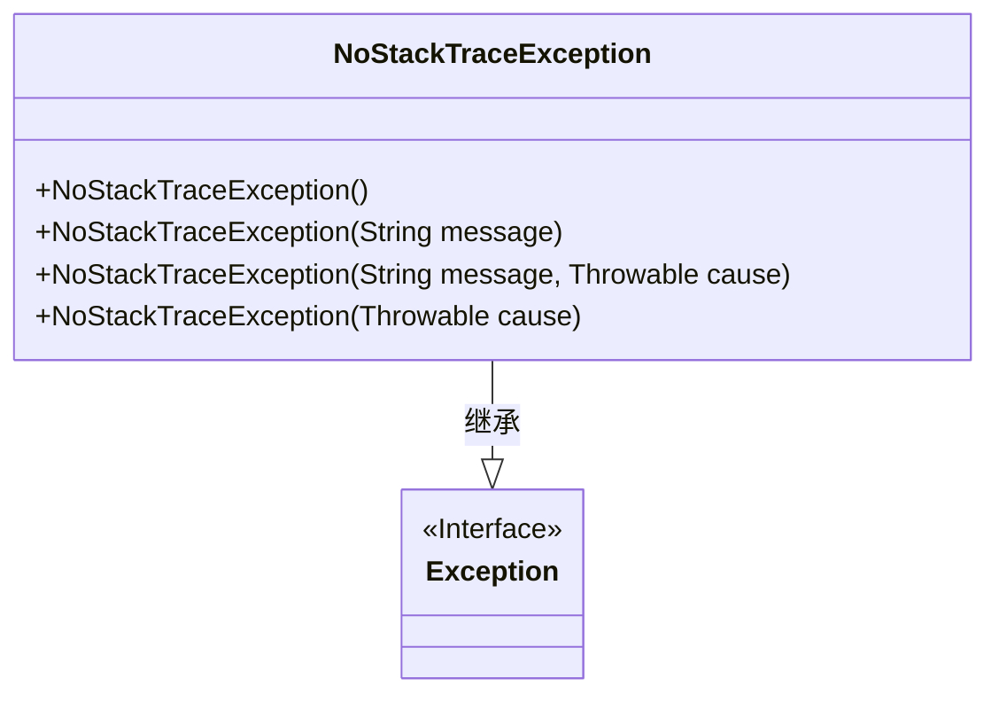
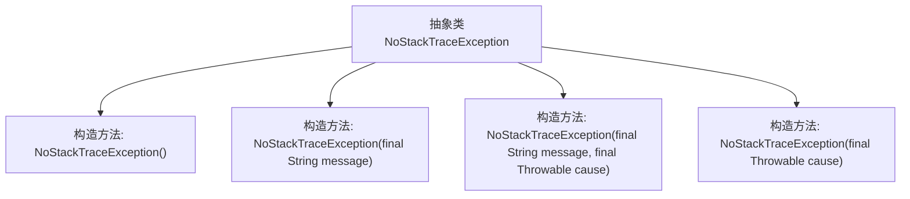

# 基础信息

|      |      |
|------|------|
| 名称 | NoStackTraceException |
| 编码语言 | .java |
| 代码路径 | Signal-Server/service/src/main/java/org/whispersystems/textsecuregcm/util/NoStackTraceException.java |
| 包名 | org.whispersystems.textsecuregcm.util |
| 依赖项 | [] |
| 概述说明 | 无堆栈跟踪异常类，继承Exception，支持多构造方法。 |

# 说明

无堆栈跟踪异常类是一个继承自Exception的异常类，其主要特点是不包含堆栈跟踪信息。该类支持多种构造方法，允许开发者以不同的方式创建异常实例。这种设计适用于那些不需要详细堆栈信息的场景，有助于减少内存开销和提高性能。通过多种构造方法，开发者可以根据具体需求灵活地初始化异常对象，从而更好地控制异常处理流程。

# 类列表 Class Summary

| 名称   | 类型  | 说明 |
|-------|------|-------------|
| NoStackTraceException | class | 无堆栈跟踪异常类，继承Exception，支持多种构造方法。 |

## 类 NoStackTraceException

|      |      |
|------|------|
| 访问范围 | public abstract |
| 类型 | class |
| 名称 | NoStackTraceException |
| 说明 | 无堆栈跟踪异常类，继承Exception，支持多种构造方法。 |

### UML类图

这段代码定义了一个抽象类 `NoStackTraceException`，它继承自 `Exception` 类。`NoStackTraceException` 类的构造函数通过调用父类的构造函数，禁止了堆栈跟踪的生成，从而减少了异常处理的开销。该类提供了四个构造函数，分别用于处理无参数、仅消息、消息与原因、仅原因的情况。这种设计适用于需要高效处理异常且不需要详细堆栈信息的场景。

### 内部方法调用关系图

这段代码定义了一个抽象类 `NoStackTraceException`，它继承自 `Exception`。该类提供了四个构造方法，分别用于初始化异常对象。这些构造方法通过调用父类的构造方法 `super`，传递不同的参数来设置异常的消息、原因，并控制是否生成堆栈跟踪。所有的构造方法都禁用了堆栈跟踪的生成，这在某些场景下可以提高性能或减少日志的冗余信息。

### 字段列表 Field List

| 名称  | 类型  | 说明 |
|-------|-------|------|

### 方法列表 Method List

| 名称  | 类型  | 说明 |
|-------|-------|------|

