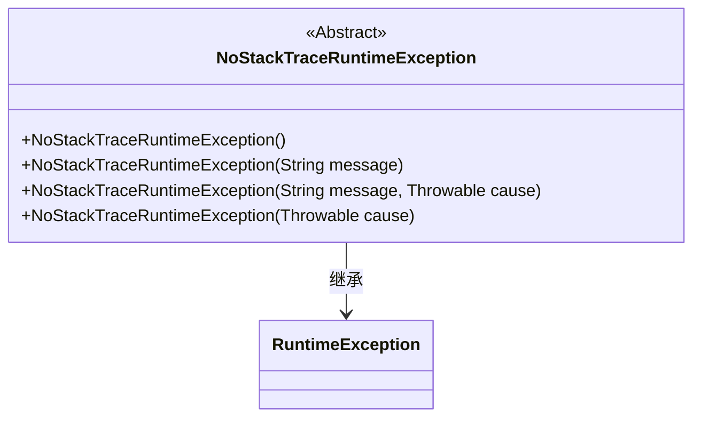
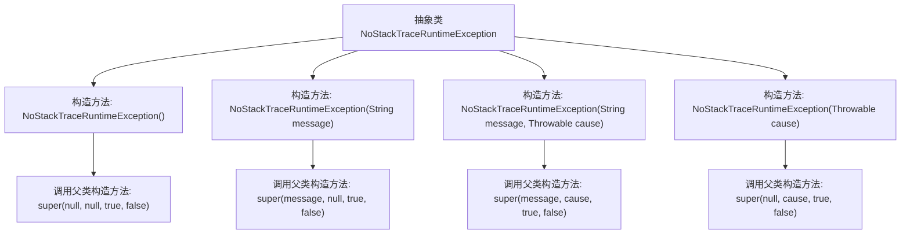

# 基础信息

|      |      |
|------|------|
| 名称 | NoStackTraceRuntimeException |
| 编码语言 | .java |
| 代码路径 | Signal-Server/service/src/main/java/org/whispersystems/textsecuregcm/util/NoStackTraceRuntimeException.java |
| 包名 | org.whispersystems.textsecuregcm.util |
| 依赖项 | [] |
| 概述说明 | 无堆栈异常类继承RuntimeException，支持多种构造方式。 |

# 说明

无堆栈异常类是一种继承自RuntimeException的异常类型，其特点是不包含堆栈跟踪信息，从而减少了异常处理的开销。该类支持多种构造方式，允许开发者在不同场景下灵活地创建异常实例。通过省略堆栈信息，该类适用于那些不需要详细调试信息的场景，提高了性能并简化了异常处理流程。

# 类列表 Class Summary

| 名称   | 类型  | 说明 |
|-------|------|-------------|
| NoStackTraceRuntimeException | class | 无堆栈异常类，继承自RuntimeException，支持多种构造方式。 |

## 类 NoStackTraceRuntimeException

|      |      |
|------|------|
| 访问范围 | public abstract |
| 类型 | class |
| 名称 | NoStackTraceRuntimeException |
| 说明 | 无堆栈异常类，继承自RuntimeException，支持多种构造方式。 |

### UML类图

这段代码定义了一个抽象类 `NoStackTraceRuntimeException`，它继承自 `RuntimeException`。该类的构造函数通过调用父类的构造函数，禁用了堆栈跟踪的生成，从而减少了异常处理的开销。这种设计适用于那些不需要详细堆栈信息的异常场景，提高了性能。

### 内部方法调用关系图

该流程图展示了抽象类`NoStackTraceRuntimeException`的构造方法及其调用关系。该类继承了`RuntimeException`，并提供了四种不同的构造方法，每种构造方法都调用了父类的构造方法，并传递了特定的参数。这些构造方法的主要目的是在创建异常对象时，不生成堆栈跟踪信息，从而提高性能。

### 字段列表 Field List

| 名称  | 类型  | 说明 |
|-------|-------|------|

### 方法列表 Method List

| 名称  | 类型  | 说明 |
|-------|-------|------|

