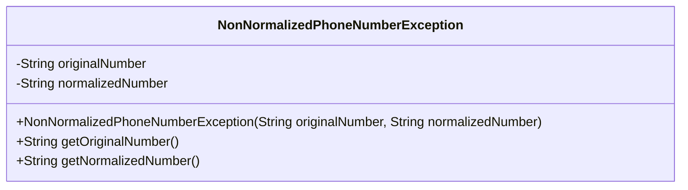
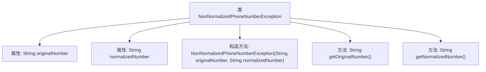

# 基础信息

|      |      |
|------|------|
| 名称 | NonNormalizedPhoneNumberException |
| 编码语言 | .java |
| 代码路径 | Signal-Server/service/src/main/java/org/whispersystems/textsecuregcm/util/NonNormalizedPhoneNumberException.java |
| 包名 | org.whispersystems.textsecuregcm.util |
| 依赖项 | [] |
| 概述说明 | 非标准化电话号码异常类，含原始与标准化号码。 |

# 说明

非标准化电话号码异常类用于处理不符合标准格式的电话号码。该类包含两个主要属性：原始号码和标准化号码。原始号码是用户输入或系统获取的未经过处理的电话号码，可能存在格式不一致、缺少区号或其他不规范的情况。标准化号码是通过特定规则或算法处理后，符合标准格式的电话号码。该异常类的主要目的是在检测到非标准化电话号码时，提供原始和标准化号码的对比，以便进行进一步的处理或纠正。

# 类列表 Class Summary

| 名称   | 类型  | 说明 |
|-------|------|-------------|
| NonNormalizedPhoneNumberException | class | 非标准化电话号码异常类，包含原始和标准化号码。 |

## 类 NonNormalizedPhoneNumberException

|      |      |
|------|------|
| 访问范围 | public |
| 类型 | class |
| 名称 | NonNormalizedPhoneNumberException |
| 说明 | 非标准化电话号码异常类，包含原始和标准化号码。 |

### UML类图

**描述：**  
`NonNormalizedPhoneNumberException` 是一个自定义异常类，继承自 `Exception`。它包含两个私有属性 `originalNumber` 和 `normalizedNumber`，分别表示原始电话号码和规范化后的电话号码。该类提供了构造函数用于初始化这两个属性，并提供了两个公有方法 `getOriginalNumber` 和 `getNormalizedNumber` 用于获取这两个属性的值。这个异常类通常用于处理电话号码规范化过程中出现的异常情况。

### 内部方法调用关系图

这段代码定义了一个自定义异常类 `NonNormalizedPhoneNumberException`，用于处理电话号码未规范化的异常情况。类中包含两个私有属性 `originalNumber` 和 `normalizedNumber`，分别表示原始电话号码和规范化后的电话号码。通过构造方法初始化这两个属性，并提供了两个公共方法 `getOriginalNumber` 和 `getNormalizedNumber` 来获取这两个属性的值。该类的设计主要用于在电话号码处理过程中捕获并处理未规范化的电话号码异常。

### 字段列表 Field List

| 名称  | 类型  | 说明 |
|-------|-------|------|
| normalizedNumber | String | 私有最终字符串变量normalizedNumber。 |
| originalNumber | String | 私有不可变字符串变量originalNumber。 |

### 方法列表 Method List

| 名称  | 类型  | 说明 |
|-------|-------|------|
| getOriginalNumber | String | 该方法返回原始号码字符串。 |
| getNormalizedNumber | String | 获取规范化数字的字符串表示。 |

