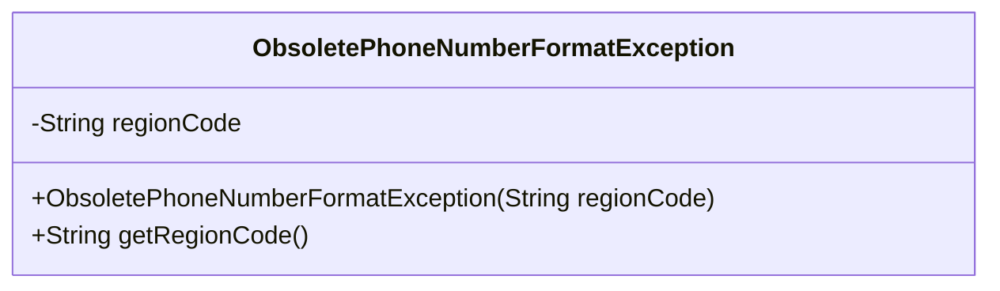
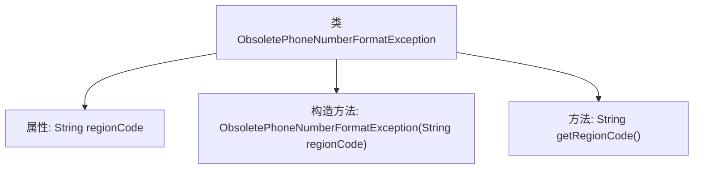

# 基础信息

|      |      |
|------|------|
| 名称 | ObsoletePhoneNumberFormatException |
| 编码语言 | .java |
| 代码路径 | Signal-Server/service/src/main/java/org/whispersystems/textsecuregcm/util/ObsoletePhoneNumberFormatException.java |
| 包名 | org.whispersystems.textsecuregcm.util |
| 依赖项 | [] |
| 概述说明 | ObsoletePhoneNumberFormatException类表示包含区域代码的过时电话号码格式异常。 |

# 说明

ObsoletePhoneNumberFormatException类用于表示过时电话号码格式的异常情况，特别涉及区域代码。该异常类旨在处理在电话号码格式中检测到不符合当前标准或已弃用的区域代码的情况，确保系统能够识别并响应此类格式问题。通过定义这一异常类，开发者可以在处理电话号码时捕获并处理相关错误，提升系统的健壮性和用户体验。

# 类列表 Class Summary

| 名称   | 类型  | 说明 |
|-------|------|-------------|
| ObsoletePhoneNumberFormatException | class | ObsoletePhoneNumberFormatException类表示过时电话号码格式异常，包含区域代码。 |

## 类 ObsoletePhoneNumberFormatException

|      |      |
|------|------|
| 访问范围 | public |
| 类型 | class |
| 名称 | ObsoletePhoneNumberFormatException |
| 说明 | ObsoletePhoneNumberFormatException类表示过时电话号码格式异常，包含区域代码。 |

### UML类图

这段代码定义了一个名为 `ObsoletePhoneNumberFormatException` 的异常类，它继承自 `Exception` 类。该类包含一个私有字段 `regionCode`，用于存储地区代码，并通过构造函数进行初始化。构造函数接受一个 `regionCode` 参数，并将其传递给父类的构造函数以生成异常消息。此外，该类还提供了一个公有方法 `getRegionCode()`，用于获取 `regionCode` 的值。这个类主要用于处理特定地区过时的电话号码格式异常。

### 内部方法调用关系图

这段代码定义了一个名为`ObsoletePhoneNumberFormatException`的自定义异常类，继承自`Exception`。该类包含一个`regionCode`属性，用于存储与异常相关的地区代码。构造方法接收一个`regionCode`参数，并通过调用父类的构造方法设置异常信息。`getRegionCode`方法用于获取`regionCode`属性的值。该异常类用于表示在特定地区提供的电话号码格式已过时的情况。

### 字段列表 Field List

| 名称  | 类型  | 说明 |
|-------|-------|------|
| regionCode | String | 定义了一个私有且不可变的字符串变量regionCode。 |

### 方法列表 Method List

| 名称  | 类型  | 说明 |
|-------|-------|------|
| getRegionCode | String | 方法返回regionCode字符串值。 |

