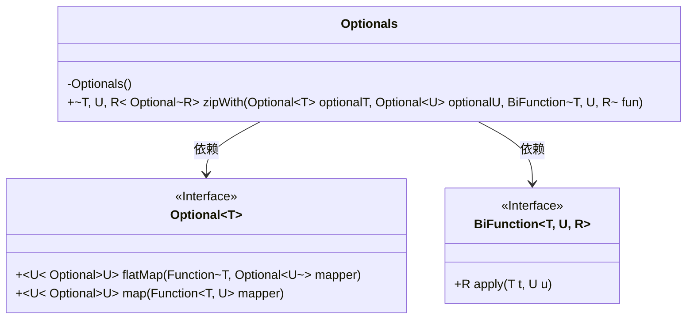
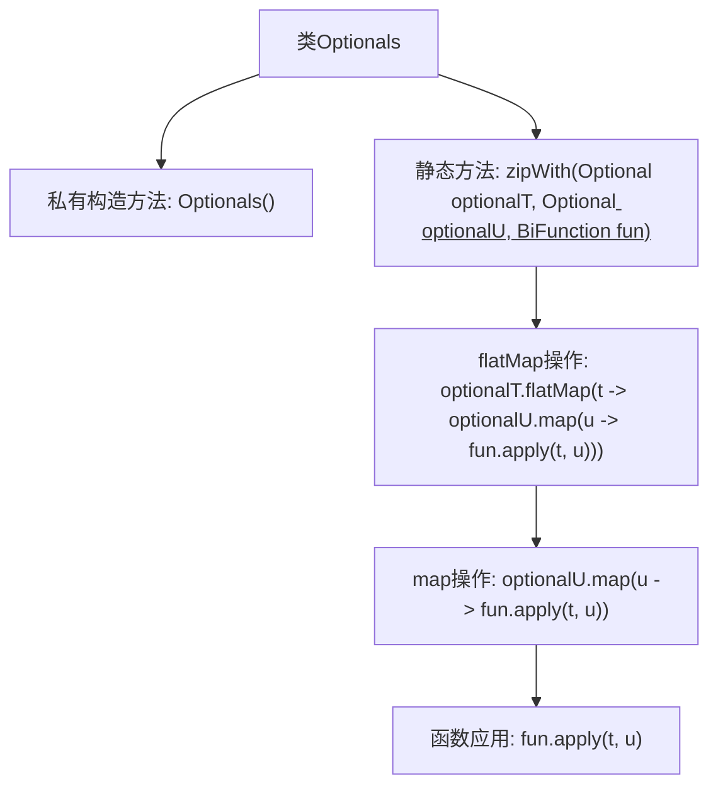

# 基础信息

|      |      |
|------|------|
| 名称 | Optionals |
| 编码语言 | .java |
| 代码路径 | Signal-Server/service/src/main/java/org/whispersystems/textsecuregcm/util/Optionals.java |
| 包名 | org.whispersystems.textsecuregcm.util |
| 依赖项 | ['java.util.Optional', 'java.util.function.BiFunction'] |
| 概述说明 | Optional类的zipWith方法对两个Optional值应用函数，任一为空则返回空。 |

# 说明

Optionals类中的zipWith方法用于处理两个Optional值，通过应用指定函数将它们结合起来。如果两个Optional值都非空，则函数会被调用并返回结果；如果其中任何一个Optional值为空，则方法返回空。这个方法提供了一种简洁的方式来处理可能为空的值，确保在任一值为空时不会执行不必要的操作。

# 类列表 Class Summary

| 名称   | 类型  | 说明 |
|-------|------|-------------|
| Optionals | class | Optionals类提供zipWith方法，用于对两个Optional值应用函数，若任一为空则返回空。 |

## 类 Optionals

|      |      |
|------|------|
| 访问范围 | public |
| 类型 | class |
| 名称 | Optionals |
| 说明 | Optionals类提供zipWith方法，用于对两个Optional值应用函数，若任一为空则返回空。 |

### UML类图

**描述：**  
该代码定义了一个`Optionals`类，其中包含一个静态方法`zipWith`，用于将两个`Optional`类型的值通过一个`BiFunction`函数进行组合，并返回一个新的`Optional`结果。如果任一`Optional`为空，则返回空`Optional`。`zipWith`方法依赖于`Optional`和`BiFunction`接口，分别用于处理可选值和函数应用。

### 内部方法调用关系图

这段代码定义了一个名为`Optionals`的类，其中包含一个私有构造方法和一个静态方法`zipWith`。`zipWith`方法接收两个`Optional`对象和一个`BiFunction`函数，通过`flatMap`和`map`操作将函数应用于`Optional`中的值，最终返回一个包含结果的`Optional`对象。如果任一`Optional`为空，则返回空的`Optional`。该方法用于处理两个`Optional`值的组合操作。

### 字段列表 Field List

| 名称  | 类型  | 说明 |
|-------|-------|------|

### 方法列表 Method List

| 名称  | 类型  | 说明 |
|-------|-------|------|
| zipWith | Optional<R> | 静态方法zipWith将两个Optional对象和一个BiFunction结合，返回新的Optional结果。 |

