# 基础信息

|      |      |
|------|------|
| 名称 | ProfileHelper |
| 编码语言 | .java |
| 代码路径 | Signal-Server/service/src/main/java/org/whispersystems/textsecuregcm/util/ProfileHelper.java |
| 包名 | org.whispersystems.textsecuregcm.util |
| 依赖项 | ['com.google.common.annotations.VisibleForTesting', 'org.signal.libsignal.protocol.ServiceId', 'org.signal.libsignal.zkgroup.InvalidInputException', 'org.signal.libsignal.zkgroup.VerificationFailedException', 'org.signal.libsignal.zkgroup.profiles.ExpiringProfileKeyCredentialResponse', 'org.signal.libsignal.zkgroup.profiles.ProfileKeyCommitment', 'org.signal.libsignal.zkgroup.profiles.ProfileKeyCredentialRequest', 'org.signal.libsignal.zkgroup.profiles.ServerZkProfileOperations', 'org.whispersystems.textsecuregcm.configuration.BadgeConfiguration', 'org.whispersystems.textsecuregcm.identity.ServiceIdentifier', 'org.whispersystems.textsecuregcm.storage.AccountBadge', 'org.whispersystems.textsecuregcm.storage.VersionedProfile', 'javax.annotation.Nullable', 'java.security.SecureRandom', 'java.time.Clock', 'java.time.Duration', 'java.time.Instant', 'java.time.temporal.ChronoUnit', 'java.util.ArrayList', 'java.util.Base64', 'java.util.LinkedHashMap', 'java.util.List', 'java.util.Map', 'java.util.UUID'] |
| 概述说明 | ProfileHelper类管理头像大小、徽章合并、生成头像及身份验证。 |

# 说明

ProfileHelper类是一个多功能工具，主要用于处理用户头像相关操作。它包含头像大小限制功能，确保上传的头像符合预设的尺寸要求。此外，该类还具备徽章合并功能，可以将多个徽章整合到用户头像中。头像生成功能允许根据特定参数动态创建头像。身份验证功能则用于验证用户身份，确保头像操作的安全性。这些功能共同为用户头像管理提供了全面的支持。

# 类列表 Class Summary

| 名称   | 类型  | 说明 |
|-------|------|-------------|
| ProfileHelper | class | ProfileHelper类包含头像大小限制、徽章合并、头像生成及身份验证等功能。 |

## 类 ProfileHelper

|      |      |
|------|------|
| 访问范围 | public |
| 类型 | class |
| 名称 | ProfileHelper |
| 说明 | ProfileHelper类包含头像大小限制、徽章合并、头像生成及身份验证等功能。 |

### UML类图

```mermaid
classDiagram
    class ProfileHelper {
        +int MAX_PROFILE_AVATAR_SIZE_BYTES
        +Duration EXPIRING_PROFILE_KEY_CREDENTIAL_EXPIRATION
        +List~AccountBadge~ mergeBadgeIdsWithExistingAccountBadges(Clock clock, Map~String, BadgeConfiguration~ badgeConfigurationMap, List~String~ badgeIds, List~AccountBadge~ accountBadges)
        +String generateAvatarObjectName()
        +boolean isSelfProfileRequest(UUID requesterUuid, ServiceIdentifier targetIdentifier)
        +ExpiringProfileKeyCredentialResponse getExpiringProfileKeyCredential(byte[] encodedCredentialRequest, VersionedProfile profile, ServiceId.Aci accountIdentifier, ServerZkProfileOperations zkProfileOperations) throws InvalidInputException, VerificationFailedException
    }

    class AccountBadge {
        <<Interface>>
        +String id()
        +AccountBadge withVisibility(boolean visibility)
    }

    class BadgeConfiguration {
        <<Interface>>
        +boolean isTestBadge()
    }

    class Clock {
        <<Interface>>
        +Instant instant()
    }

    class ServiceIdentifier {
        <<Interface>>
        +UUID uuid()
    }

    class ServiceId.Aci {
        <<Interface>>
    }

    class ServerZkProfileOperations {
        <<Interface>>
        +ExpiringProfileKeyCredentialResponse issueExpiringProfileKeyCredential(ProfileKeyCredentialRequest request, ServiceId.Aci accountIdentifier, ProfileKeyCommitment commitment, Instant expiration) throws InvalidInputException, VerificationFailedException
    }

    class ProfileKeyCommitment {
        +ProfileKeyCommitment(byte[] commitment)
    }

    class ProfileKeyCredentialRequest {
        +ProfileKeyCredentialRequest(byte[] encodedCredentialRequest)
    }

    class ExpiringProfileKeyCredentialResponse {
    }

    ProfileHelper --> AccountBadge : 使用
    ProfileHelper --> BadgeConfiguration : 使用
    ProfileHelper --> Clock : 使用
    ProfileHelper --> ServiceIdentifier : 使用
    ProfileHelper --> ServiceId.Aci : 使用
    ProfileHelper --> ServerZkProfileOperations : 使用
    ProfileHelper --> ProfileKeyCommitment : 使用
    ProfileHelper --> ProfileKeyCredentialRequest : 使用
    ProfileHelper --> ExpiringProfileKeyCredentialResponse : 使用
```

**描述**：`ProfileHelper` 类提供了多个静态方法，用于处理用户档案相关的操作，如合并徽章、生成头像对象名称、判断是否为自我档案请求以及获取过期的档案密钥凭证。该类依赖于多个接口和类，如 `AccountBadge`、`BadgeConfiguration`、`Clock`、`ServiceIdentifier`、`ServiceId.Aci`、`ServerZkProfileOperations`、`ProfileKeyCommitment` 和 `ProfileKeyCredentialRequest`，通过这些依赖实现其功能。

### 内部方法调用关系图

```mermaid
graph TD
    A["类ProfileHelper"]
    B["属性: int MAX_PROFILE_AVATAR_SIZE_BYTES"]
    C["属性: Duration EXPIRING_PROFILE_KEY_CREDENTIAL_EXPIRATION"]
    D["方法: List<AccountBadge> mergeBadgeIdsWithExistingAccountBadges(Clock, Map<String, BadgeConfiguration>, List<String>, List<AccountBadge>)"]
    E["方法: String generateAvatarObjectName()"]
    F["方法: boolean isSelfProfileRequest(UUID, ServiceIdentifier)"]
    G["方法: ExpiringProfileKeyCredentialResponse getExpiringProfileKeyCredential(byte[], VersionedProfile, ServiceId.Aci, ServerZkProfileOperations)"]

    A --> B
    A --> C
    A --> D
    A --> E
    A --> F
    A --> G

    D --> H["初始化: LinkedHashMap<String, AccountBadge> existingBadges"]
    D --> I["遍历: accountBadges"]
    I --> J["放入: existingBadges.putIfAbsent(accountBadge.id(), accountBadge)"]
    D --> K["初始化: LinkedHashMap<String, AccountBadge> result"]
    D --> L["遍历: badgeIds"]
    L --> M["检查: result.containsKey(badgeId)"]
    M --> N["跳过: continue"]
    L --> O["获取: badgeConfiguration = badgeConfigurationMap.get(badgeId)"]
    O --> P["检查: badgeConfiguration != null && badgeConfiguration.isTestBadge()"]
    P --> Q["放入: result.put(badgeId, new AccountBadge(badgeId, clock.instant().plus(Duration.ofDays(1)), true))"]
    L --> R["检查: existingBadges.containsKey(badgeId)"]
    R --> S["更新: AccountBadge accountBadge = existingBadges.get(badgeId).withVisibility(true)"]
    S --> T["放入: result.put(badgeId, accountBadge)"]
    D --> U["遍历: existingBadges.entrySet()"]
    U --> V["检查: !result.containsKey(entry.getKey())"]
    V --> W["更新: AccountBadge accountBadge = entry.getValue().withVisibility(false)"]
    W --> X["放入: result.put(accountBadge.id(), accountBadge)"]
    D --> Y["返回: new ArrayList<>(result.values())"]

    E --> Z["初始化: byte[] object = new byte[16]"]
    Z --> AA["生成随机数: new SecureRandom().nextBytes(object)"]
    AA --> AB["返回: 'profiles/' + Base64.getUrlEncoder().encodeToString(object)"]

    F --> AC["检查: targetIdentifier.uuid().equals(requesterUuid)"]
    AC --> AD["返回: boolean"]

    G --> AE["计算: Instant expiration = Instant.now().plus(EXPIRING_PROFILE_KEY_CREDENTIAL_EXPIRATION).truncatedTo(ChronoUnit.DAYS)"]
    AE --> AF["初始化: ProfileKeyCommitment commitment = new ProfileKeyCommitment(profile.commitment())"]
    AF --> AG["初始化: ProfileKeyCredentialRequest request = new ProfileKeyCredentialRequest(encodedCredentialRequest)"]
    AG --> AH["返回: zkProfileOperations.issueExpiringProfileKeyCredential(request, accountIdentifier, commitment, expiration)"]
```

这段代码定义了一个名为 `ProfileHelper` 的类，包含了多个静态方法和属性。主要功能包括合并徽章ID与现有账户徽章、生成头像对象名称、检查是否为自我配置文件请求以及获取过期的配置文件密钥凭证。每个方法都有详细的处理逻辑，例如在 `mergeBadgeIdsWithExistingAccountBadges` 方法中，通过遍历和条件判断来更新徽章的状态。整体代码结构清晰，功能明确，适用于处理与用户配置文件相关的操作。

### 字段列表 Field List

| 名称  | 类型  | 说明 |
|-------|-------|------|
| MAX_PROFILE_AVATAR_SIZE_BYTES = 10 * 1024 * 1024 | int | 最大头像文件大小为10MB。 |
| EXPIRING_PROFILE_KEY_CREDENTIAL_EXPIRATION = Duration.ofDays(7) | Duration | 测试可见的配置文件密钥凭证有效期设为7天。 |

### 方法列表 Method List

| 名称  | 类型  | 说明 |
|-------|-------|------|
| generateAvatarObjectName | String | 生成随机16字节编码作为头像对象名。 |
| isSelfProfileRequest | boolean | 判断请求者UUID是否与目标服务标识符UUID一致。 |
| mergeBadgeIdsWithExistingAccountBadges | List<AccountBadge> | 合并徽章ID与现有账户徽章，处理测试徽章和可见性调整。 |
| getExpiringProfileKeyCredential | ExpiringProfileKeyCredentialResponse | 获取过期配置文件密钥凭证的方法，包含请求、配置文件、账户标识和操作参数。 |

