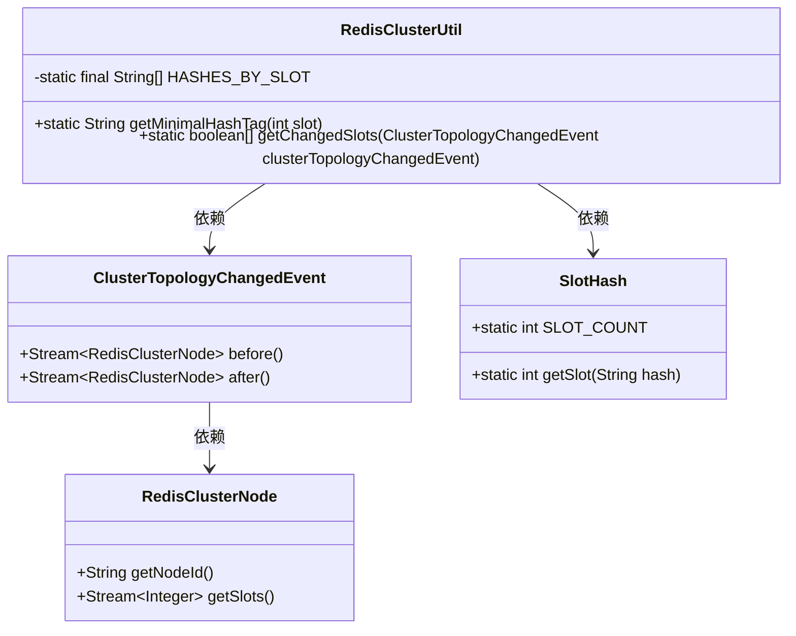
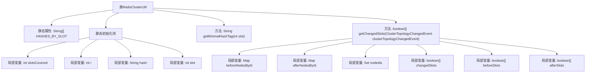

# 基础信息

|      |      |
|------|------|
| 名称 | RedisClusterUtil |
| 编码语言 | .java |
| 代码路径 | Signal-Server/service/src/main/java/org/whispersystems/textsecuregcm/util/RedisClusterUtil.java |
| 包名 | org.whispersystems.textsecuregcm.util |
| 依赖项 | ['io.lettuce.core.cluster.SlotHash', 'io.lettuce.core.cluster.event.ClusterTopologyChangedEvent', 'io.lettuce.core.cluster.models.partitions.RedisClusterNode', 'java.util.HashSet', 'java.util.Map', 'java.util.Set', 'java.util.stream.Collectors'] |
| 概述说明 | RedisClusterUtil类实现集群槽位哈希标签及拓扑变化检测功能。 |

# 说明

RedisClusterUtil类主要提供两大功能：一是支持Redis集群中的槽位哈希标签处理，确保数据在集群中正确分布；二是具备拓扑变化槽位检测能力，能够及时识别和处理集群拓扑结构的变化，保证系统的稳定性和数据的完整性。

# 类列表 Class Summary

| 名称   | 类型  | 说明 |
|-------|------|-------------|
| RedisClusterUtil | class | RedisClusterUtil类提供Redis集群槽位哈希标签和拓扑变化槽位检测功能。 |

## 类 RedisClusterUtil

|      |      |
|------|------|
| 访问范围 | public |
| 类型 | class |
| 名称 | RedisClusterUtil |
| 说明 | RedisClusterUtil类提供Redis集群槽位哈希标签和拓扑变化槽位检测功能。 |

### UML类图

**描述：**  
`RedisClusterUtil` 是一个工具类，用于处理 Redis 集群中的哈希槽相关操作。它包含一个静态数组 `HASHES_BY_SLOT`，用于存储与每个槽位对应的哈希值。`getMinimalHashTag` 方法返回给定槽位的最小哈希标签，而 `getChangedSlots` 方法则根据 `ClusterTopologyChangedEvent` 事件返回哪些槽位发生了变化。`ClusterTopologyChangedEvent` 类提供了事件前后的 Redis 集群节点信息，`RedisClusterNode` 类表示 Redis 集群节点，`SlotHash` 类提供了槽位哈希计算的相关功能。

### 内部方法调用关系图

**描述：**
该代码定义了一个`RedisClusterUtil`类，主要用于处理Redis集群的相关操作。静态初始化块通过循环生成哈希值并填充`HASHES_BY_SLOT`数组。`getMinimalHashTag`方法根据给定的槽位返回对应的哈希标签。`getChangedSlots`方法通过比较集群拓扑变化前后节点的槽位，返回一个布尔数组，表示哪些槽位发生了变化。

### 字段列表 Field List

| 名称  | 类型  | 说明 |
|-------|-------|------|
| HASHES_BY_SLOT = new String[SlotHash.SLOT_COUNT] | String[] | 定义一个静态字符串数组，大小为SlotHash.SLOT_COUNT。 |

### 方法列表 Method List

| 名称  | 类型  | 说明 |
|-------|-------|------|
| getMinimalHashTag | String | 获取指定位置的最小哈希标签。 |
| getChangedSlots | boolean[] | 获取集群拓扑变化后槽位变更信息。 |

