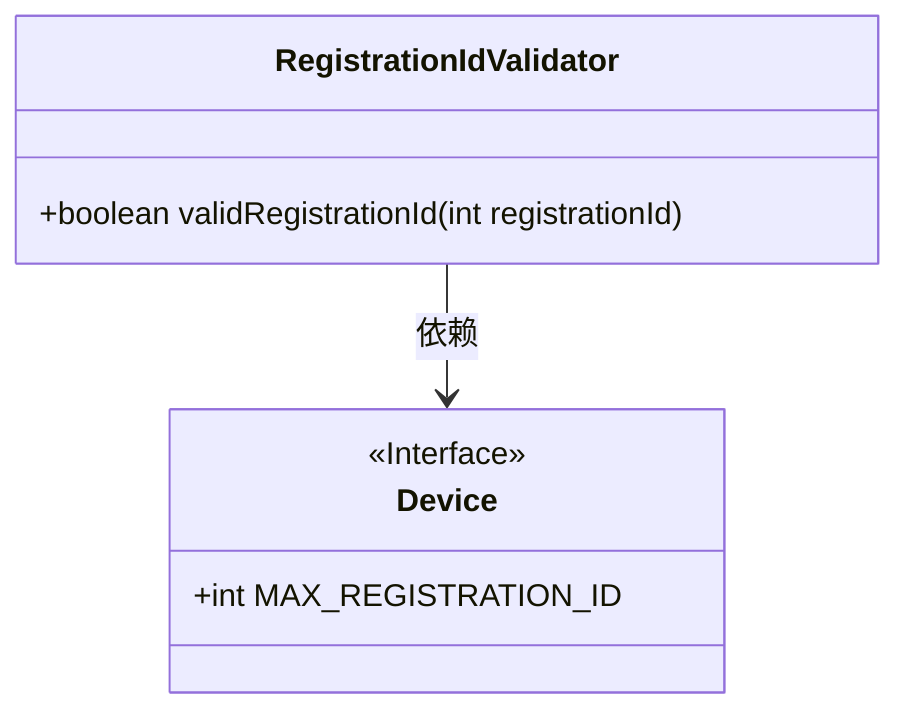
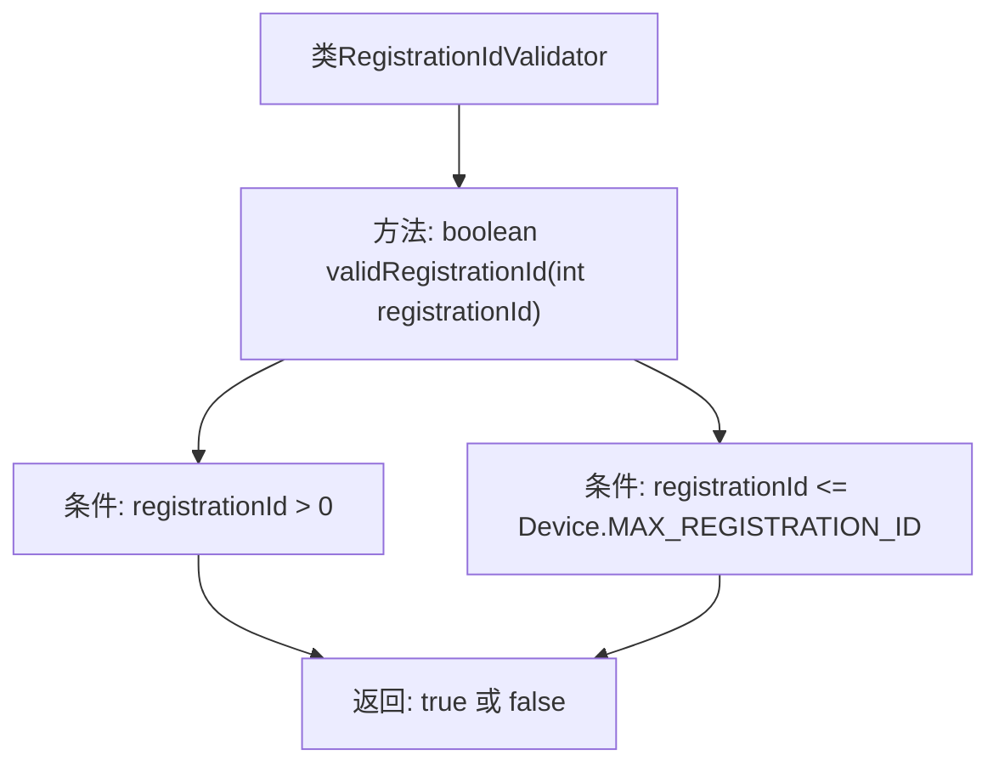

# 基础信息

|      |      |
|------|------|
| 名称 | RegistrationIdValidator |
| 编码语言 | .java |
| 代码路径 | Signal-Server/service/src/main/java/org/whispersystems/textsecuregcm/util/RegistrationIdValidator.java |
| 包名 | org.whispersystems.textsecuregcm.util |
| 依赖项 | ['org.whispersystems.textsecuregcm.storage.Device'] |
| 概述说明 | 验证注册ID是否在有效范围内。 |

# 说明

该内容描述了一个验证过程，目的是检查注册ID是否位于预先定义的有效范围内。这一步骤通常用于确保用户输入的ID符合系统要求，避免无效或超出范围的ID被提交。验证过程可能涉及对比ID与最小值和最大值，确保其处于合法区间内。这一操作在用户注册或数据录入时至关重要，有助于维护数据的完整性和系统的稳定性。

# 类列表 Class Summary

| 名称   | 类型  | 说明 |
|-------|------|-------------|
| RegistrationIdValidator | class | 验证注册ID是否在有效范围内。 |

## 类 RegistrationIdValidator

|      |      |
|------|------|
| 访问范围 | public |
| 类型 | class |
| 名称 | RegistrationIdValidator |
| 说明 | 验证注册ID是否在有效范围内。 |

### UML类图

这段代码定义了一个 `RegistrationIdValidator` 类，其中包含一个静态方法 `validRegistrationId`，用于验证传入的 `registrationId` 是否在有效范围内（大于0且小于等于 `Device.MAX_REGISTRATION_ID`）。`Device` 是一个接口，定义了 `MAX_REGISTRATION_ID` 常量。`RegistrationIdValidator` 依赖于 `Device` 接口来获取最大注册ID的值。

### 内部方法调用关系图

这段代码定义了一个名为 `RegistrationIdValidator` 的类，其中包含一个静态方法 `validRegistrationId`，用于验证传入的 `registrationId` 是否有效。该方法通过检查 `registrationId` 是否大于 0 且小于等于 `Device.MAX_REGISTRATION_ID` 来确定其有效性，并返回一个布尔值。流程图清晰地展示了方法的执行流程，包括条件的判断和最终返回的结果。

### 字段列表 Field List

| 名称  | 类型  | 说明 |
|-------|-------|------|

### 方法列表 Method List

| 名称  | 类型  | 说明 |
|-------|-------|------|
| validRegistrationId | boolean | 验证注册ID是否在有效范围内。 |

