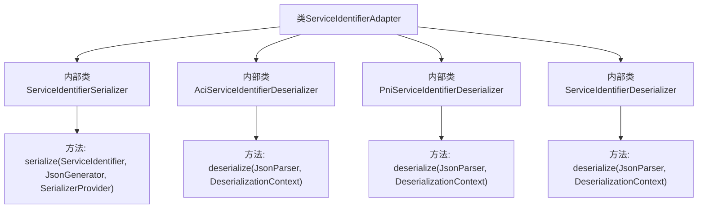

# 基础信息

|      |      |
|------|------|
| 名称 | ServiceIdentifierAdapter |
| 编码语言 | .java |
| 代码路径 | Signal-Server/service/src/main/java/org/whispersystems/textsecuregcm/util/ServiceIdentifierAdapter.java |
| 包名 | org.whispersystems.textsecuregcm.util |
| 依赖项 | ['com.fasterxml.jackson.core.JsonGenerator', 'com.fasterxml.jackson.core.JsonParser', 'com.fasterxml.jackson.databind.DeserializationContext', 'com.fasterxml.jackson.databind.JsonDeserializer', 'java.io.IOException', 'com.fasterxml.jackson.databind.JsonSerializer', 'com.fasterxml.jackson.databind.SerializerProvider', 'org.whispersystems.textsecuregcm.identity.ServiceIdentifier', 'org.whispersystems.textsecuregcm.identity.AciServiceIdentifier', 'org.whispersystems.textsecuregcm.identity.PniServiceIdentifier'] |
| 概述说明 | ServiceIdentifierAdapter处理ServiceIdentifier及其子类的JSON序列化和反序列化。 |

# 说明

ServiceIdentifierAdapter是一个用于处理ServiceIdentifier及其子类JSON转换的工具，包含序列化和反序列化功能。它能够将ServiceIdentifier对象转换为JSON格式，同时也能将JSON数据反序列化为ServiceIdentifier对象，确保数据的准确传递和兼容性。

# 类列表 Class Summary

| 名称   | 类型  | 说明 |
|-------|------|-------------|
| ServiceIdentifierAdapter | class | ServiceIdentifierAdapter包含序列化和反序列化类，用于处理ServiceIdentifier及其子类的JSON转换。 |

## 类 ServiceIdentifierAdapter

|      |      |
|------|------|
| 访问范围 | public |
| 类型 | class |
| 名称 | ServiceIdentifierAdapter |
| 说明 | ServiceIdentifierAdapter包含序列化和反序列化类，用于处理ServiceIdentifier及其子类的JSON转换。 |

### UML类图

```mermaid
classDiagram
    class ServiceIdentifierAdapter {
    }

    class ServiceIdentifierSerializer {
        <<Interface>> JsonSerializer~ServiceIdentifier~
        +void serialize(ServiceIdentifier identifier, JsonGenerator jsonGenerator, SerializerProvider serializers)
    }

    class AciServiceIdentifierDeserializer {
        <<Interface>> JsonDeserializer~AciServiceIdentifier~
        +AciServiceIdentifier deserialize(JsonParser parser, DeserializationContext context)
    }

    class PniServiceIdentifierDeserializer {
        <<Interface>> JsonDeserializer~PniServiceIdentifier~
        +PniServiceIdentifier deserialize(JsonParser parser, DeserializationContext context)
    }

    class ServiceIdentifierDeserializer {
        <<Interface>> JsonDeserializer~ServiceIdentifier~
        +ServiceIdentifier deserialize(JsonParser parser, DeserializationContext context)
    }

    ServiceIdentifierAdapter --> ServiceIdentifierSerializer : 包含
    ServiceIdentifierAdapter --> AciServiceIdentifierDeserializer : 包含
    ServiceIdentifierAdapter --> PniServiceIdentifierDeserializer : 包含
    ServiceIdentifierAdapter --> ServiceIdentifierDeserializer : 包含
```

这段代码定义了一个名为 `ServiceIdentifierAdapter` 的类，其中包含了四个静态内部类，分别用于序列化和反序列化不同类型的 `ServiceIdentifier`。`ServiceIdentifierSerializer` 用于将 `ServiceIdentifier` 序列化为字符串，而 `AciServiceIdentifierDeserializer`、`PniServiceIdentifierDeserializer` 和 `ServiceIdentifierDeserializer` 则分别用于将字符串反序列化为 `AciServiceIdentifier`、`PniServiceIdentifier` 和 `ServiceIdentifier`。这些内部类都实现了相应的接口，并提供了具体的实现方法。

### 内部方法调用关系图

这段代码定义了一个名为 `ServiceIdentifierAdapter` 的类，其中包含了四个内部类，分别用于序列化和反序列化不同类型的 `ServiceIdentifier` 对象。`ServiceIdentifierSerializer` 类负责将 `ServiceIdentifier` 对象序列化为字符串，而 `AciServiceIdentifierDeserializer`、`PniServiceIdentifierDeserializer` 和 `ServiceIdentifierDeserializer` 类则分别负责将字符串反序列化为 `AciServiceIdentifier`、`PniServiceIdentifier` 和 `ServiceIdentifier` 对象。每个内部类都实现了相应的序列化或反序列化方法，确保数据在不同格式之间正确转换。

### 字段列表 Field List

| 名称  | 类型  | 说明 |
|-------|-------|------|

### 方法列表 Method List

| 名称  | 类型  | 说明 |
|-------|-------|------|

