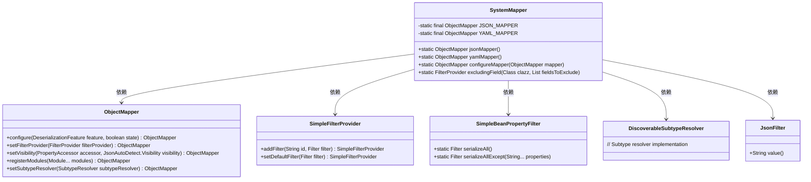
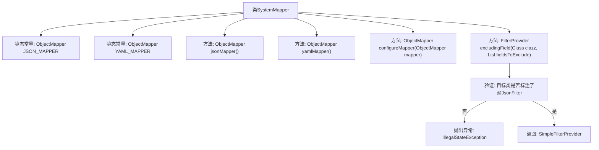

# 基础信息

|      |      |
|------|------|
| 名称 | SystemMapper |
| 编码语言 | .java |
| 代码路径 | Signal-Server/service/src/main/java/org/whispersystems/textsecuregcm/util/SystemMapper.java |
| 包名 | org.whispersystems.textsecuregcm.util |
| 依赖项 | ['com.fasterxml.jackson.annotation.JsonAutoDetect', 'com.fasterxml.jackson.annotation.JsonFilter', 'com.fasterxml.jackson.annotation.PropertyAccessor', 'com.fasterxml.jackson.databind.DeserializationFeature', 'com.fasterxml.jackson.databind.ObjectMapper', 'com.fasterxml.jackson.databind.ser.FilterProvider', 'com.fasterxml.jackson.databind.ser.impl.SimpleBeanPropertyFilter', 'com.fasterxml.jackson.databind.ser.impl.SimpleFilterProvider', 'com.fasterxml.jackson.dataformat.yaml.YAMLMapper', 'com.fasterxml.jackson.datatype.jdk8.Jdk8Module', 'com.fasterxml.jackson.datatype.jsr310.JavaTimeModule', 'java.util.Arrays', 'java.util.List', 'java.util.Objects', 'javax.annotation.Nonnull', 'io.dropwizard.jackson.DiscoverableSubtypeResolver', 'org.whispersystems.textsecuregcm.configuration.secrets.SecretsModule'] |
| 概述说明 | SystemMapper类支持JSON和YAML映射，可配置属性过滤和模块注册。 |

# 说明

SystemMapper类是一个功能强大的工具，提供JSON和YAML映射功能。它允许用户配置以忽略未知属性，设置过滤器以控制数据映射的范围，并调整属性的可见性。此外，该类还支持模块注册，便于扩展和自定义映射行为，从而满足各种复杂的数据处理需求。

# 类列表 Class Summary

| 名称   | 类型  | 说明 |
|-------|------|-------------|
| SystemMapper | class | SystemMapper类提供JSON和YAML映射器，配置忽略未知属性、设置过滤器和可见性，并支持模块注册。 |

## 类 SystemMapper

|      |      |
|------|------|
| 访问范围 | public |
| 类型 | class |
| 名称 | SystemMapper |
| 说明 | SystemMapper类提供JSON和YAML映射器，配置忽略未知属性、设置过滤器和可见性，并支持模块注册。 |

### UML类图

**描述：**
`SystemMapper` 类提供了对 `ObjectMapper` 的配置和管理，支持 JSON 和 YAML 格式的序列化与反序列化。它通过静态方法 `jsonMapper()` 和 `yamlMapper()` 返回预配置的 `ObjectMapper` 实例。`configureMapper` 方法用于配置 `ObjectMapper`，包括设置过滤器、可见性和注册模块。`excludingField` 方法用于生成排除指定字段的过滤器。该类依赖于 `ObjectMapper`、`SimpleFilterProvider`、`SimpleBeanPropertyFilter`、`DiscoverableSubtypeResolver` 和 `JsonFilter` 等类来实现其功能。

### 内部方法调用关系图

这段代码定义了一个`SystemMapper`类，主要用于配置和提供`ObjectMapper`实例，支持JSON和YAML格式的序列化和反序列化。类中包含两个静态常量`JSON_MAPPER`和`YAML_MAPPER`，分别用于存储配置好的`ObjectMapper`实例。`configureMapper`方法用于配置`ObjectMapper`，而`excludingField`方法则用于创建一个过滤特定字段的`FilterProvider`。代码还包含了对`@JsonFilter`注解的验证，确保目标类正确标注了该注解。

### 字段列表 Field List

| 名称  | 类型  | 说明 |
|-------|-------|------|
| YAML_MAPPER = configureMapper(new YAMLMapper())      .setSubtypeResolver(new DiscoverableSubtypeResolver()) | ObjectMapper | 初始化YAML映射器并配置子类型解析器。 |
| JSON_MAPPER = configureMapper(new ObjectMapper()) | ObjectMapper | 私有静态常量JSON_MAPPER通过configureMapper初始化ObjectMapper实例。 |

### 方法列表 Method List

| 名称  | 类型  | 说明 |
|-------|-------|------|
| jsonMapper | ObjectMapper | 返回一个非空的JSON映射器实例。 |
| yamlMapper | ObjectMapper | 非空静态方法返回YAML映射器对象。 |
| excludingField | FilterProvider | 静态方法排除指定类字段，验证JsonFilter注解，返回过滤提供者。 |
| configureMapper | ObjectMapper | 配置ObjectMapper，忽略未知属性，设置过滤器，控制可见性，注册模块。 |

