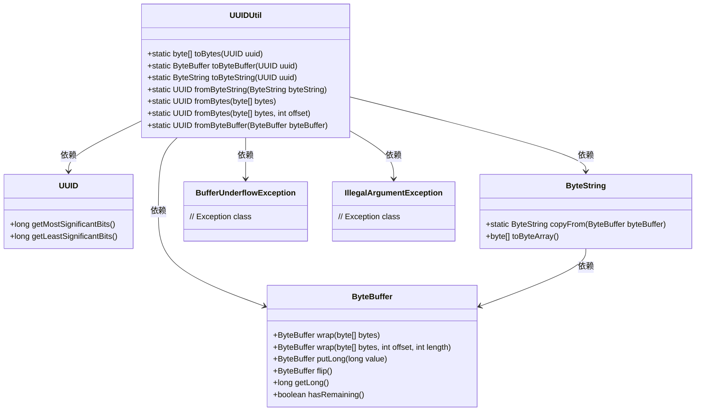
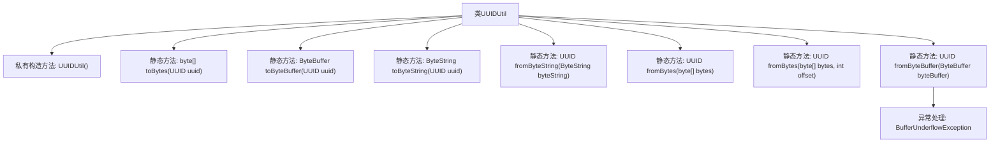

# 基础信息

|      |      |
|------|------|
| 名称 | UUIDUtil |
| 编码语言 | .java |
| 代码路径 | Signal-Server/service/src/main/java/org/whispersystems/textsecuregcm/util/UUIDUtil.java |
| 包名 | org.whispersystems.textsecuregcm.util |
| 依赖项 | ['com.google.protobuf.ByteString', 'java.nio.BufferUnderflowException', 'java.nio.ByteBuffer', 'java.util.UUID'] |
| 概述说明 | UUIDUtil类实现UUID与字节数组、ByteBuffer、ByteString的相互转换。 |

# 说明

UUIDUtil类提供了在UUID与字节数组、ByteBuffer、ByteString之间进行转换的功能。这些方法使得用户能够方便地在不同的数据类型之间进行UUID的转换操作，从而满足各种应用场景的需求。通过该类，用户可以高效地处理UUID与其他二进制数据格式之间的互转，确保数据的一致性和兼容性。

# 类列表 Class Summary

| 名称   | 类型  | 说明 |
|-------|------|-------------|
| UUIDUtil | class | UUIDUtil类提供UUID与字节数组、ByteBuffer、ByteString间的转换方法。 |

## 类 UUIDUtil

|      |      |
|------|------|
| 访问范围 | public final |
| 类型 | class |
| 名称 | UUIDUtil |
| 说明 | UUIDUtil类提供UUID与字节数组、ByteBuffer、ByteString间的转换方法。 |

### UML类图

**描述：**
`UUIDUtil` 是一个工具类，提供了将 `UUID` 转换为 `byte[]`、`ByteBuffer` 和 `ByteString` 的方法，以及从这些类型转换回 `UUID` 的方法。它依赖于 `UUID`、`ByteBuffer`、`ByteString` 类，并在处理过程中可能抛出 `BufferUnderflowException` 和 `IllegalArgumentException` 异常。该类的主要功能是处理 `UUID` 的字节表示形式，确保数据的正确性和一致性。

### 内部方法调用关系图

这段代码定义了一个工具类 `UUIDUtil`，用于在 `UUID` 和字节数组、`ByteBuffer`、`ByteString` 之间进行转换。类中包含多个静态方法，分别用于将 `UUID` 转换为字节数组、`ByteBuffer` 或 `ByteString`，以及从这些格式中还原 `UUID`。代码还处理了字节数组长度不合法的情况，并抛出了相应的异常。

### 字段列表 Field List

| 名称  | 类型  | 说明 |
|-------|-------|------|

### 方法列表 Method List

| 名称  | 类型  | 说明 |
|-------|-------|------|
| toBytes | byte[] | 将UUID转换为字节数组的方法。 |
| fromBytes | UUID | 静态方法fromBytes将字节数组转换为UUID。 |
| fromByteString | UUID | 静态方法将ByteString转换为UUID。 |
| toByteString | ByteString | 将UUID转换为ByteString的静态方法。 |
| toByteBuffer | ByteBuffer | 将UUID转换为16字节的ByteBuffer。 |
| fromBytes | UUID | 静态方法从字节数组生成UUID，指定偏移量。 |
| fromByteBuffer | UUID | 从ByteBuffer生成UUID，检查长度并处理异常。 |

