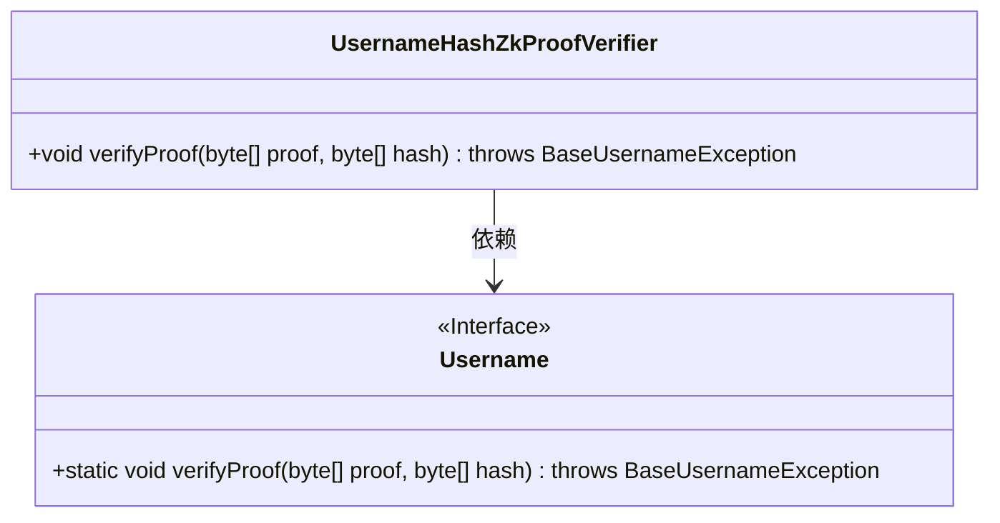
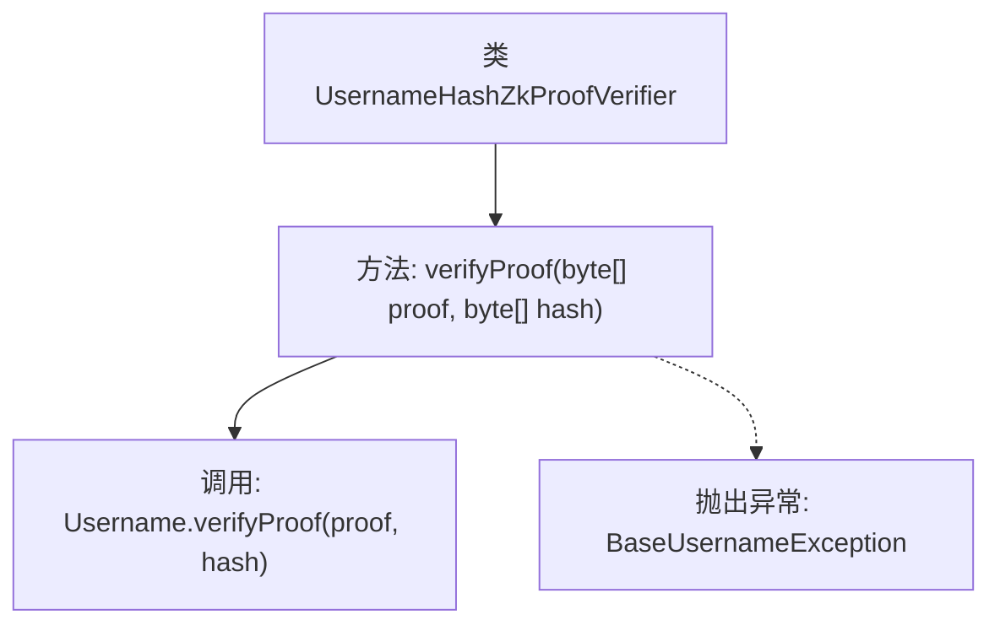

# 基础信息

|      |      |
|------|------|
| 名称 | UsernameHashZkProofVerifier |
| 编码语言 | .java |
| 代码路径 | Signal-Server/service/src/main/java/org/whispersystems/textsecuregcm/util/UsernameHashZkProofVerifier.java |
| 包名 | org.whispersystems.textsecuregcm.util |
| 依赖项 | ['org.signal.libsignal.usernames.BaseUsernameException', 'org.signal.libsignal.usernames.Username'] |
| 概述说明 | 验证用户名哈希的零知识证明类，使用verifyProof方法进行验证。 |

# 说明

该内容描述了一个用于验证用户名哈希零知识证明的类。该类的核心功能是通过调用verifyProof方法来执行验证操作。零知识证明是一种确保在不泄露实际信息的情况下验证其真实性的技术。通过此类，用户可以验证用户名的哈希值是否符合预期，而无需暴露实际用户名。这种方法在保护用户隐私和数据安全方面具有重要意义。

# 类列表 Class Summary

| 名称   | 类型  | 说明 |
|-------|------|-------------|
| UsernameHashZkProofVerifier | class | 验证用户名哈希零知识证明的类，调用verifyProof方法进行验证。 |

## 类 UsernameHashZkProofVerifier

|      |      |
|------|------|
| 访问范围 | public |
| 类型 | class |
| 名称 | UsernameHashZkProofVerifier |
| 说明 | 验证用户名哈希零知识证明的类，调用verifyProof方法进行验证。 |

### UML类图

类图描述：`UsernameHashZkProofVerifier` 类包含一个公有方法 `verifyProof`，用于验证零知识证明。该方法依赖于 `Username` 接口中的静态方法 `verifyProof` 来完成实际验证操作。`Username` 接口被标记为 `<<Interface>>`，表示它是一个接口。`UsernameHashZkProofVerifier` 类通过调用 `Username` 接口的方法来实现其功能。

### 内部方法调用关系图

该流程图描述了`UsernameHashZkProofVerifier`类中的`verifyProof`方法的执行流程。该方法接收两个字节数组参数`proof`和`hash`，并调用`Username`类的`verifyProof`方法进行验证。如果验证过程中出现异常，则会抛出`BaseUsernameException`。整个过程简洁明了，展示了方法调用和异常处理的逻辑关系。

### 字段列表 Field List

| 名称  | 类型  | 说明 |
|-------|-------|------|

### 方法列表 Method List

| 名称  | 类型  | 说明 |
|-------|-------|------|
| verifyProof | void | 验证用户名证明和哈希值的Java方法。 |

