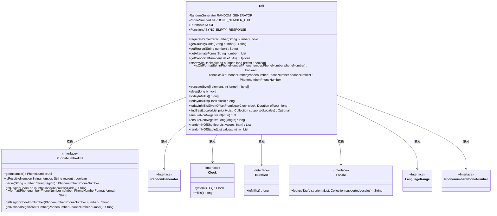

# 基础信息

|      |      |
|------|------|
| 名称 | Util |
| 编码语言 | .java |
| 代码路径 | Signal-Server/service/src/main/java/org/whispersystems/textsecuregcm/util/Util.java |
| 包名 | org.whispersystems.textsecuregcm.util |
| 依赖项 | ['com.google.i18n.phonenumbers.NumberParseException', 'com.google.i18n.phonenumbers.PhoneNumberUtil', 'com.google.i18n.phonenumbers.PhoneNumberUtil.PhoneNumberFormat', 'com.google.i18n.phonenumbers.Phonenumber', 'com.google.i18n.phonenumbers.Phonenumber.PhoneNumber', 'jakarta.ws.rs.core.Response', 'java.time.Clock', 'java.time.Duration', 'java.util.ArrayList', 'java.util.Collection', 'java.util.Collections', 'java.util.Comparator', 'java.util.HashSet', 'java.util.List', 'java.util.Locale', 'java.util.Locale.LanguageRange', 'java.util.Optional', 'java.util.Random', 'java.util.Set', 'java.util.concurrent.TimeUnit', 'java.util.function.Function', 'java.util.random.RandomGenerator', 'java.util.stream.Collectors', 'org.apache.commons.lang3.StringUtils'] |
| 概述说明 | Util类提供电话号码验证、格式化、随机选择、睡眠和本地化处理等工具方法。 |

# 说明

Util类是一个多功能工具类，提供了多种实用方法，涵盖电话号码的验证与格式化、随机选择功能、睡眠控制以及本地化处理等。这些方法旨在简化开发过程中的常见任务，提升代码的效率和可维护性。通过集成这些工具方法，开发者可以更便捷地处理各种业务需求，减少重复代码的编写。

# 类列表 Class Summary

| 名称   | 类型  | 说明 |
|-------|------|-------------|
| Util | class | Util类提供工具方法，包括电话号码验证、格式化、随机选择、睡眠和本地化处理等。 |

## 类 Util

|      |      |
|------|------|
| 访问范围 | public |
| 类型 | class |
| 名称 | Util |
| 说明 | Util类提供工具方法，包括电话号码验证、格式化、随机选择、睡眠和本地化处理等。 |

### UML类图

这段代码定义了一个名为 `Util` 的工具类，提供了多种实用方法，包括电话号码的验证、格式化、随机数生成、时间处理、本地化查找等。`Util` 类依赖于多个接口和工具类，如 `PhoneNumberUtil`、`RandomGenerator`、`Clock`、`Duration`、`Locale` 和 `LanguageRange`，这些接口和类提供了实现这些功能所需的核心功能。代码设计上注重处理边缘情况，如电话号码的格式转换、随机数的生成、时间的计算等，确保在各种场景下都能正确执行。

### 内部方法调用关系图

```mermaid
graph TD
    A["类Util"]
    B["属性: RandomGenerator RANDOM_GENERATOR"]
    C["属性: PhoneNumberUtil PHONE_NUMBER_UTIL"]
    D["属性: Runnable NOOP"]
    E["属性: Function<Object, Response> ASYNC_EMPTY_RESPONSE"]
    F["方法: requireNormalizedNumber(String number)"]
    G["方法: getCountryCode(String number)"]
    H["方法: getRegion(String number)"]
    I["方法: getAlternateForms(String number)"]
    J["方法: getCanonicalNumber(List<String> e164s)"]
    K["方法: startsWithDecimal(long number, long prefix)"]
    L["方法: isOldFormatBeninPhoneNumber(PhoneNumber phoneNumber)"]
    M["方法: canonicalizePhoneNumber(PhoneNumber phoneNumber)"]
    N["方法: truncate(byte[] element, int length)"]
    O["方法: sleep(long i)"]
    P["方法: todayInMillis()"]
    Q["方法: todayInMillis(Clock clock)"]
    R["方法: todayInMillisGivenOffsetFromNow(Clock clock, Duration offset)"]
    S["方法: findBestLocale(List<LanguageRange> priorityList, Collection<String> supportedLocales)"]
    T["方法: ensureNonNegativeInt(int n)"]
    U["方法: ensureNonNegativeLong(long n)"]
    V["方法: randomNOfShuffled(List<E> values, int n)"]
    W["方法: randomNOfStable(List<E> values, int n)"]

    A --> B
    A --> C
    A --> D
    A --> E
    A --> F
    A --> G
    A --> H
    A --> I
    A --> J
    A --> K
    A --> L
    A --> M
    A --> N
    A --> O
    A --> P
    A --> Q
    A --> R
    A --> S
    A --> T
    A --> U
    A --> V
    A --> W
```

这段代码定义了一个名为`Util`的工具类，其中包含了多个静态方法和属性，用于处理电话号码的验证、格式化、随机数生成、时间计算等操作。代码通过`PhoneNumberUtil`类处理电话号码的解析和格式化，并提供了多种工具方法来处理不同的业务场景。例如，`requireNormalizedNumber`方法用于验证电话号码是否符合E164格式，`getAlternateForms`方法用于获取电话号码的等效形式，`randomNOfShuffled`和`randomNOfStable`方法用于从列表中随机选取元素。这些方法通过流程图清晰地展示了类内部的函数调用关系。

### 字段列表 Field List

| 名称  | 类型  | 说明 |
|-------|-------|------|
| RANDOM_GENERATOR = new Random() | RandomGenerator | 定义一个私有的静态随机生成器实例。 |
| PHONE_NUMBER_UTIL = PhoneNumberUtil.getInstance() | PhoneNumberUtil | 静态常量PHONE_NUMBER_UTIL获取PhoneNumberUtil实例。 |
| NOOP = () -> {} | Runnable | 定义了一个无操作的静态Runnable实例。 |
| ASYNC_EMPTY_RESPONSE = ignored -> Response.noContent().build() | Function<Object, Response> | 异步返回空响应的静态函数定义。 |

### 方法列表 Method List

| 名称  | 类型  | 说明 |
|-------|-------|------|
| todayInMillis | long | 返回当前UTC时间的毫秒数。 |
| ensureNonNegativeLong | long | 确保长整型非负，最小值返回0。 |
| todayInMillisGivenOffsetFromNow | long | 根据时钟和偏移量计算当天毫秒数。 |
| getAlternateForms | List<String> | 获取贝宁电话号码的旧版和新版格式。 |
| findBestLocale | Optional<String> | 查找最佳语言环境的静态方法，返回匹配的Locale标签。 |
| getRegion | String | 解析电话号码并返回其所属地区代码，失败时返回"ZZ"。 |
| isOldFormatBeninPhoneNumber | boolean | 判断贝宁旧格式电话号码，需满足国家代码为BJ且号码长度为8位。 |
| requireNormalizedNumber | void | 验证电话号码合法性并标准化，若非法或未标准化则抛出异常。 |
| randomNOfStable | List<E> | 从列表中随机选取n个元素，保持原顺序。 |
| ensureNonNegativeInt | int | 确保整数非负，若为最小值返回0，否则取绝对值。 |
| sleep | void | 静态方法sleep使当前线程暂停指定毫秒，忽略中断异常。 |
| startsWithDecimal | boolean | 检查数字是否以指定前缀开头，数字和前缀必须为正。 |
| truncate | byte[] | 截取字节数组至指定长度并返回新数组。 |
| getCountryCode | String | 解析电话号码并返回国家代码，解析失败返回"0"。 |
| canonicalizePhoneNumber | Phonenumber.PhoneNumber | 方法检查贝宁旧格式电话号码，若匹配则抛出异常，否则返回原号码。 |
| randomNOfShuffled | List<E> | 随机获取列表中的n个元素并打乱顺序。 |
| getCanonicalNumber | Optional<String> | 从E164号码列表中获取规范号码，处理不同国家及贝宁特殊格式，返回最长或排序首项。 |
| todayInMillis | long | 静态方法todayInMillis将当前时间转换为当天的毫秒数。 |

