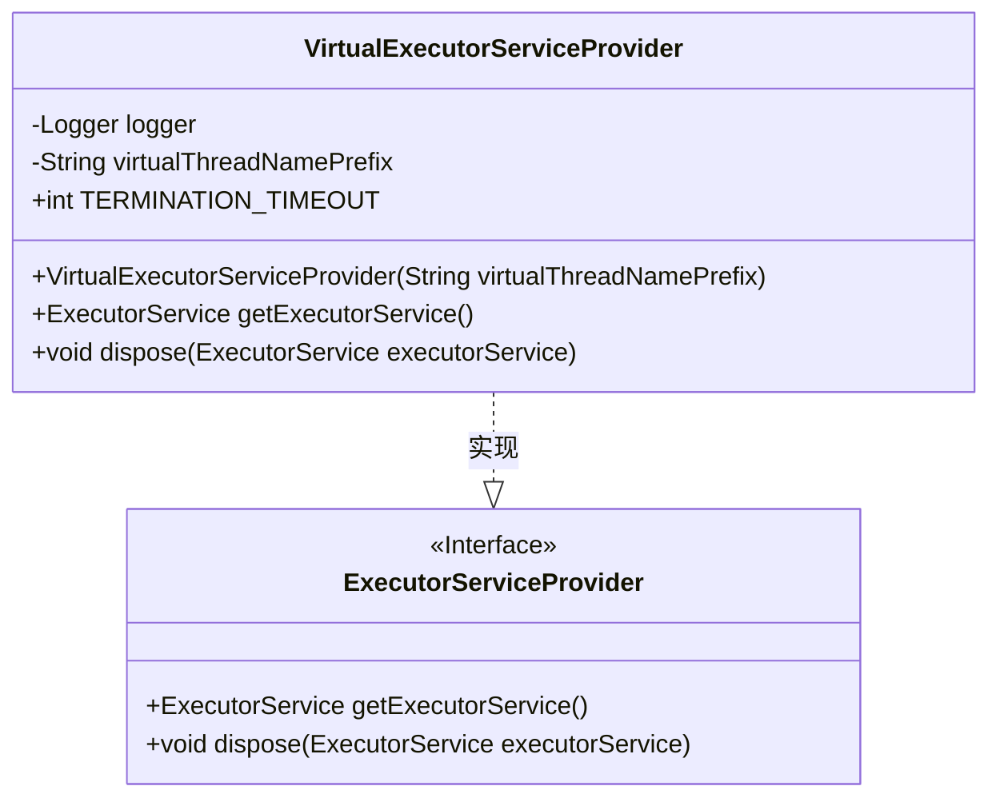
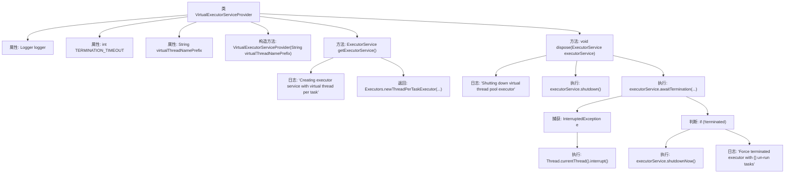

# 基础信息

|      |      |
|------|------|
| 名称 | VirtualExecutorServiceProvider |
| 编码语言 | .java |
| 代码路径 | Signal-Server/service/src/main/java/org/whispersystems/textsecuregcm/util/VirtualExecutorServiceProvider.java |
| 包名 | org.whispersystems.textsecuregcm.util |
| 依赖项 | ['java.util.List', 'java.util.concurrent.ExecutorService', 'java.util.concurrent.Executors', 'java.util.concurrent.TimeUnit', 'org.glassfish.jersey.server.ManagedAsyncExecutor', 'org.glassfish.jersey.spi.ExecutorServiceProvider', 'org.slf4j.Logger', 'org.slf4j.LoggerFactory'] |
| 概述说明 | 提供虚拟线程执行器服务，支持创建和关闭线程池，默认超时5000毫秒。 |

# 说明

该服务提供了虚拟线程执行器的功能，支持用户创建和关闭线程池。默认情况下，线程操作的超时时间设置为5000毫秒，确保任务在指定时间内完成或终止。

# 类列表 Class Summary

| 名称   | 类型  | 说明 |
|-------|------|-------------|
| VirtualExecutorServiceProvider | class | 提供虚拟线程执行器服务，支持创建和关闭线程池，默认超时5000毫秒。 |

## 类 VirtualExecutorServiceProvider

|      |      |
|------|------|
| 访问范围 | @ManagedAsyncExecutor;public |
| 类型 | class |
| 名称 | VirtualExecutorServiceProvider |
| 说明 | 提供虚拟线程执行器服务，支持创建和关闭线程池，默认超时5000毫秒。 |

### UML类图

### 描述
`VirtualExecutorServiceProvider` 类实现了 `ExecutorServiceProvider` 接口，提供了虚拟线程池的执行器服务。该类通过 `getExecutorService` 方法创建一个基于虚拟线程的执行器，并通过 `dispose` 方法优雅地关闭执行器，确保所有任务完成或在超时后强制终止。`TERMINATION_TIMEOUT` 定义了默认的线程池终止超时时间，`virtualThreadNamePrefix` 用于设置虚拟线程的名称前缀。

### 内部方法调用关系图

这段代码定义了一个`VirtualExecutorServiceProvider`类，用于提供虚拟线程的`ExecutorService`。类中包含一个构造方法和两个主要方法：`getExecutorService`用于创建并返回一个基于虚拟线程的`ExecutorService`，`dispose`用于关闭并清理`ExecutorService`。`dispose`方法首先尝试优雅关闭线程池，若超时则强制关闭，并记录未执行的任务数量。整个流程通过日志记录关键操作，确保线程池的正确管理和资源释放。

### 字段列表 Field List

| 名称  | 类型  | 说明 |
|-------|-------|------|
| logger = LoggerFactory.getLogger(VirtualExecutorServiceProvider.class) | Logger | VirtualExecutorServiceProvider类中定义了一个静态日志记录器。 |
| TERMINATION_TIMEOUT = 5000 | int | 终止超时设为5000毫秒。 |
| virtualThreadNamePrefix | String | 定义私有常量字符串变量virtualThreadNamePrefix。 |

### 方法列表 Method List

| 名称  | 类型  | 说明 |
|-------|-------|------|
| getExecutorService | ExecutorService | 重写方法返回基于虚拟线程的线程池执行器。 |
| dispose | void | 关闭虚拟线程池执行器，等待终止，未终止则强制关闭并记录未运行任务数。 |

