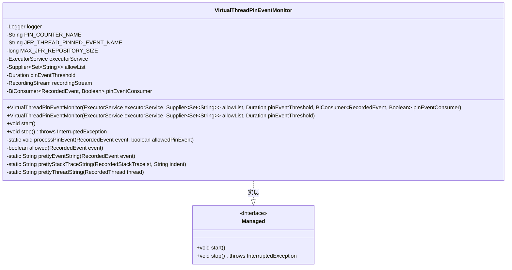

# 基础信息

|      |      |
|------|------|
| 名称 | VirtualThreadPinEventMonitor |
| 编码语言 | .java |
| 代码路径 | Signal-Server/service/src/main/java/org/whispersystems/textsecuregcm/util/VirtualThreadPinEventMonitor.java |
| 包名 | org.whispersystems.textsecuregcm.util |
| 依赖项 | ['com.google.common.annotations.VisibleForTesting', 'io.dropwizard.lifecycle.Managed', 'io.micrometer.core.instrument.Metrics', 'java.time.Duration', 'java.util.Set', 'java.util.concurrent.ExecutorService', 'java.util.function.BiConsumer', 'java.util.function.Supplier', 'java.util.stream.Collectors', 'jdk.jfr.consumer.RecordedEvent', 'jdk.jfr.consumer.RecordedFrame', 'jdk.jfr.consumer.RecordedStackTrace', 'jdk.jfr.consumer.RecordedThread', 'jdk.jfr.consumer.RecordingStream', 'org.slf4j.Logger', 'org.slf4j.LoggerFactory', 'org.whispersystems.textsecuregcm.metrics.MetricsUtil'] |
| 概述说明 | VirtualThreadPinEventMonitor类监控虚拟线程固定事件，支持启动和停止操作。 |

# 说明

VirtualThreadPinEventMonitor类负责监控虚拟线程的固定事件，能够记录并处理这些事件。该类提供了启动和停止操作的功能，确保对虚拟线程固定事件的有效监控和管理。通过该类的实现，用户可以实时掌握虚拟线程的状态变化，并进行相应的处理。

# 类列表 Class Summary

| 名称   | 类型  | 说明 |
|-------|------|-------------|
| VirtualThreadPinEventMonitor | class | VirtualThreadPinEventMonitor类监控虚拟线程固定事件，记录并处理事件，支持启动和停止操作。 |

## 类 VirtualThreadPinEventMonitor

|      |      |
|------|------|
| 访问范围 | public |
| 类型 | class |
| 名称 | VirtualThreadPinEventMonitor |
| 说明 | VirtualThreadPinEventMonitor类监控虚拟线程固定事件，记录并处理事件，支持启动和停止操作。 |

### UML类图

### 描述
`VirtualThreadPinEventMonitor` 类实现了 `Managed` 接口，用于监控虚拟线程的挂起事件。它通过 `RecordingStream` 捕获 JFR 事件，并根据允许列表判断事件是否合法。类中包含多个私有方法用于处理事件、判断事件是否允许、以及格式化事件信息。`start` 和 `stop` 方法分别用于启动和停止监控。

### 内部方法调用关系图

```mermaid
graph TD
    A["类VirtualThreadPinEventMonitor"]
    B["属性: Logger logger"]
    C["属性: String PIN_COUNTER_NAME"]
    D["属性: String JFR_THREAD_PINNED_EVENT_NAME"]
    E["属性: long MAX_JFR_REPOSITORY_SIZE"]
    F["属性: ExecutorService executorService"]
    G["属性: Supplier<Set<String>> allowList"]
    H["属性: Duration pinEventThreshold"]
    I["属性: RecordingStream recordingStream"]
    J["属性: BiConsumer<RecordedEvent, Boolean> pinEventConsumer"]
    K["构造方法: VirtualThreadPinEventMonitor(ExecutorService, Supplier<Set<String>>, Duration, BiConsumer<RecordedEvent, Boolean>)"]
    L["构造方法: VirtualThreadPinEventMonitor(ExecutorService, Supplier<Set<String>>, Duration)"]
    M["方法: start()"]
    N["方法: stop()"]
    O["方法: processPinEvent(RecordedEvent, boolean)"]
    P["方法: allowed(RecordedEvent)"]
    Q["方法: prettyEventString(RecordedEvent)"]
    R["方法: prettyStackTraceString(RecordedStackTrace, String)"]
    S["方法: prettyThreadString(RecordedThread)"]

    A --> B
    A --> C
    A --> D
    A --> E
    A --> F
    A --> G
    A --> H
    A --> I
    A --> J
    A --> K
    A --> L
    A --> M
    A --> N
    A --> O
    A --> P
    A --> Q
    A --> R
    A --> S
    K --> J
    L --> K
    M --> I
    N --> I
    O --> B
    O --> C
    P --> G
    Q --> R
    Q --> S
```

这段代码定义了一个名为 `VirtualThreadPinEventMonitor` 的类，用于监控虚拟线程的钉住事件。该类通过 `RecordingStream` 捕获 JFR（Java Flight Recorder）事件，并根据允许列表和事件阈值处理这些事件。主要功能包括启动和停止监控、处理钉住事件、检查事件是否被允许、以及格式化事件和堆栈跟踪信息。代码通过日志记录和指标计数器来记录和处理这些事件。

### 字段列表 Field List

| 名称  | 类型  | 说明 |
|-------|-------|------|
| logger = LoggerFactory.getLogger(VirtualThreadPinEventMonitor.class) | Logger | VirtualThreadPinEventMonitor类中定义了一个静态日志记录器。 |
| recordingStream | RecordingStream | 私有且不可变的RecordingStream对象。 |
| pinEventThreshold | Duration | 私有变量pinEventThreshold为Duration类型。 |
| PIN_COUNTER_NAME = MetricsUtil.name(VirtualThreadPinEventMonitor.class,      "virtualThreadPinned") | String | 定义了静态常量PIN_COUNTER_NAME，用于监控虚拟线程固定事件。 |
| MAX_JFR_REPOSITORY_SIZE = 1024 * 1024 * 4L | long | 私有常量MAX_JFR_REPOSITORY_SIZE值为4MB。 |
| pinEventConsumer | BiConsumer<RecordedEvent, Boolean> | 私有终端的BiConsumer用于处理记录事件和布尔值。 |
| JFR_THREAD_PINNED_EVENT_NAME = "jdk.VirtualThreadPinned" | String | 定义常量JFR_THREAD_PINNED_EVENT_NAME为"jdk.VirtualThreadPinned"。 |
| executorService | ExecutorService | 私有线程池执行器服务。 |
| allowList | Supplier<Set<String>> | 私有最终变量，提供允许列表的字符串集合。 |

### 方法列表 Method List

| 名称  | 类型  | 说明 |
|-------|-------|------|
| stop | void | 停止记录流并释放资源。 |
| allowed | boolean | 方法检查事件堆栈帧是否在允许列表中。 |
| processPinEvent | void | 处理虚拟线程固定事件，记录日志并更新指标。 |
| prettyThreadString | String | 方法prettyThreadString格式化线程信息，若线程为空返回n/a。 |
| prettyStackTraceString | String | 将堆栈跟踪信息格式化为带缩进的字符串，仅包含Java帧。 |
| prettyEventString | String | 方法prettyEventString格式化事件信息，包含类型、时间、持续时长、线程和堆栈跟踪。 |
| start | void | 设置最大JFR存储大小，启用线程锁定事件并设置阈值，事件触发时执行消费操作，提交任务启动流。 |

