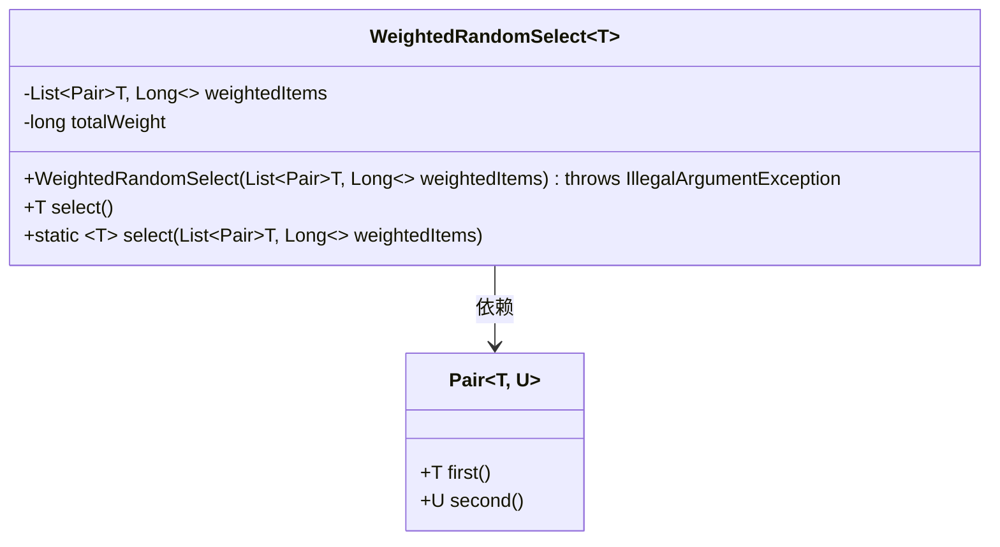
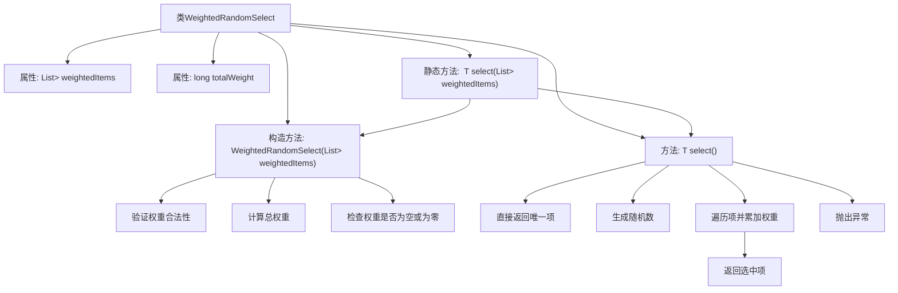

# 基础信息

|      |      |
|------|------|
| 名称 | WeightedRandomSelect |
| 编码语言 | .java |
| 代码路径 | Signal-Server/service/src/main/java/org/whispersystems/textsecuregcm/util/WeightedRandomSelect.java |
| 包名 | org.whispersystems.textsecuregcm.util |
| 依赖项 | ['java.util.List', 'java.util.concurrent.ThreadLocalRandom'] |
| 概述说明 | 加权随机选择类，支持带权重随机选择，确保权重非负且非空。 |

# 说明

加权随机选择类是一种用于实现带权重随机选择功能的工具。它支持根据给定的权重进行随机选择，确保权重值非负且非空。该类的核心功能是根据权重分配选择概率，从而实现更灵活和精确的随机选择操作。通过这种机制，用户可以根据不同的权重值来控制选择结果的分布，满足各种应用场景的需求。

# 类列表 Class Summary

| 名称   | 类型  | 说明 |
|-------|------|-------------|
| WeightedRandomSelect | class | 加权随机选择类，支持带权重的随机选择，确保权重非负且非空。 |

## 类 WeightedRandomSelect

|      |      |
|------|------|
| 访问范围 | public |
| 类型 | class |
| 名称 | WeightedRandomSelect |
| 说明 | 加权随机选择类，支持带权重的随机选择，确保权重非负且非空。 |

### UML类图

类图描述：`WeightedRandomSelect` 是一个泛型类，用于根据权重随机选择元素。它包含一个 `Pair<T, Long>` 类型的列表 `weightedItems`，表示元素及其权重，以及一个 `totalWeight` 表示总权重。构造函数会验证权重是否合法，并计算总权重。`select` 方法根据权重随机选择一个元素，而静态方法 `select` 则直接根据输入的权重列表进行选择。`Pair` 类用于存储元素及其权重。

### 内部方法调用关系图

这段代码实现了一个加权随机选择器，允许根据权重从一组项中随机选择一个项。首先，构造方法会验证权重的合法性并计算总权重。如果权重列表为空或总权重为零，将抛出异常。在`select`方法中，如果只有一个项，则直接返回该项；否则，生成一个随机数并遍历项，累加权重，直到找到第一个累加权重超过随机数的项并返回。如果遍历完所有项仍未找到符合条件的项，则抛出异常。静态方法`select`简化了创建实例并调用`select`方法的过程。

### 字段列表 Field List

| 名称  | 类型  | 说明 |
|-------|-------|------|
| totalWeight | long | 定义长整型变量totalWeight。 |
| weightedItems | List<Pair<T, Long>> | 包含类型T和权重Long的加权项列表。 |

### 方法列表 Method List

| 名称  | 类型  | 说明 |
|-------|-------|------|
| select | T | 加权随机选择算法，根据权重选择对应项。 |
| select | T | 静态方法select根据权重随机选择列表中的元素。 |

