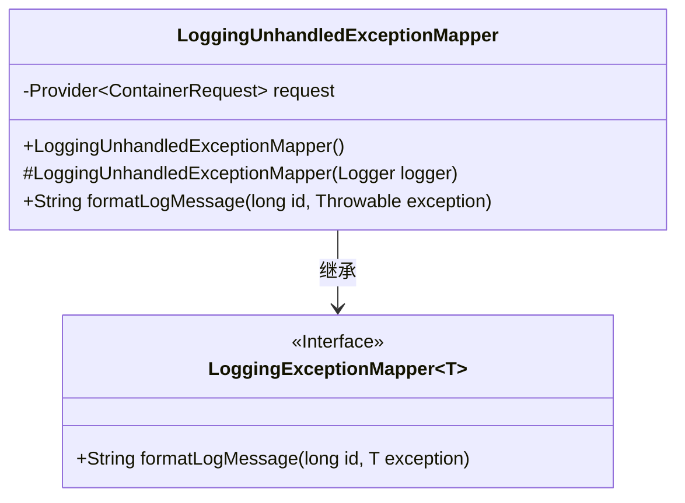
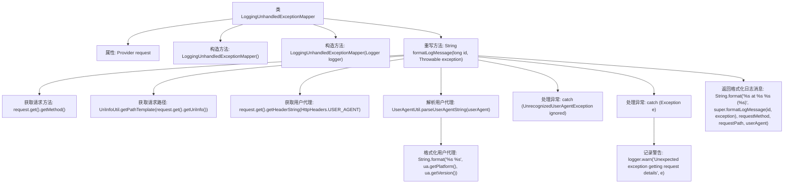

# 基础信息

|      |      |
|------|------|
| 名称 | LoggingUnhandledExceptionMapper |
| 编码语言 | .java |
| 代码路径 | Signal-Server/service/src/main/java/org/whispersystems/textsecuregcm/util/logging/LoggingUnhandledExceptionMapper.java |
| 包名 | org.whispersystems.textsecuregcm.util.logging |
| 依赖项 | ['com.google.common.annotations.VisibleForTesting', 'com.google.common.net.HttpHeaders', 'io.dropwizard.jersey.errors.LoggingExceptionMapper', 'jakarta.inject.Provider', 'jakarta.ws.rs.core.Context', 'org.glassfish.jersey.server.ContainerRequest', 'org.slf4j.Logger', 'org.whispersystems.textsecuregcm.util.ua.UnrecognizedUserAgentException', 'org.whispersystems.textsecuregcm.util.ua.UserAgent', 'org.whispersystems.textsecuregcm.util.ua.UserAgentUtil'] |
| 概述说明 | LoggingUnhandledExceptionMapper类处理未捕获异常，记录请求方法和用户代理等详细信息。 |

# 说明

LoggingUnhandledExceptionMapper类专门用于捕获和处理未捕获的异常，并生成格式化的日志信息。该日志信息包含详细的请求方法和用户代理等关键数据，以便更好地追踪和诊断问题。通过这种方式，开发人员可以更全面地了解异常发生的上下文，从而更有效地进行问题排查和修复。

# 类列表 Class Summary

| 名称   | 类型  | 说明 |
|-------|------|-------------|
| LoggingUnhandledExceptionMapper | class | LoggingUnhandledExceptionMapper类用于处理未捕获异常并格式化日志信息，包含请求方法和用户代理等详细信息。 |

## 类 LoggingUnhandledExceptionMapper

|      |      |
|------|------|
| 访问范围 | public |
| 类型 | class |
| 名称 | LoggingUnhandledExceptionMapper |
| 说明 | LoggingUnhandledExceptionMapper类用于处理未捕获异常并格式化日志信息，包含请求方法和用户代理等详细信息。 |

### UML类图

类图描述：
`LoggingUnhandledExceptionMapper` 是一个继承自 `LoggingExceptionMapper<Throwable>` 的类，用于处理未捕获的异常并生成日志消息。它包含一个 `Provider<ContainerRequest>` 类型的私有成员 `request`，用于获取请求信息。类中提供了两个构造函数，一个默认构造函数和一个用于测试的构造函数。`formatLogMessage` 方法用于格式化日志消息，包含请求方法、路径和用户代理信息。该类通过继承 `LoggingExceptionMapper<Throwable>` 接口来实现异常处理功能。

### 内部方法调用关系图

这段代码定义了一个`LoggingUnhandledExceptionMapper`类，用于处理未捕获的异常并生成格式化的日志消息。代码通过获取请求的方法、路径和用户代理信息，并将其与异常信息结合，生成最终的日志消息。在处理过程中，代码还考虑了用户代理解析失败和其他异常情况，确保日志记录的健壮性。

### 字段列表 Field List

| 名称  | 类型  | 说明 |
|-------|-------|------|
| request | Provider<ContainerRequest> | 该代码定义了一个私有Provider对象，用于提供ContainerRequest实例。 |

### 方法列表 Method List

| 名称  | 类型  | 说明 |
|-------|-------|------|
| formatLogMessage | String | 方法格式化日志信息，包含请求方法、路径和用户代理。 |

