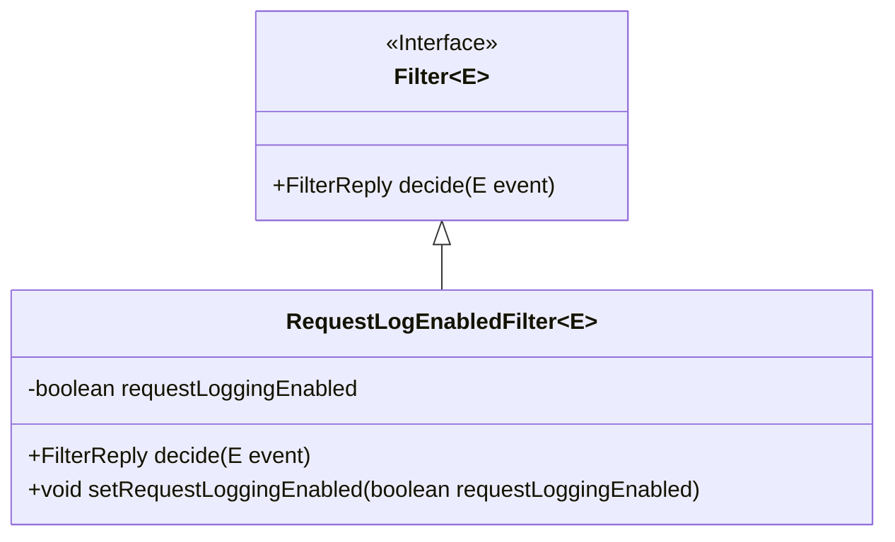
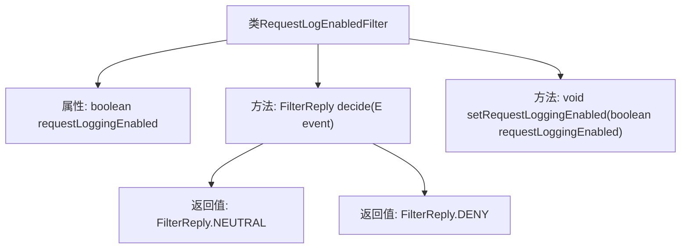

# 基础信息

|      |      |
|------|------|
| 名称 | RequestLogEnabledFilter |
| 编码语言 | .java |
| 代码路径 | Signal-Server/service/src/main/java/org/whispersystems/textsecuregcm/util/logging/RequestLogEnabledFilter.java |
| 包名 | org.whispersystems.textsecuregcm.util.logging |
| 依赖项 | ['ch.qos.logback.core.filter.Filter', 'ch.qos.logback.core.spi.FilterReply'] |
| 概述说明 | RequestLogEnabledFilter继承Filter，按requestLoggingEnabled状态决定事件处理。 |

# 说明

RequestLogEnabledFilter类继承自Filter类，其主要功能是根据requestLoggingEnabled状态来决定事件的处理结果。该类通过检查requestLoggingEnabled的状态，决定是否对请求进行日志记录或采取其他处理措施。这种设计使得日志记录功能可以根据配置灵活启用或禁用，提高了系统的可配置性和灵活性。

# 类列表 Class Summary

| 名称   | 类型  | 说明 |
|-------|------|-------------|
| RequestLogEnabledFilter | class | RequestLogEnabledFilter类继承Filter，根据requestLoggingEnabled状态决定事件处理结果。 |

## 类 RequestLogEnabledFilter

|      |      |
|------|------|
| 访问范围 | None |
| 类型 | class |
| 名称 | RequestLogEnabledFilter |
| 说明 | RequestLogEnabledFilter类继承Filter，根据requestLoggingEnabled状态决定事件处理结果。 |

### UML类图

**描述：**  
`RequestLogEnabledFilter` 是一个泛型类，继承自 `Filter` 接口。它包含一个 `volatile` 类型的布尔变量 `requestLoggingEnabled`，用于控制请求日志是否启用。`decide` 方法根据 `requestLoggingEnabled` 的值返回 `FilterReply.NEUTRAL` 或 `FilterReply.DENY`。`setRequestLoggingEnabled` 方法用于设置 `requestLoggingEnabled` 的值。类图展示了 `RequestLogEnabledFilter` 与 `Filter` 接口之间的继承关系。

### 内部方法调用关系图

这段代码定义了一个泛型类 `RequestLogEnabledFilter<E>`，它继承自 `Filter<E>`。该类包含一个布尔类型的属性 `requestLoggingEnabled`，用于控制请求日志是否启用。`decide` 方法根据 `requestLoggingEnabled` 的值返回 `FilterReply.NEUTRAL` 或 `FilterReply.DENY`。`setRequestLoggingEnabled` 方法用于设置 `requestLoggingEnabled` 的值。流程图展示了类的结构及其方法之间的关系。

### 字段列表 Field List

| 名称  | 类型  | 说明 |
|-------|-------|------|
| requestLoggingEnabled = false | boolean | 私有易变布尔变量，用于控制请求日志记录，默认关闭。 |

### 方法列表 Method List

| 名称  | 类型  | 说明 |
|-------|-------|------|
| setRequestLoggingEnabled | void | 设置请求日志记录功能的启用状态。 |
| decide | FilterReply | 方法根据requestLoggingEnabled决定返回NEUTRAL或DENY。 |

