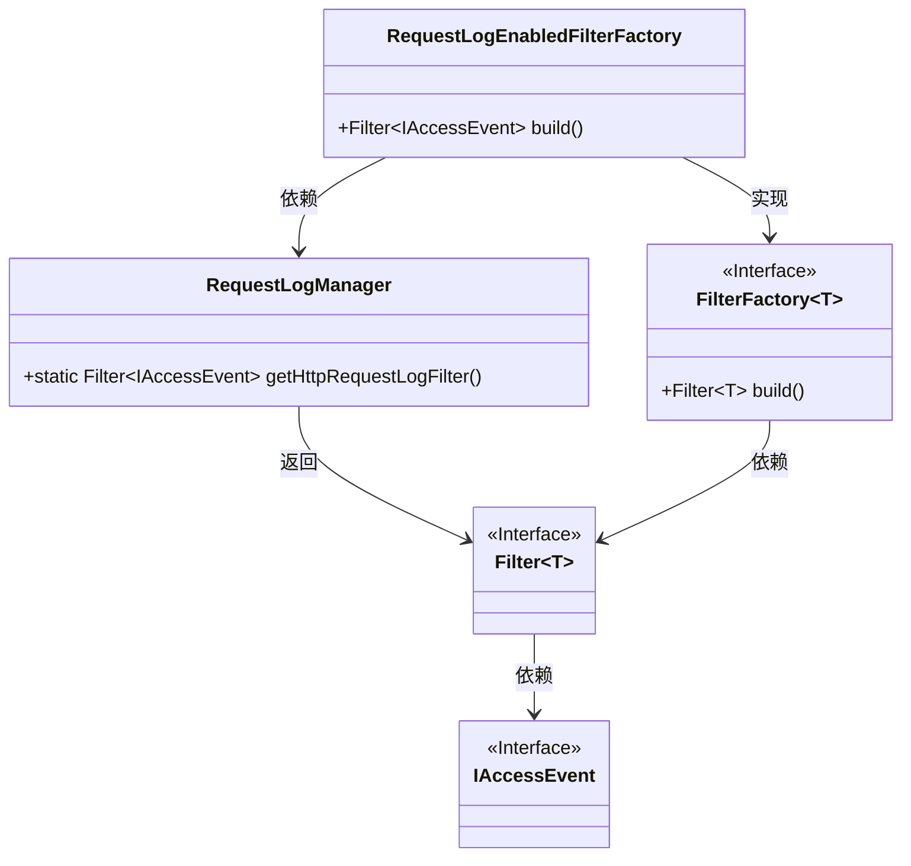
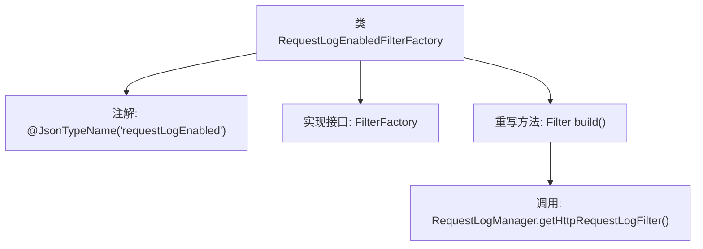

# 基础信息

|      |      |
|------|------|
| 名称 | RequestLogEnabledFilterFactory |
| 编码语言 | .java |
| 代码路径 | Signal-Server/service/src/main/java/org/whispersystems/textsecuregcm/util/logging/RequestLogEnabledFilterFactory.java |
| 包名 | org.whispersystems.textsecuregcm.util.logging |
| 依赖项 | ['ch.qos.logback.access.spi.IAccessEvent', 'ch.qos.logback.core.filter.Filter', 'com.fasterxml.jackson.annotation.JsonTypeName', 'io.dropwizard.logging.common.filter.FilterFactory'] |
| 概述说明 | 类RequestLogEnabledFilterFactory实现FilterFactory接口，返回HTTP请求日志过滤器。 |

# 说明

类RequestLogEnabledFilterFactory实现了FilterFactory接口，其主要功能是返回一个用于记录HTTP请求日志的过滤器。该过滤器通过捕获和记录HTTP请求的相关信息，帮助开发者监控和分析应用程序的请求处理过程。这一实现使得日志记录功能能够灵活地集成到应用程序中，便于调试和性能优化。

# 类列表 Class Summary

| 名称   | 类型  | 说明 |
|-------|------|-------------|
| RequestLogEnabledFilterFactory | class | 类RequestLogEnabledFilterFactory实现FilterFactory接口，返回HTTP请求日志过滤器。 |

## 类 RequestLogEnabledFilterFactory

|      |      |
|------|------|
| 访问范围 | @JsonTypeName("requestLogEnabled") |
| 类型 | class |
| 名称 | RequestLogEnabledFilterFactory |
| 说明 | 类RequestLogEnabledFilterFactory实现FilterFactory接口，返回HTTP请求日志过滤器。 |

### UML类图

**描述：**
`RequestLogEnabledFilterFactory` 类实现了 `FilterFactory<IAccessEvent>` 接口，并重写了 `build` 方法。该方法通过调用 `RequestLogManager` 的静态方法 `getHttpRequestLogFilter` 来返回一个 `Filter<IAccessEvent>` 对象。`FilterFactory` 和 `Filter` 都是泛型接口，分别用于创建过滤器和定义过滤器行为。`IAccessEvent` 是事件接口，表示访问事件。

### 内部方法调用关系图

这段代码定义了一个名为`RequestLogEnabledFilterFactory`的类，该类实现了`FilterFactory<IAccessEvent>`接口，并通过`@JsonTypeName`注解标记为`requestLogEnabled`。在`build`方法中，它调用了`RequestLogManager.getHttpRequestLogFilter()`来返回一个`Filter<IAccessEvent>`对象。流程图清晰地展示了类的结构、注解、接口实现以及方法调用关系。

### 字段列表 Field List

| 名称  | 类型  | 说明 |
|-------|-------|------|

### 方法列表 Method List

| 名称  | 类型  | 说明 |
|-------|-------|------|
| build | Filter<IAccessEvent> | 该方法重写并返回HTTP请求日志过滤器。 |

