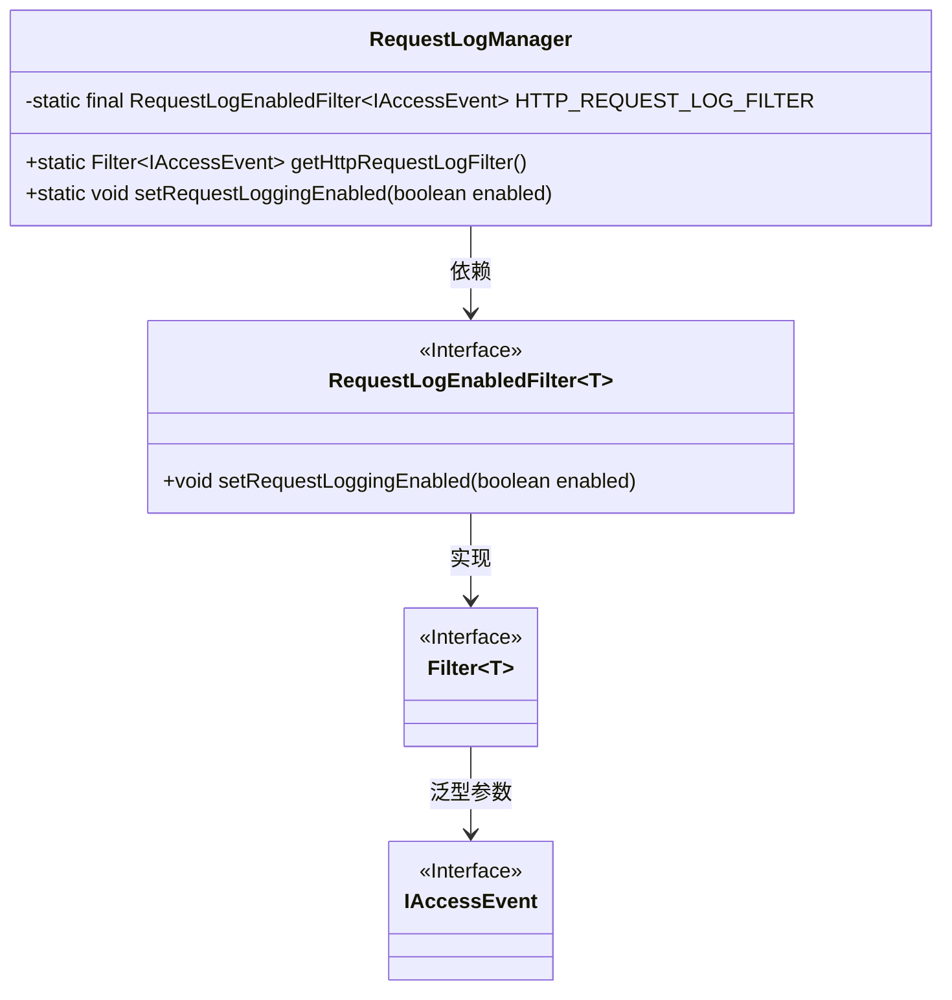
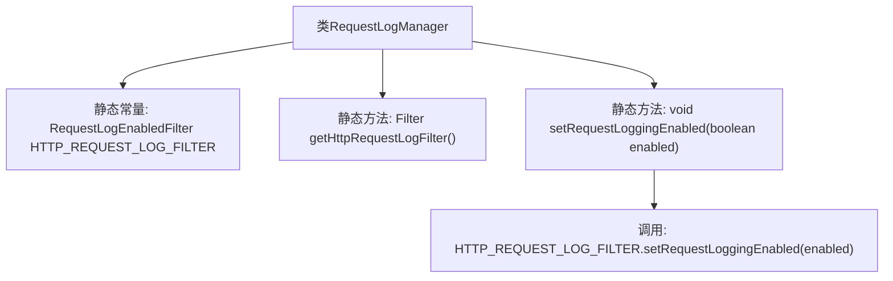

# 基础信息

|      |      |
|------|------|
| 名称 | RequestLogManager |
| 编码语言 | .java |
| 代码路径 | Signal-Server/service/src/main/java/org/whispersystems/textsecuregcm/util/logging/RequestLogManager.java |
| 包名 | org.whispersystems.textsecuregcm.util.logging |
| 依赖项 | ['ch.qos.logback.access.spi.IAccessEvent', 'ch.qos.logback.core.filter.Filter'] |
| 概述说明 | RequestLogManager类控制HTTP请求日志过滤器的启用与禁用。 |

# 说明

RequestLogManager类负责管理HTTP请求的日志过滤器，其主要功能包括启用或禁用日志记录。该类通过提供相应的方法，使用户能够灵活控制日志记录的开启与关闭，从而实现对HTTP请求日志的有效管理。

# 类列表 Class Summary

| 名称   | 类型  | 说明 |
|-------|------|-------------|
| RequestLogManager | class | RequestLogManager类管理HTTP请求日志过滤器，提供启用或禁用日志记录的方法。 |

## 类 RequestLogManager

|      |      |
|------|------|
| 访问范围 | public |
| 类型 | class |
| 名称 | RequestLogManager |
| 说明 | RequestLogManager类管理HTTP请求日志过滤器，提供启用或禁用日志记录的方法。 |

### UML类图

这段代码定义了一个 `RequestLogManager` 类，用于管理 HTTP 请求日志的过滤器。`RequestLogManager` 类包含一个静态的 `RequestLogEnabledFilter<IAccessEvent>` 实例，并提供获取该过滤器以及设置日志启用状态的方法。`RequestLogEnabledFilter` 实现了 `Filter` 接口，并且 `Filter` 接口使用了泛型参数 `T`，其中 `T` 被指定为 `IAccessEvent`。该设计允许通过 `RequestLogManager` 类动态控制日志记录的启用与禁用。

### 内部方法调用关系图

这段代码定义了一个名为 `RequestLogManager` 的类，该类包含一个静态常量 `HTTP_REQUEST_LOG_FILTER` 和两个静态方法 `getHttpRequestLogFilter` 和 `setRequestLoggingEnabled`。`getHttpRequestLogFilter` 方法返回 `HTTP_REQUEST_LOG_FILTER`，而 `setRequestLoggingEnabled` 方法则调用 `HTTP_REQUEST_LOG_FILTER` 的 `setRequestLoggingEnabled` 方法来设置请求日志的启用状态。流程图展示了类与方法和常量之间的关系，以及方法之间的调用顺序。

### 字段列表 Field List

| 名称  | 类型  | 说明 |
|-------|-------|------|
| HTTP_REQUEST_LOG_FILTER = new RequestLogEnabledFilter<>() | RequestLogEnabledFilter<IAccessEvent> | 定义了一个私有的静态最终HTTP请求日志过滤器实例。 |

### 方法列表 Method List

| 名称  | 类型  | 说明 |
|-------|-------|------|
| getHttpRequestLogFilter | Filter<IAccessEvent> | 获取HTTP请求日志过滤器实例。 |
| setRequestLoggingEnabled | void | 设置HTTP请求日志记录功能的启用状态。 |

