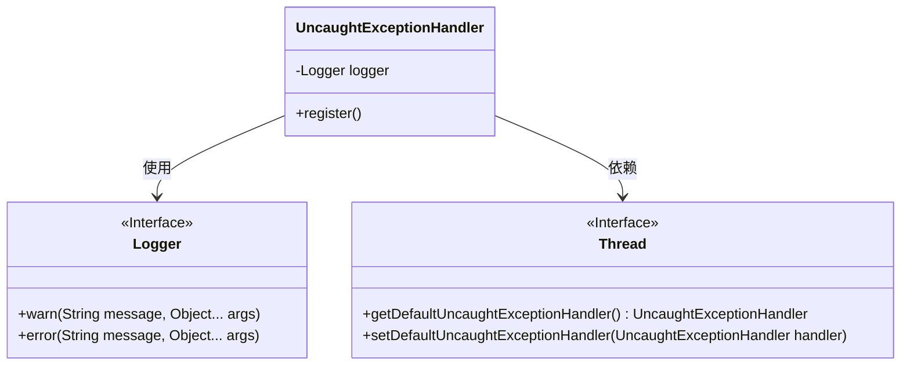
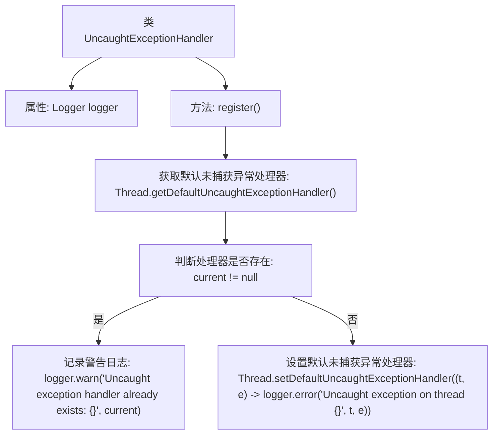

# 基础信息

|      |      |
|------|------|
| 名称 | UncaughtExceptionHandler |
| 编码语言 | .java |
| 代码路径 | Signal-Server/service/src/main/java/org/whispersystems/textsecuregcm/util/logging/UncaughtExceptionHandler.java |
| 包名 | org.whispersystems.textsecuregcm.util.logging |
| 依赖项 | ['javax.annotation.Nullable', 'org.slf4j.Logger', 'org.slf4j.LoggerFactory'] |
| 概述说明 | 注册未捕获异常处理器，存在则记录警告，否则默认记录错误。 |

# 说明

注册未捕获异常处理器时，首先检查是否已存在处理器。如果存在，则记录警告信息；如果不存在，则设置默认处理器并记录错误信息。这一过程确保在未捕获异常发生时，系统能够正确处理并记录相关信息，避免异常未被捕获导致的问题。

# 类列表 Class Summary

| 名称   | 类型  | 说明 |
|-------|------|-------------|
| UncaughtExceptionHandler | class | 注册未捕获异常处理器，若存在则记录警告，否则设置默认处理器记录错误。 |

## 类 UncaughtExceptionHandler

|      |      |
|------|------|
| 访问范围 | public |
| 类型 | class |
| 名称 | UncaughtExceptionHandler |
| 说明 | 注册未捕获异常处理器，若存在则记录警告，否则设置默认处理器记录错误。 |

### UML类图

这段代码定义了一个`UncaughtExceptionHandler`类，用于注册一个默认的未捕获异常处理器。该类包含一个静态的`register`方法，首先检查是否已经存在默认的未捕获异常处理器，如果存在则记录警告信息并返回；否则，设置一个新的未捕获异常处理器，当线程发生未捕获异常时，记录错误信息。类图展示了`UncaughtExceptionHandler`类与`Logger`和`Thread`接口之间的依赖关系。

### 内部方法调用关系图

这段代码定义了一个`UncaughtExceptionHandler`类，用于注册默认的未捕获异常处理器。首先，它获取当前的未捕获异常处理器，如果已存在则记录警告日志并返回；否则，设置一个新的未捕获异常处理器，当线程发生未捕获异常时，记录错误日志。流程图展示了代码的执行流程，包括获取处理器、判断处理器是否存在、记录日志和设置处理器的步骤。

### 字段列表 Field List

| 名称  | 类型  | 说明 |
|-------|-------|------|
| logger = LoggerFactory.getLogger(UncaughtExceptionHandler.class) | Logger | 定义私有静态日志记录器，用于捕获未处理异常。 |

### 方法列表 Method List

| 名称  | 类型  | 说明 |
|-------|-------|------|
| register | void | 注册默认线程未捕获异常处理程序，若已存在则记录警告。 |

