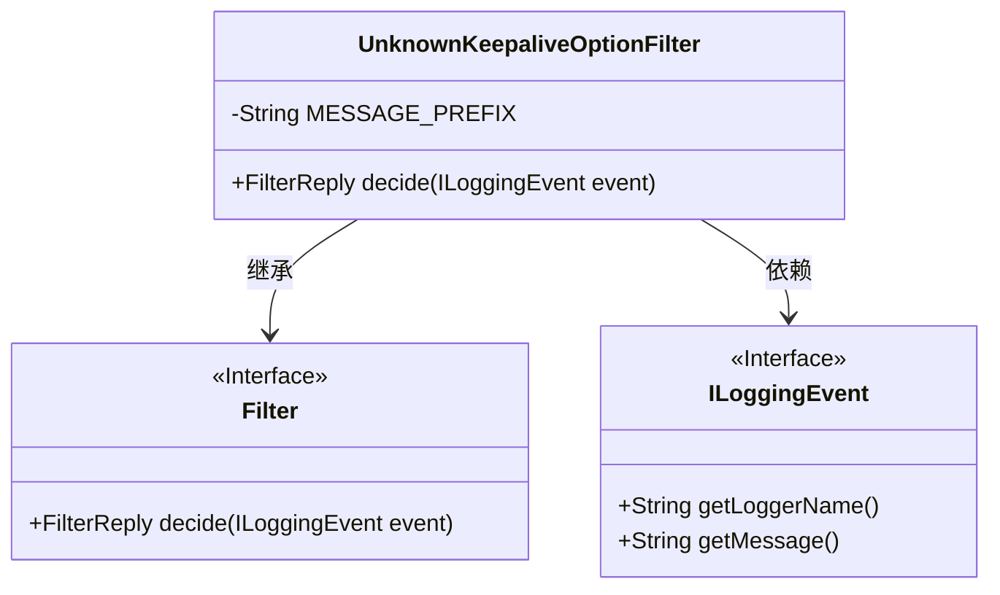
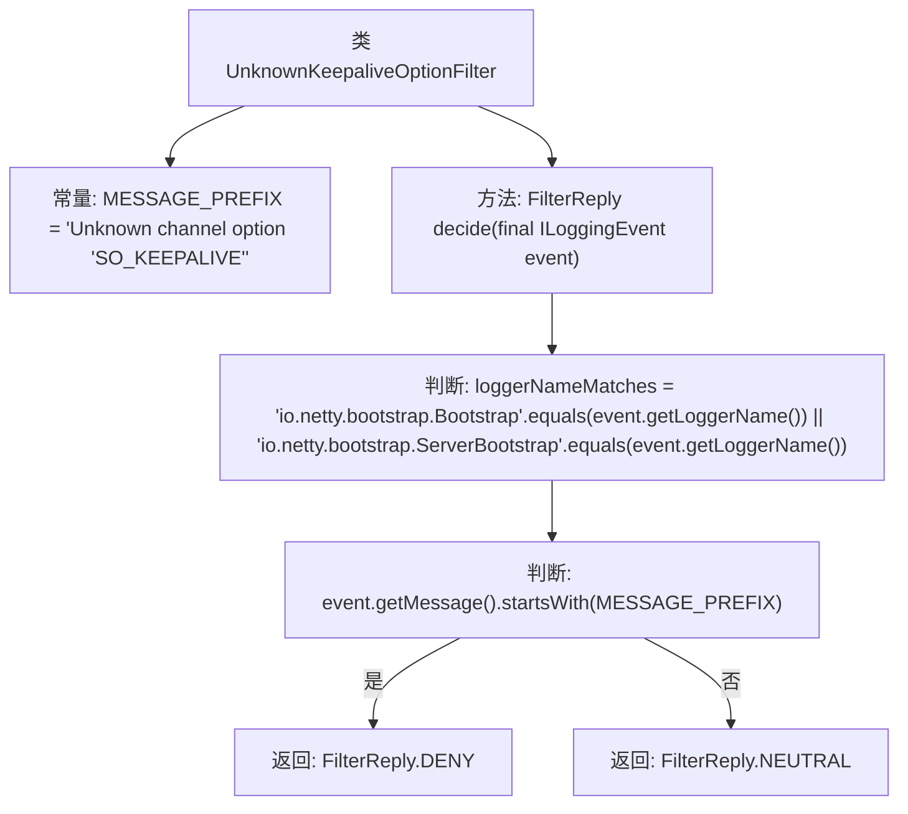

# 基础信息

|      |      |
|------|------|
| 名称 | UnknownKeepaliveOptionFilter |
| 编码语言 | .java |
| 代码路径 | Signal-Server/service/src/main/java/org/whispersystems/textsecuregcm/util/logging/UnknownKeepaliveOptionFilter.java |
| 包名 | org.whispersystems.textsecuregcm.util.logging |
| 依赖项 | ['ch.qos.logback.classic.spi.ILoggingEvent', 'ch.qos.logback.core.filter.Filter', 'ch.qos.logback.core.spi.FilterReply'] |
| 概述说明 | 过滤日志中的未知SO_KEEPALIVE选项信息。 |

# 说明

该内容描述了一个处理日志的任务，具体涉及过滤掉日志中未知的SO_KEEPALIVE选项信息。SO_KEEPALIVE是一个与网络套接字相关的选项，用于检测连接是否仍然活跃。在处理日志时，系统可能会遇到未知的SO_KEEPALIVE选项信息，这些信息需要被过滤掉以确保日志的准确性和可读性。该任务的目标是清理日志数据，排除无关或无效的选项信息，从而提升日志处理的质量和效率。

# 类列表 Class Summary

| 名称   | 类型  | 说明 |
|-------|------|-------------|
| UnknownKeepaliveOptionFilter | class | 过滤日志中未知的SO_KEEPALIVE选项信息。 |

## 类 UnknownKeepaliveOptionFilter

|      |      |
|------|------|
| 访问范围 | public |
| 类型 | class |
| 名称 | UnknownKeepaliveOptionFilter |
| 说明 | 过滤日志中未知的SO_KEEPALIVE选项信息。 |

### UML类图

这段代码定义了一个名为 `UnknownKeepaliveOptionFilter` 的类，它继承自 `Filter<ILoggingEvent>` 接口。该类的主要功能是通过 `decide` 方法对日志事件进行过滤。`decide` 方法会检查日志事件的 logger 名称是否匹配特定的值，并且日志消息是否以特定的前缀开头。如果条件满足，则返回 `FilterReply.DENY`，否则返回 `FilterReply.NEUTRAL`。该类的设计目的是过滤掉与 `SO_KEEPALIVE` 选项相关的未知日志消息。

### 内部方法调用关系图

这段代码定义了一个名为 `UnknownKeepaliveOptionFilter` 的过滤器类，用于处理日志事件。该类包含一个常量 `MESSAGE_PREFIX` 和一个 `decide` 方法。`decide` 方法首先检查日志事件的 `loggerName` 是否匹配特定的类名（`io.netty.bootstrap.Bootstrap` 或 `io.netty.bootstrap.ServerBootstrap`），然后检查日志消息是否以 `MESSAGE_PREFIX` 开头。如果两个条件都满足，则返回 `FilterReply.DENY`，否则返回 `FilterReply.NEUTRAL`。该过滤器的作用是阻止特定类型的日志消息被记录。

### 字段列表 Field List

| 名称  | 类型  | 说明 |
|-------|-------|------|
| MESSAGE_PREFIX = "Unknown channel option 'SO_KEEPALIVE'" | String | 未知通道选项 'SO_KEEPALIVE' 的提示信息。 |

### 方法列表 Method List

| 名称  | 类型  | 说明 |
|-------|-------|------|
| decide | FilterReply | 过滤日志事件，匹配指定日志名且消息前缀符合时拒绝，否则中立。 |

