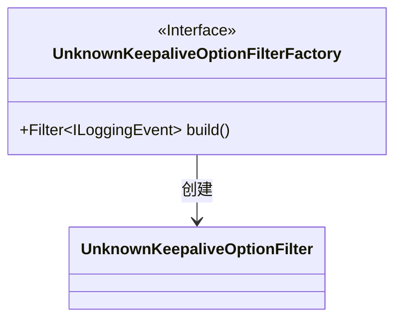
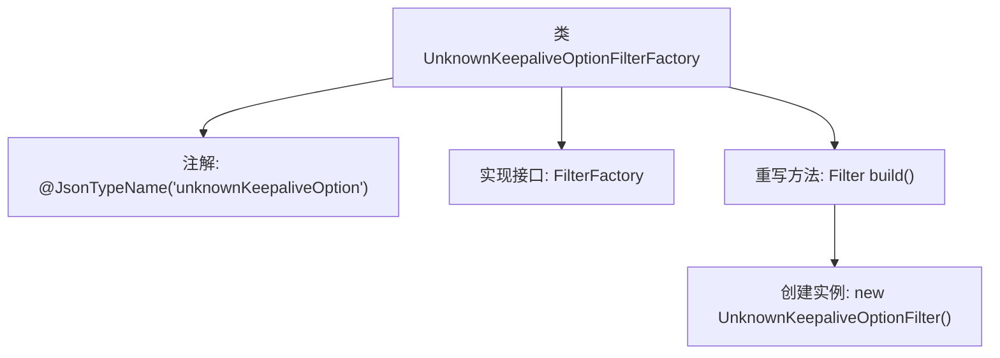

# 基础信息

|      |      |
|------|------|
| 名称 | UnknownKeepaliveOptionFilterFactory |
| 编码语言 | .java |
| 代码路径 | Signal-Server/service/src/main/java/org/whispersystems/textsecuregcm/util/logging/UnknownKeepaliveOptionFilterFactory.java |
| 包名 | org.whispersystems.textsecuregcm.util.logging |
| 依赖项 | ['ch.qos.logback.classic.spi.ILoggingEvent', 'ch.qos.logback.core.filter.Filter', 'com.fasterxml.jackson.annotation.JsonTypeName', 'io.dropwizard.logging.common.filter.FilterFactory'] |
| 概述说明 | 未知Keepalive选项过滤器工厂实现日志过滤。 |

# 说明

未知Keepalive选项过滤器工厂用于实现日志事件的过滤功能。该工厂通过特定的过滤机制，对日志事件进行处理和筛选，以确保只有符合条件的事件被记录或传递。这一功能有助于优化日志管理，提高系统的运行效率和日志的可读性。

# 类列表 Class Summary

| 名称   | 类型  | 说明 |
|-------|------|-------------|
| UnknownKeepaliveOptionFilterFactory | class | 未知Keepalive选项过滤器工厂实现日志事件过滤。 |

## 类 UnknownKeepaliveOptionFilterFactory

|      |      |
|------|------|
| 访问范围 | @JsonTypeName("unknownKeepaliveOption");public |
| 类型 | class |
| 名称 | UnknownKeepaliveOptionFilterFactory |
| 说明 | 未知Keepalive选项过滤器工厂实现日志事件过滤。 |

### UML类图

这段代码定义了一个名为 `UnknownKeepaliveOptionFilterFactory` 的类，该类实现了 `FilterFactory<ILoggingEvent>` 接口。`UnknownKeepaliveOptionFilterFactory` 类的主要职责是通过 `build` 方法创建一个 `UnknownKeepaliveOptionFilter` 实例。`UnknownKeepaliveOptionFilter` 是一个具体的过滤器类，用于处理与 `ILoggingEvent` 相关的日志事件。类图展示了 `UnknownKeepaliveOptionFilterFactory` 类依赖于 `UnknownKeepaliveOptionFilter` 类来创建过滤器实例的关系。

### 内部方法调用关系图

这段代码定义了一个名为 `UnknownKeepaliveOptionFilterFactory` 的类，该类实现了 `FilterFactory<ILoggingEvent>` 接口，并通过 `@JsonTypeName` 注解指定了类型名称为 "unknownKeepaliveOption"。类中重写了 `build` 方法，该方法返回一个 `UnknownKeepaliveOptionFilter` 的实例。流程图展示了类的结构及其方法的调用关系，清晰地反映了代码的执行流程。

### 字段列表 Field List

| 名称  | 类型  | 说明 |
|-------|-------|------|

### 方法列表 Method List

| 名称  | 类型  | 说明 |
|-------|-------|------|
| build | Filter<ILoggingEvent> | 该方法构建并返回一个未知保活选项过滤器。 |

