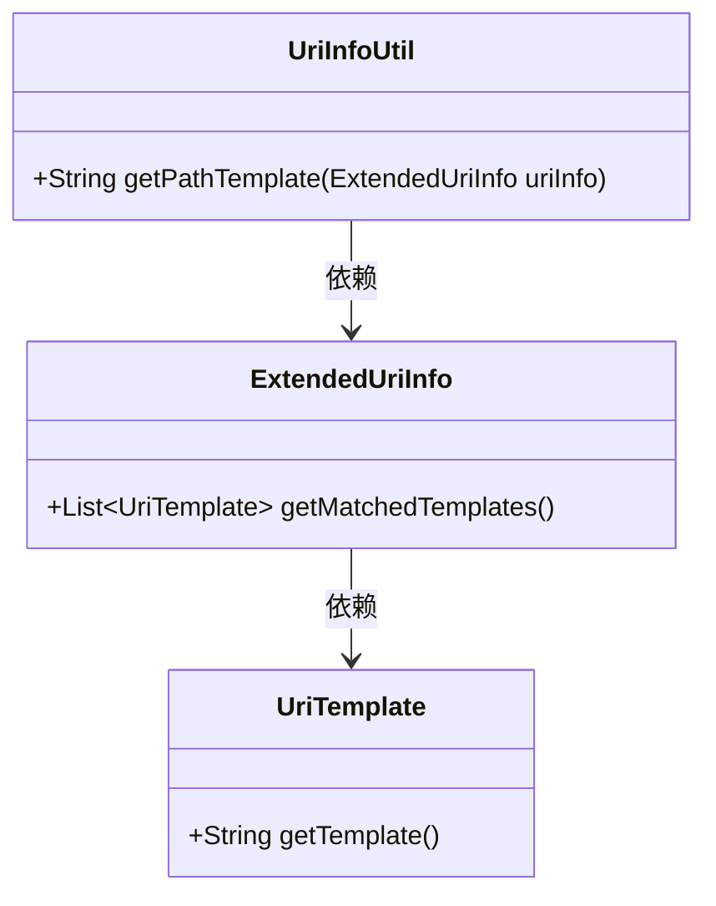
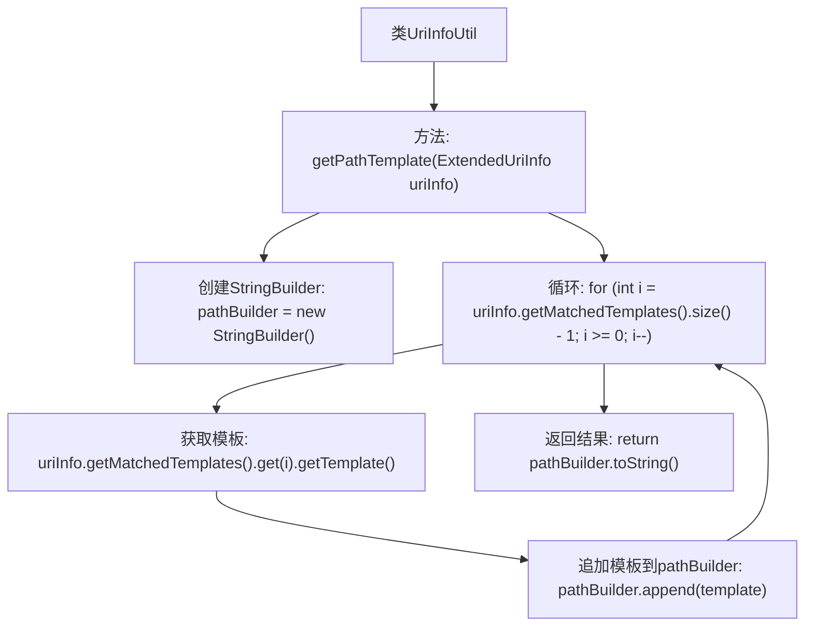

# 基础信息

|      |      |
|------|------|
| 名称 | UriInfoUtil |
| 编码语言 | .java |
| 代码路径 | Signal-Server/service/src/main/java/org/whispersystems/textsecuregcm/util/logging/UriInfoUtil.java |
| 包名 | org.whispersystems.textsecuregcm.util.logging |
| 依赖项 | ['org.glassfish.jersey.server.ExtendedUriInfo'] |
| 概述说明 | UriInfoUtil类的getPathTemplate方法用于拼接匹配的URI模板。 |

# 说明

UriInfoUtil类中的getPathTemplate方法的主要功能是拼接匹配的URI模板。该方法通过将URI的各个部分组合起来，生成一个完整的模板路径，以便在后续处理中能够准确匹配和解析URI。此方法在URI处理和路由匹配中起到关键作用，确保系统能够正确识别和处理传入的请求路径。

# 类列表 Class Summary

| 名称   | 类型  | 说明 |
|-------|------|-------------|
| UriInfoUtil | class | UriInfoUtil类中的getPathTemplate方法用于拼接匹配的URI模板。 |

## 类 UriInfoUtil

|      |      |
|------|------|
| 访问范围 | public |
| 类型 | class |
| 名称 | UriInfoUtil |
| 说明 | UriInfoUtil类中的getPathTemplate方法用于拼接匹配的URI模板。 |

### UML类图

这段代码定义了一个 `UriInfoUtil` 类，其中包含一个静态方法 `getPathTemplate`，用于从 `ExtendedUriInfo` 对象中获取路径模板。`ExtendedUriInfo` 类提供了一个方法 `getMatchedTemplates`，返回一个 `UriTemplate` 对象的列表。`UriTemplate` 类则提供了 `getTemplate` 方法，返回模板字符串。`UriInfoUtil` 类依赖于 `ExtendedUriInfo` 类，而 `ExtendedUriInfo` 类又依赖于 `UriTemplate` 类。

### 内部方法调用关系图

该流程图展示了`UriInfoUtil`类中的`getPathTemplate`方法的执行流程。方法首先创建一个`StringBuilder`对象，然后通过倒序遍历`uriInfo.getMatchedTemplates()`中的模板，将每个模板追加到`StringBuilder`中，最后返回构建的路径字符串。该流程确保路径模板按照特定顺序拼接，适用于处理复杂的URI模板。

### 字段列表 Field List

| 名称  | 类型  | 说明 |
|-------|-------|------|

### 方法列表 Method List

| 名称  | 类型  | 说明 |
|-------|-------|------|
| getPathTemplate | String | 静态方法获取路径模板，逆向拼接URI模板字符串。 |

