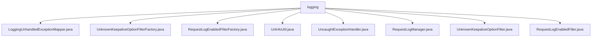

# 基础信息

|      |      |
|------|------|
| 名称 | logging |
| 编码语言 | .java |
| 代码路径 | Signal-Server/service/src/main/java/org/whispersystems/textsecuregcm/util/logging |
| 包名 | Signal-Server.service.src.main.java.org.whispersystems.textsecuregcm.util.logging |
| 概述说明 | LoggingUnhandledExceptionMapper捕获未处理异常并记录日志。UnknownKeepaliveOptionFilterFactory过滤日志事件。RequestLogEnabledFilterFactory返回HTTP请求日志过滤器。UriInfoUtil拼接URI模板。UncaughtExceptionHandler注册未捕获异常处理器。RequestLogManager管理HTTP请求日志。UnknownKeepaliveOptionFilter过滤未知SO_KEEPALIVE选项。RequestLogEnabledFilter根据状态决定日志记录。 |

# 说明

## 概述
该代码模块主要专注于日志管理和异常处理功能，旨在通过捕获、记录和过滤日志信息，帮助开发人员更好地监控、调试和优化系统。模块提供了多种工具和过滤器，用于处理未捕获的异常、记录HTTP请求日志、过滤无效的日志选项，并生成格式化的日志信息。通过这些功能，模块确保了日志数据的准确性、可读性和可管理性，同时提升了系统的稳定性和可维护性。

## 主要业务场景
1. **未捕获异常处理**：通过`LoggingUnhandledExceptionMapper`和`UncaughtExceptionHandler`类，模块能够捕获未处理的异常，并生成包含详细上下文信息的日志，帮助开发人员快速定位和修复问题。
2. **HTTP请求日志管理**：`RequestLogEnabledFilterFactory`和`RequestLogManager`类提供了灵活的HTTP请求日志记录功能，允许开发人员根据需要启用或禁用日志记录，便于监控和分析请求处理过程。
3. **日志过滤与优化**：`UnknownKeepaliveOptionFilter`和`UnknownKeepaliveOptionFilterFactory`类用于过滤日志中无效或无关的`SO_KEEPALIVE`选项信息，确保日志数据的准确性和可读性。
4. **URI路径处理**：`UriInfoUtil`类中的`getPathTemplate`方法用于拼接和匹配URI模板，确保系统能够正确识别和处理传入的请求路径，支持路由匹配和URI解析。
5. **日志事件处理**：`RequestLogEnabledFilter`类根据配置状态决定是否记录请求日志，提供了灵活的事件处理机制，增强了系统的可配置性和适应性。

### 包内部结构视图

该流程图展示了`logging`目录下的文件层级关系。`logging`作为根节点，包含了多个文件，如`LoggingUnhandledExceptionMapper.java`、`UnknownKeepaliveOptionFilterFactory.java`等。每个文件都直接隶属于`logging`目录，没有进一步的子目录结构。这些文件主要用于处理日志记录、异常捕获和请求过滤等功能，确保了系统的日志管理和错误处理机制的完整性。

# 文件列表 File List

| 名称   | 类型  | 说明 |
|-------|------|-------------|
| [RequestLogManager.java](RequestLogManager.md) | file | RequestLogManager类控制HTTP请求日志过滤器的启用与禁用。 |
| [UriInfoUtil.java](UriInfoUtil.md) | file | UriInfoUtil类的getPathTemplate方法用于拼接匹配的URI模板。 |
| [RequestLogEnabledFilter.java](RequestLogEnabledFilter.md) | file | RequestLogEnabledFilter继承Filter，按requestLoggingEnabled状态决定事件处理。 |
| [UnknownKeepaliveOptionFilter.java](UnknownKeepaliveOptionFilter.md) | file | 过滤日志中的未知SO_KEEPALIVE选项信息。 |
| [UncaughtExceptionHandler.java](UncaughtExceptionHandler.md) | file | 注册未捕获异常处理器，存在则记录警告，否则默认记录错误。 |
| [RequestLogEnabledFilterFactory.java](RequestLogEnabledFilterFactory.md) | file | 类RequestLogEnabledFilterFactory实现FilterFactory接口，返回HTTP请求日志过滤器。 |
| [UnknownKeepaliveOptionFilterFactory.java](UnknownKeepaliveOptionFilterFactory.md) | file | 未知Keepalive选项过滤器工厂实现日志过滤。 |
| [LoggingUnhandledExceptionMapper.java](LoggingUnhandledExceptionMapper.md) | file | LoggingUnhandledExceptionMapper类处理未捕获异常，记录请求方法和用户代理等详细信息。 |

