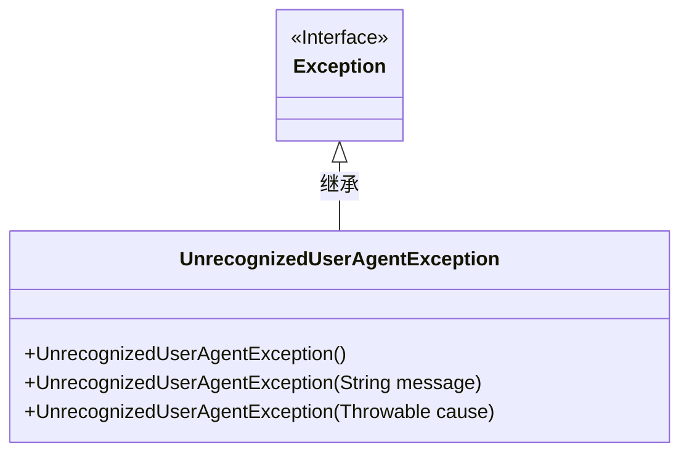
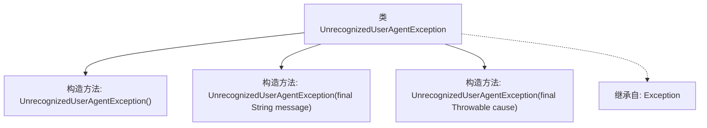

# 基础信息

|      |      |
|------|------|
| 名称 | UnrecognizedUserAgentException |
| 编码语言 | .java |
| 代码路径 | Signal-Server/service/src/main/java/org/whispersystems/textsecuregcm/util/ua/UnrecognizedUserAgentException.java |
| 包名 | org.whispersystems.textsecuregcm.util.ua |
| 依赖项 | [] |
| 概述说明 | UnrecognizedUserAgentException继承Exception，支持多种构造方法。 |

# 说明

UnrecognizedUserAgentException类继承自Exception类，提供了多种构造方法。该类用于处理未识别的用户代理异常，允许开发者通过不同的构造方法创建异常实例，以适应不同的使用场景和需求。通过扩展Exception类，UnrecognizedUserAgentException能够更好地集成到现有的异常处理机制中，提供更灵活的错误处理方式。

# 类列表 Class Summary

| 名称   | 类型  | 说明 |
|-------|------|-------------|
| UnrecognizedUserAgentException | class | UnrecognizedUserAgentException类扩展Exception，提供多种构造方法。 |

## 类 UnrecognizedUserAgentException

|      |      |
|------|------|
| 访问范围 | public |
| 类型 | class |
| 名称 | UnrecognizedUserAgentException |
| 说明 | UnrecognizedUserAgentException类扩展Exception，提供多种构造方法。 |

### UML类图

这段代码定义了一个名为 `UnrecognizedUserAgentException` 的自定义异常类，它继承自 `Exception` 类。该类提供了三个构造函数：一个无参构造函数，一个接受字符串消息的构造函数，以及一个接受 `Throwable` 对象的构造函数。这些构造函数允许在抛出异常时传递不同的信息或原因。该类的主要作用是处理未识别的用户代理（User Agent）情况，并通过继承 `Exception` 类来实现标准的异常处理机制。

### 内部方法调用关系图

这段代码定义了一个名为 `UnrecognizedUserAgentException` 的自定义异常类，它继承自 `Exception` 类。该类提供了三个构造方法：一个无参构造方法、一个接受字符串参数的构造方法以及一个接受 `Throwable` 参数的构造方法。这些构造方法分别用于创建不带消息、带消息或带原因的异常对象。该异常类通常用于处理用户代理字符串无法识别的情况。

### 字段列表 Field List

| 名称  | 类型  | 说明 |
|-------|-------|------|

### 方法列表 Method List

| 名称  | 类型  | 说明 |
|-------|-------|------|

