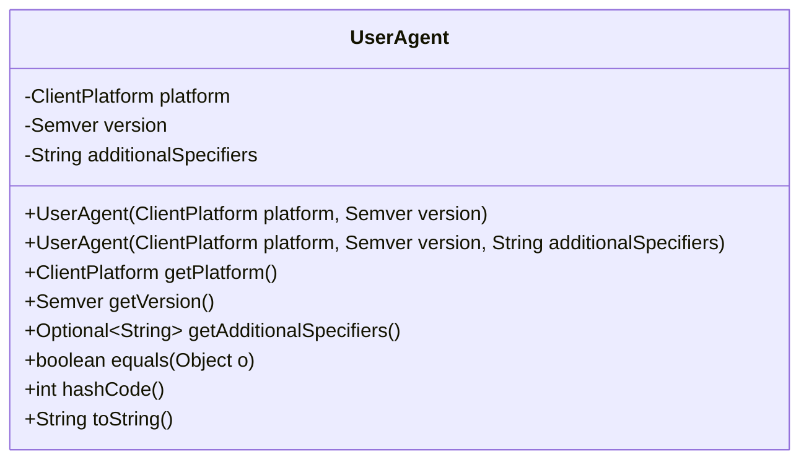
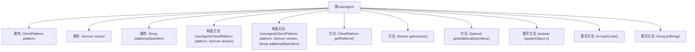

# 基础信息

|      |      |
|------|------|
| 名称 | UserAgent |
| 编码语言 | .java |
| 代码路径 | Signal-Server/service/src/main/java/org/whispersystems/textsecuregcm/util/ua/UserAgent.java |
| 包名 | org.whispersystems.textsecuregcm.util.ua |
| 依赖项 | ['com.vdurmont.semver4j.Semver', 'java.util.Objects', 'java.util.Optional'] |
| 概述说明 | UserAgent类支持平台、版本、标识符的构造、获取和比较。 |

# 说明

UserAgent类用于管理平台、版本和附加标识符信息，提供构造、获取和比较功能。该类允许创建UserAgent实例，获取平台和版本等详细信息，并支持比较不同UserAgent实例的功能。

# 类列表 Class Summary

| 名称   | 类型  | 说明 |
|-------|------|-------------|
| UserAgent | class | UserAgent类包含平台、版本和附加标识符，提供构造、获取和比较功能。 |

## 类 UserAgent

|      |      |
|------|------|
| 访问范围 | public |
| 类型 | class |
| 名称 | UserAgent |
| 说明 | UserAgent类包含平台、版本和附加标识符，提供构造、获取和比较功能。 |

### UML类图

**描述：**  
`UserAgent`类用于表示用户代理信息，包含平台类型(`ClientPlatform`)、版本号(`Semver`)和附加说明(`additionalSpecifiers`)。类提供了两个构造函数，分别用于初始化平台和版本，以及平台、版本和附加说明。此外，类还提供了获取平台、版本和附加说明的方法，并重写了`equals`、`hashCode`和`toString`方法，以确保对象的比较、哈希计算和字符串表示的准确性。

### 内部方法调用关系图

这段代码定义了一个`UserAgent`类，包含三个属性：`platform`、`version`和`additionalSpecifiers`。类提供了两个构造方法，分别用于初始化这些属性。此外，类还提供了获取属性的方法，并重写了`equals`、`hashCode`和`toString`方法，以便进行对象比较、哈希计算和字符串表示。流程图展示了类的结构及其内部方法之间的调用关系。

### 字段列表 Field List

| 名称  | 类型  | 说明 |
|-------|-------|------|
| platform | ClientPlatform | 私有不可变的客户端平台实例。 |
| version | Semver | 私有最终变量存储版本号。 |
| additionalSpecifiers | String | 私有字符串常量additionalSpecifiers。 |

### 方法列表 Method List

| 名称  | 类型  | 说明 |
|-------|-------|------|
| getVersion | Semver | 获取版本号的方法。 |
| getPlatform | ClientPlatform | 获取客户端平台的方法，返回平台对象。 |
| getAdditionalSpecifiers | Optional<String> | 方法返回可选的附加说明符字符串。 |
| equals | boolean | 重写equals方法，比较平台、版本和附加标识符。 |
| toString | String | 重写toString方法，返回用户代理的平台、版本和附加信息。 |
| hashCode | int | 重写hashCode方法，使用Objects.hash计算平台、版本和附加标识符的哈希值。 |

