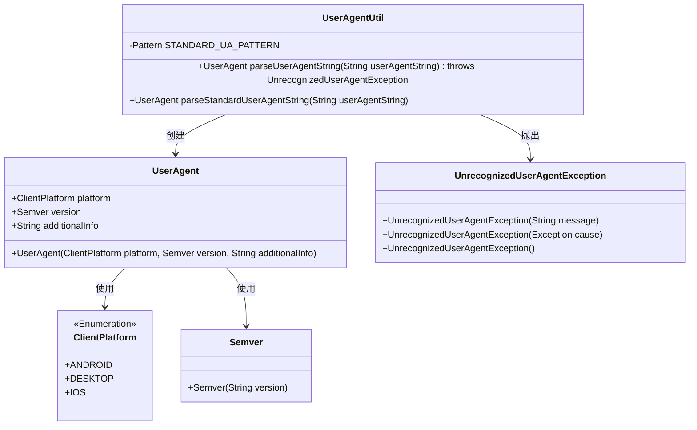
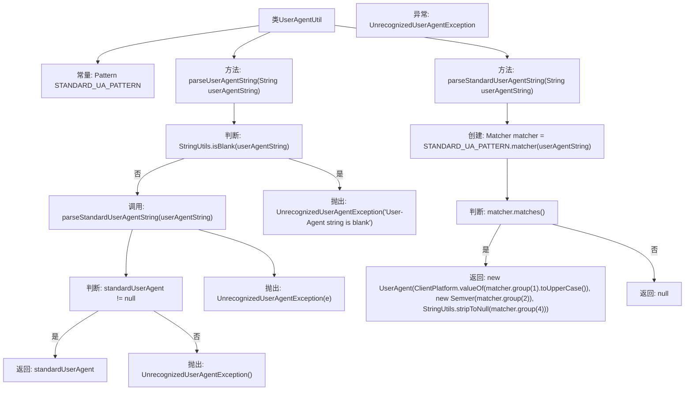

# 基础信息

|      |      |
|------|------|
| 名称 | UserAgentUtil |
| 编码语言 | .java |
| 代码路径 | Signal-Server/service/src/main/java/org/whispersystems/textsecuregcm/util/ua/UserAgentUtil.java |
| 包名 | org.whispersystems.textsecuregcm.util.ua |
| 依赖项 | ['com.google.common.annotations.VisibleForTesting', 'com.vdurmont.semver4j.Semver', 'java.util.regex.Matcher', 'java.util.regex.Pattern', 'org.apache.commons.lang3.StringUtils'] |
| 概述说明 | 解析用户代理字符串，支持Android、Desktop、iOS平台。 |

# 说明

该工具类专注于解析用户代理字符串，能够识别并处理来自Android、Desktop和iOS平台的用户代理信息。通过解析这些字符串，工具类能够提取出设备类型、操作系统版本、浏览器类型等关键信息，从而帮助开发者更好地理解和适配不同平台的用户环境。该工具类适用于需要跨平台兼容性的应用场景，提供了一种高效且准确的方式来处理用户代理数据。

# 类列表 Class Summary

| 名称   | 类型  | 说明 |
|-------|------|-------------|
| UserAgentUtil | class | 解析用户代理字符串的工具类，支持Android、Desktop、iOS平台。 |

## 类 UserAgentUtil

|      |      |
|------|------|
| 访问范围 | public |
| 类型 | class |
| 名称 | UserAgentUtil |
| 说明 | 解析用户代理字符串的工具类，支持Android、Desktop、iOS平台。 |

### UML类图

这段代码定义了一个`UserAgentUtil`类，用于解析用户代理字符串。`UserAgentUtil`类包含两个主要方法：`parseUserAgentString`和`parseStandardUserAgentString`。`parseUserAgentString`方法首先检查用户代理字符串是否为空，然后尝试使用`parseStandardUserAgentString`方法解析标准格式的用户代理字符串。如果解析成功，返回`UserAgent`对象；否则抛出`UnrecognizedUserAgentException`异常。`UserAgent`类包含平台、版本和附加信息三个属性，分别由`ClientPlatform`枚举和`Semver`类表示。

### 内部方法调用关系图

这段代码用于解析用户代理字符串（User-Agent string），并返回一个`UserAgent`对象。首先，代码检查输入字符串是否为空，若为空则抛出异常。然后，尝试调用`parseStandardUserAgentString`方法解析字符串，若解析成功则返回结果，否则抛出异常。`parseStandardUserAgentString`方法使用正则表达式匹配字符串，若匹配成功则返回`UserAgent`对象，否则返回`null`。

### 字段列表 Field List

| 名称  | 类型  | 说明 |
|-------|-------|------|
| STANDARD_UA_PATTERN = Pattern.compile("^Signal-(Android|Desktop|iOS)/([^ ]+)( (.+))?$", Pattern.CASE_INSENSITIVE) | Pattern | 标准用户代理正则表达式匹配Signal客户端版本信息。 |

### 方法列表 Method List

| 名称  | 类型  | 说明 |
|-------|-------|------|
| parseUserAgentString | UserAgent | 解析用户代理字符串，若为空或无法识别则抛出异常。 |
| parseStandardUserAgentString | UserAgent | 解析标准用户代理字符串，返回UserAgent对象，不匹配则返回null。 |

