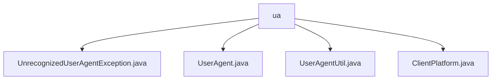

# 基础信息

|      |      |
|------|------|
| 名称 | ua |
| 编码语言 | .java |
| 代码路径 | Signal-Server/service/src/main/java/org/whispersystems/textsecuregcm/util/ua |
| 包名 | Signal-Server.service.src.main.java.org.whispersystems.textsecuregcm.util.ua |
| 概述说明 | UnrecognizedUserAgentException处理未识别用户代理异常，UserAgent管理平台信息，UserAgentUtil解析用户代理字符串。 |

# 说明

## 概述
该代码模块主要处理与用户代理（User Agent）相关的功能，包括用户代理字符串的解析、用户代理信息的封装以及未识别用户代理异常的处理。模块的核心目标是为开发者提供一种高效且准确的方式来处理跨平台的用户代理数据，从而帮助应用更好地适配不同平台的用户环境。

## 主要业务场景
1. **用户代理字符串解析**：通过`UserAgentUtil`工具类，开发者可以解析来自Android、Desktop和iOS平台的用户代理字符串，提取出设备类型、操作系统版本、浏览器类型等关键信息。这适用于需要跨平台兼容性的应用场景，确保应用能够准确识别和适配不同平台的用户环境。
  
2. **用户代理信息管理**：`UserAgent`类用于封装和管理平台、版本及附加标识符信息。开发者可以通过该类创建`UserAgent`实例，获取平台和版本等详细信息，并支持比较不同`UserAgent`实例的功能。这有助于在应用中对用户代理信息进行统一管理和操作。

3. **未识别用户代理异常处理**：`UnrecognizedUserAgentException`类继承自`Exception`类，用于处理未识别的用户代理异常。该类提供了多种构造方法，允许开发者根据不同的使用场景和需求创建异常实例。通过扩展`Exception`类，该异常能够更好地集成到现有的异常处理机制中，提供更灵活的错误处理方式。

4. **平台类型定义**：`ClientPlatform`类（尽管未提供具体细节）可能用于定义和区分不同的客户端平台类型，如Android、iOS和Desktop等。这有助于在应用中对不同平台进行明确的分类和处理。

### 包内部结构视图

该流程图展示了`ua`文件夹下的文件层级关系。`ua`文件夹包含了四个文件：`UnrecognizedUserAgentException.java`、`UserAgent.java`、`UserAgentUtil.java`和`ClientPlatform.java`。这些文件均直接位于`ua`文件夹下，没有进一步的子文件夹层级。

# 文件列表 File List

| 名称   | 类型  | 说明 |
|-------|------|-------------|
| [ClientPlatform.java](ClientPlatform.md) | file | 信息为空，无法生成概要描述。 |
| [UserAgentUtil.java](UserAgentUtil.md) | file | 解析用户代理字符串，支持Android、Desktop、iOS平台。 |
| [UserAgent.java](UserAgent.md) | file | UserAgent类支持平台、版本、标识符的构造、获取和比较。 |
| [UnrecognizedUserAgentException.java](UnrecognizedUserAgentException.md) | file | UnrecognizedUserAgentException继承Exception，支持多种构造方法。 |

