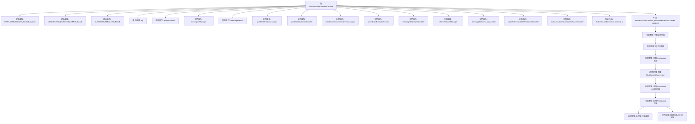

# 基础信息

|      |      |
|------|------|
| 名称 | AuthenticatedConnectListener |
| 编码语言 | .java |
| 代码路径 | Signal-Server/service/src/main/java/org/whispersystems/textsecuregcm/websocket/AuthenticatedConnectListener.java |
| 包名 | org.whispersystems.textsecuregcm.websocket |
| 依赖项 | ['org.whispersystems.textsecuregcm.metrics.MetricsUtil.name', 'io.micrometer.core.instrument.Tags', 'java.util.concurrent.ScheduledExecutorService', 'org.slf4j.Logger', 'org.slf4j.LoggerFactory', 'org.whispersystems.textsecuregcm.auth.AuthenticatedDevice', 'org.whispersystems.textsecuregcm.limits.MessageDeliveryLoopMonitor', 'org.whispersystems.textsecuregcm.metrics.MessageMetrics', 'org.whispersystems.textsecuregcm.metrics.OpenWebSocketCounter', 'org.whispersystems.textsecuregcm.push.WebSocketConnectionEventManager', 'org.whispersystems.textsecuregcm.push.PushNotificationManager', 'org.whispersystems.textsecuregcm.push.PushNotificationScheduler', 'org.whispersystems.textsecuregcm.push.ReceiptSender', 'org.whispersystems.textsecuregcm.storage.ClientReleaseManager', 'org.whispersystems.textsecuregcm.storage.MessagesManager', 'org.whispersystems.websocket.session.WebSocketSessionContext', 'org.whispersystems.websocket.setup.WebSocketConnectListener', 'reactor.core.scheduler.Scheduler'] |
| 概述说明 | AuthenticatedConnectListener负责WebSocket连接、认证设备消息传递及推送通知管理。 |

# 说明

AuthenticatedConnectListener负责处理WebSocket连接，主要功能包括管理认证设备之间的消息传递以及推送通知的发送。该组件确保通过WebSocket建立的连接是经过认证的，并在连接期间高效地处理设备间的通信和通知推送。

# 类列表 Class Summary

| 名称   | 类型  | 说明 |
|-------|------|-------------|
| AuthenticatedConnectListener | class | AuthenticatedConnectListener处理WebSocket连接，管理认证设备的消息传递和推送通知。 |

## 类 AuthenticatedConnectListener

|      |      |
|------|------|
| 访问范围 | public |
| 类型 | class |
| 名称 | AuthenticatedConnectListener |
| 说明 | AuthenticatedConnectListener处理WebSocket连接，管理认证设备的消息传递和推送通知。 |

### UML类图

```mermaid
classDiagram
    class AuthenticatedConnectListener {
        -static final String OPEN_WEBSOCKET_GAUGE_NAME
        -static final String CONNECTED_DURATION_TIMER_NAME
        -static final String AUTHENTICATED_TAG_NAME
        -static final Logger log
        -ReceiptSender receiptSender
        -MessagesManager messagesManager
        -MessageMetrics messageMetrics
        -PushNotificationManager pushNotificationManager
        -PushNotificationScheduler pushNotificationScheduler
        -WebSocketConnectionEventManager webSocketConnectionEventManager
        -ScheduledExecutorService scheduledExecutorService
        -Scheduler messageDeliveryScheduler
        -ClientReleaseManager clientReleaseManager
        -MessageDeliveryLoopMonitor messageDeliveryLoopMonitor
        -OpenWebSocketCounter openAuthenticatedWebSocketCounter
        -OpenWebSocketCounter openUnauthenticatedWebSocketCounter
        +AuthenticatedConnectListener(ReceiptSender, MessagesManager, MessageMetrics, PushNotificationManager, PushNotificationScheduler, WebSocketConnectionEventManager, ScheduledExecutorService, Scheduler, ClientReleaseManager, MessageDeliveryLoopMonitor)
        +void onWebSocketConnect(WebSocketSessionContext context)
    }

    class WebSocketConnectListener {
        <<Interface>>
        +void onWebSocketConnect(WebSocketSessionContext context)
    }

    class WebSocketSessionContext {
        +AuthenticatedDevice getAuthenticated()
        +Client getClient()
        +void addWebsocketClosedListener(WebSocketClosedListener listener)
    }

    class AuthenticatedDevice {
        +Account getAccount()
        +AuthenticatedDevice getAuthenticatedDevice()
    }

    class WebSocketConnection {
        +WebSocketConnection(ReceiptSender, MessagesManager, MessageMetrics, PushNotificationManager, PushNotificationScheduler, AuthenticatedDevice, Client, ScheduledExecutorService, Scheduler, ClientReleaseManager, MessageDeliveryLoopMonitor)
        +void start()
        +void stop()
    }

    class OpenWebSocketCounter {
        +OpenWebSocketCounter(String gaugeName, String timerName, Tags tags)
        +void countOpenWebSocket(WebSocketSessionContext context)
    }

    class WebSocketConnectionEventManager {
        +void handleClientConnected(UUID accountUuid, long deviceId, WebSocketConnection connection)
        +void handleClientDisconnected(UUID accountUuid, long deviceId)
    }

    AuthenticatedConnectListener ..|> WebSocketConnectListener : 实现
    AuthenticatedConnectListener --> WebSocketSessionContext : 使用
    AuthenticatedConnectListener --> WebSocketConnection : 创建
    AuthenticatedConnectListener --> OpenWebSocketCounter : 使用
    AuthenticatedConnectListener --> WebSocketConnectionEventManager : 使用
    WebSocketSessionContext --> AuthenticatedDevice : 获取
    WebSocketConnection --> AuthenticatedDevice : 使用
    WebSocketConnection --> WebSocketConnectionEventManager : 通知
```

**描述：**  
`AuthenticatedConnectListener` 类实现了 `WebSocketConnectListener` 接口，用于处理 WebSocket 连接事件。它依赖于多个管理器和服务类，如 `ReceiptSender`、`MessagesManager`、`PushNotificationManager` 等，来执行消息发送、推送通知调度等操作。该类在 WebSocket 连接时，根据认证状态选择不同的计数器进行统计，并创建 `WebSocketConnection` 对象来管理连接。连接关闭时，会通知 `WebSocketConnectionEventManager` 处理客户端断开事件。

### 内部方法调用关系图

**描述：**  
`AuthenticatedConnectListener` 类用于处理WebSocket连接的认证和连接管理。它包含多个静态和实例属性，用于管理连接计数、消息传递、推送通知等。`onWebSocketConnect` 方法是核心逻辑，负责判断连接是否认证，选择相应的计数器，创建并启动WebSocket连接，同时添加关闭监听器以处理连接断开时的逻辑。如果初始化过程中发生异常，会记录日志并关闭连接。

### 字段列表 Field List

| 名称  | 类型  | 说明 |
|-------|-------|------|
| CONNECTED_DURATION_TIMER_NAME =      name(AuthenticatedConnectListener.class, "connectedDuration") | String | 定义连接时长计时器名称常量。 |
| pushNotificationManager | PushNotificationManager | 私有推送通知管理器实例。 |
| messageDeliveryScheduler | Scheduler | 私有消息调度器实例。 |
| log = LoggerFactory.getLogger(AuthenticatedConnectListener.class) | Logger | 定义AuthenticatedConnectListener类的静态日志实例。 |
| messagesManager | MessagesManager | 私有且不可变的MessagesManager实例。 |
| pushNotificationScheduler | PushNotificationScheduler | 私有且不可变的推送通知调度器实例。 |
| clientReleaseManager | ClientReleaseManager | 私有且不可变的客户端发布管理器实例。 |
| receiptSender | ReceiptSender | 私有且不可变的收据发送器实例。 |
| scheduledExecutorService | ScheduledExecutorService | 私有最终定时任务执行服务。 |
| messageMetrics | MessageMetrics | 私有且不可变的MessageMetrics实例。 |
| webSocketConnectionEventManager | WebSocketConnectionEventManager | 私有WebSocket连接事件管理器实例。 |
| openUnauthenticatedWebSocketCounter | OpenWebSocketCounter | 私有成员变量，用于统计未认证WebSocket连接数。 |
| OPEN_WEBSOCKET_GAUGE_NAME = name(WebSocketConnection.class, "openWebsockets") | String | 定义WebSocket连接开放数量的度量名称。 |
| AUTHENTICATED_TAG_NAME = "authenticated" | String | 定义常量字符串"AUTHENTICATED_TAG_NAME"为"authenticated"。 |
| openAuthenticatedWebSocketCounter | OpenWebSocketCounter | 私有最终变量用于统计已认证的WebSocket连接数。 |
| messageDeliveryLoopMonitor | MessageDeliveryLoopMonitor | 私有消息循环监视器实例。 |

### 方法列表 Method List

| 名称  | 类型  | 说明 |
|-------|-------|------|
| onWebSocketConnect | void | WebSocket连接处理：验证后创建连接，启动时取消推送通知，关闭时处理断开并停止消息传递。 |

