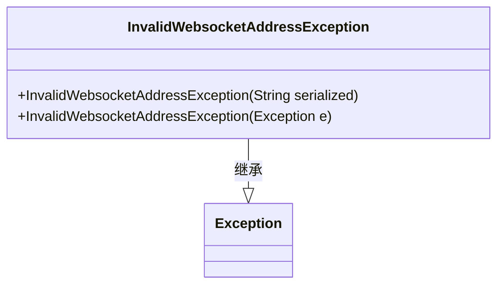
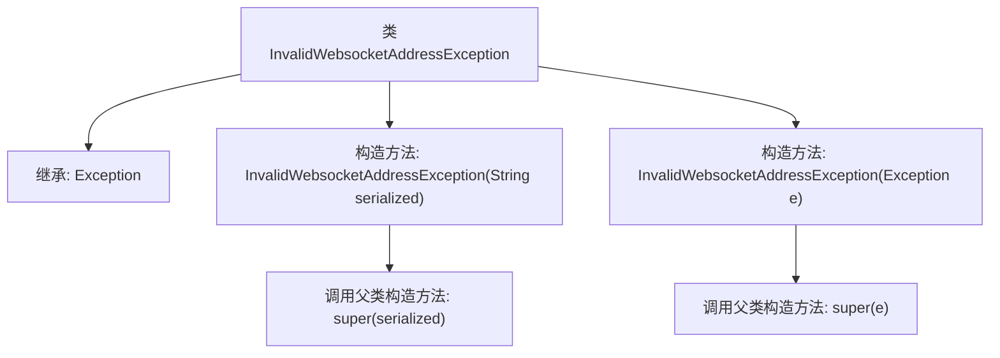

# 基础信息

|      |      |
|------|------|
| 名称 | InvalidWebsocketAddressException |
| 编码语言 | .java |
| 代码路径 | Signal-Server/service/src/main/java/org/whispersystems/textsecuregcm/websocket/InvalidWebsocketAddressException.java |
| 包名 | org.whispersystems.textsecuregcm.websocket |
| 依赖项 | [] |
| 概述说明 | InvalidWebsocketAddressException类继承Exception，处理无效WebSocket地址异常。 |

# 说明

InvalidWebsocketAddressException类继承自Exception类，专门用于处理无效WebSocket地址的异常情况。该类通过扩展Exception，提供了对WebSocket地址无效时的异常捕获和处理机制，确保在遇到无效地址时能够及时抛出异常并进行相应处理。

# 类列表 Class Summary

| 名称   | 类型  | 说明 |
|-------|------|-------------|
| InvalidWebsocketAddressException | class | InvalidWebsocketAddressException类扩展Exception，用于处理无效WebSocket地址异常。 |

## 类 InvalidWebsocketAddressException

|      |      |
|------|------|
| 访问范围 | public |
| 类型 | class |
| 名称 | InvalidWebsocketAddressException |
| 说明 | InvalidWebsocketAddressException类扩展Exception，用于处理无效WebSocket地址异常。 |

### UML类图

这段代码定义了一个名为 `InvalidWebsocketAddressException` 的异常类，它继承自 `Exception` 类。该类提供了两个构造函数：一个接受字符串参数 `serialized`，用于传递异常信息；另一个接受 `Exception` 类型的参数 `e`，用于包装另一个异常。这个类主要用于处理与无效WebSocket地址相关的异常情况，提供了灵活的异常信息传递方式。

### 内部方法调用关系图

这段代码定义了一个名为`InvalidWebsocketAddressException`的异常类，它继承自`Exception`类。该类包含两个构造方法：一个接受字符串参数并调用父类的构造方法，另一个接受异常对象并调用父类的构造方法。流程图展示了类的继承关系以及构造方法的调用流程。

### 字段列表 Field List

| 名称  | 类型  | 说明 |
|-------|-------|------|

### 方法列表 Method List

| 名称  | 类型  | 说明 |
|-------|-------|------|

