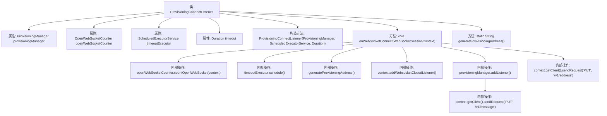

# 基础信息

|      |      |
|------|------|
| 名称 | ProvisioningConnectListener |
| 编码语言 | .java |
| 代码路径 | Signal-Server/service/src/main/java/org/whispersystems/textsecuregcm/websocket/ProvisioningConnectListener.java |
| 包名 | org.whispersystems.textsecuregcm.websocket |
| 依赖项 | ['com.google.common.annotations.VisibleForTesting', 'java.security.SecureRandom', 'java.time.Duration', 'java.util.Base64', 'java.util.List', 'java.util.Optional', 'java.util.concurrent.ScheduledExecutorService', 'java.util.concurrent.ScheduledFuture', 'java.util.concurrent.TimeUnit', 'org.whispersystems.textsecuregcm.auth.AuthenticatedDevice', 'org.whispersystems.textsecuregcm.controllers.ProvisioningController', 'org.whispersystems.textsecuregcm.entities.MessageProtos', 'org.whispersystems.textsecuregcm.entities.ProvisioningMessage', 'org.whispersystems.textsecuregcm.metrics.MetricsUtil', 'org.whispersystems.textsecuregcm.metrics.OpenWebSocketCounter', 'org.whispersystems.textsecuregcm.push.ProvisioningManager', 'org.whispersystems.textsecuregcm.storage.PubSubProtos', 'org.whispersystems.textsecuregcm.util.HeaderUtils', 'org.whispersystems.websocket.session.WebSocketSessionContext', 'org.whispersystems.websocket.setup.WebSocketConnectListener'] |
| 概述说明 | ProvisioningConnectListener管理WebSocket连接、超时及消息传递。 |

# 说明

ProvisioningConnectListener负责处理WebSocket连接的建立与维护，确保连接在超时情况下能够被有效管理。该组件还负责处理消息的传递，确保客户端与服务器之间的通信顺畅。通过监控连接状态和超时机制，ProvisioningConnectListener能够及时处理异常情况，保障系统的稳定性和可靠性。

# 类列表 Class Summary

| 名称   | 类型  | 说明 |
|-------|------|-------------|
| ProvisioningConnectListener | class | ProvisioningConnectListener处理WebSocket连接，管理超时和消息传递。 |

## 类 ProvisioningConnectListener

|      |      |
|------|------|
| 访问范围 | public |
| 类型 | class |
| 名称 | ProvisioningConnectListener |
| 说明 | ProvisioningConnectListener处理WebSocket连接，管理超时和消息传递。 |

### UML类图

```mermaid
classDiagram
    class ProvisioningConnectListener {
        -ProvisioningManager provisioningManager
        -OpenWebSocketCounter openWebSocketCounter
        -ScheduledExecutorService timeoutExecutor
        -Duration timeout
        +ProvisioningConnectListener(ProvisioningManager provisioningManager, ScheduledExecutorService timeoutExecutor, Duration timeout)
        +void onWebSocketConnect(WebSocketSessionContext context)
        +static String generateProvisioningAddress()
    }

    class ProvisioningManager {
        +void addListener(String provisioningAddress, Consumer~PubSubProtos.PubSubMessage~ listener)
        +void removeListener(String provisioningAddress)
    }

    class OpenWebSocketCounter {
        +OpenWebSocketCounter(String openWebsocketsMetricName, String sessionDurationMetricName)
        +void countOpenWebSocket(WebSocketSessionContext context)
    }

    class WebSocketSessionContext {
        +Client getClient()
        +void addWebsocketClosedListener(BiConsumer~WebSocketSessionContext, Integer, String~ listener)
    }

    class Client {
        +void close(int statusCode, String reason)
        +CompletableFuture~Void~ sendRequest(String method, String path, List~Header~ headers, Optional~byte[]~ body)
    }

    class HeaderUtils {
        +static Header getTimestampHeader()
    }

    class PubSubProtos.PubSubMessage {
        <<Interface>>
        +Type getType()
        +ByteString getContent()
    }

    class MessageProtos.ProvisioningAddress {
        <<Interface>>
        +Builder setAddress(String address)
        +byte[] toByteArray()
    }

    ProvisioningConnectListener --> ProvisioningManager : 依赖
    ProvisioningConnectListener --> OpenWebSocketCounter : 依赖
    ProvisioningConnectListener --> WebSocketSessionContext : 依赖
    ProvisioningConnectListener --> Client : 依赖
    ProvisioningConnectListener --> HeaderUtils : 依赖
    ProvisioningConnectListener --> PubSubProtos.PubSubMessage : 依赖
    ProvisioningConnectListener --> MessageProtos.ProvisioningAddress : 依赖
```

**描述：**
`ProvisioningConnectListener` 类实现了 `WebSocketConnectListener` 接口，用于处理 WebSocket 连接事件。它通过 `ProvisioningManager` 管理监听器，使用 `OpenWebSocketCounter` 统计打开的 WebSocket 连接，并通过 `ScheduledExecutorService` 设置超时机制。在 `onWebSocketConnect` 方法中，它生成一个唯一的 `provisioningAddress`，并在 WebSocket 关闭时移除监听器。此外，它还通过 `Client` 发送请求，并使用 `HeaderUtils` 获取时间戳头信息。整个流程涉及多个类的协作，确保 WebSocket 连接的安全性和可靠性。

### 内部方法调用关系图

**流程图描述：**
该流程图展示了`ProvisioningConnectListener`类的结构及其内部方法调用关系。类包含四个属性和三个方法，其中`onWebSocketConnect`方法为核心逻辑，负责处理WebSocket连接事件。流程包括初始化计数器、设置超时任务、生成地址、添加关闭监听器、添加消息监听器以及发送请求等步骤，确保WebSocket连接的正常管理和消息处理。

### 字段列表 Field List

| 名称  | 类型  | 说明 |
|-------|-------|------|
| provisioningManager | ProvisioningManager | 私有且不可变的ProvisioningManager实例。 |
| timeout | Duration | 私有且不可变的超时时间变量。 |
| openWebSocketCounter | OpenWebSocketCounter | 私有变量openWebSocketCounter用于统计WebSocket连接数。 |
| timeoutExecutor | ScheduledExecutorService | 私有且不可变的定时任务执行服务。 |

### 方法列表 Method List

| 名称  | 类型  | 说明 |
|-------|-------|------|
| generateProvisioningAddress | String | 生成16字节随机地址并Base64编码返回。 |
| onWebSocketConnect | void | WebSocket连接时，计数器增加，设置超时关闭，生成地址并监听关闭事件，管理消息发送与地址更新。 |

